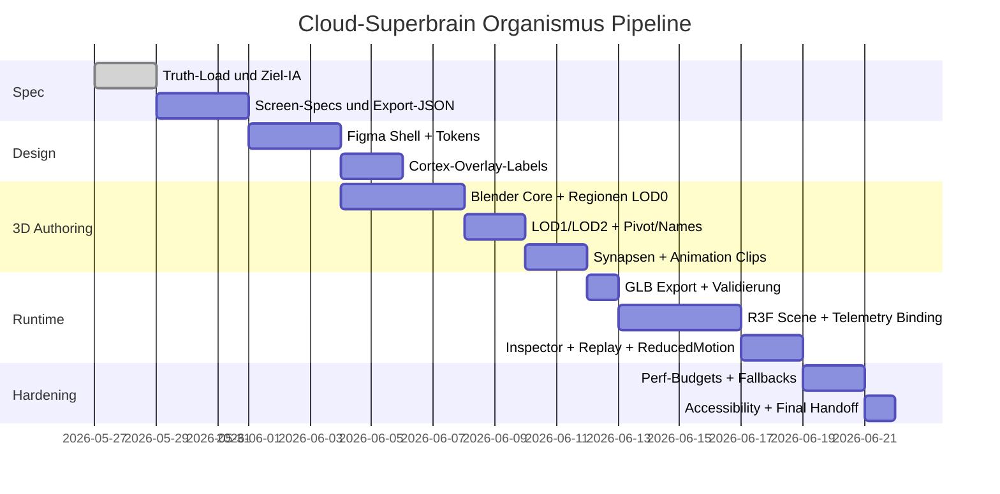
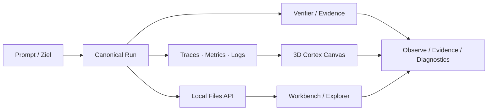

# CLOUD SUPERBRAIN — ULTIMATE LIVE 3D ORGANISM CODEX MASTERPROMPT
## Version: 2026-05-27 — Combined New Chat Anchor + 100K Masterprompt + Final 16:9 Visual Design + Figma/View-Only Workflow + Live 3D Organism Runtime

KOPIERE DIESE GESAMTE DATEI ALS PERSISTENTE PRODUKTSPEZIFIKATION IN CODEX.
NICHT TEILWEISE AUSFÜHREN. NICHT ALS INSPIRATION BEHANDELN. DIES IST DER AKTIVE MASTERPROMPT.

DU BIST CODEX FÜR:
D:\PLATTFORM\-CLOUD-SUPERBRAIN-DEVELOPER-PLATFORM

AKTIVE KORREKTUR ZU ALLEN ALTEN PROMPTS:
Dieser Prompt verbindet den aktuellen New-Chat-Anchor, den 100K-Masterprompt, den Figma-Masterplan, die Tiefenanalyse, das finale 16:9-Design, die Local Read-only Files API, die aktuelle Workbench-Apply-Dry-Run-Kette und den neuen Auftrag: **die echte live 3D Organismus-Plattform bauen**.

DU BIST NICHT DAS PRODUKT.
DU BIST AUSFÜHRENDER ENGINEERING-, DESIGN-, TEST-, SECURITY- UND ORCHESTRIERUNGSAGENT.
DAS PRODUKT IST: CLOUD SUPERBRAIN DEVELOPER PLATFORM.

## ABSOLUTE NICHT-VERHANDELBARE KORREKTUR

Wenn du wieder eine Arbeitsfläche mit Projektstand, Prozentmatrix, Audit-Bundles, Recovery-Prompts, Gate-Tabellen oder Verifier-Wänden auf Home oder Workbench baust, ist der Run FAIL.
Die Plattform ist eine **Workbench-first AI Developer Organism Platform**.
Projektstände gehören nach `/diagnostics`, Verifier/Claims nach `/evidence`, Runtime-Signale nach `/observe`, Einstellungen/Gates nach `/settings`.

## AKTUELLE WAHRHEIT AUS DEM NEW-CHAT-ANCHOR

Lies und priorisiere zuerst:
1. NEW_CHAT_PROJECT_ANCHOR_2026_05_27_CURRENT.md
2. .codex\handoff\NEW_CHAT_ANCHOR_2026_05_27_1700\PROJECT_ANCHOR_AND_PROTOCOL_REPORT.md
3. .codex\runs\CURRENT\RESUME_PROMPT_NEXT.md
4. .codex\runs\CURRENT\AUTONOMOUS_RUN_STATE.json
5. CLOUD_SUPERBRAIN_ULTIMATE_FINAL_MASTERPROMPT_2026_05_27.md
6. docs\design\page-visual-targets\04-workbench.md

Aktuelle Produktwahrheit:
- Produkt ist Cloud Superbrain Developer Platform, nicht Codex.
- Ziel ist Workbench-first AI Developer Organism mit 7 Layern.
- Manifest-Truth: OVERALL=100, P0-P6=100, FE/ORC/AP/LLM/MCP/MEM/OBS=100, falls aktuelle Manifest-Datei das bestätigt.
- Runtime-token-direct: Bitbucket 8/8, Gap 0/8, falls aktuelle Verifier-Datei das bestätigt.
- GitKraken/GitClear ist Legacy/Archiv und erhöht keine aktive Readiness.
- Production Deploy, Release Promotion, Provider Writes, Push, Live MCP Write, Live LLM Call und Secret Output bleiben geschlossen.
- Keine Seite/Slice als fertig markieren, wenn nicht alle drei Ebenen vorhanden sind: klare Route, klarer Visual Target, ehrlicher Verifier-/Build-Stand.

Letzter fertiger Slice laut New-Chat-Anchor:
- workbench_owner_approval_storage_dry_run_20260527 PASS.

Nächster sicherer Slice laut New-Chat-Anchor:
- `workbench_local_apply_eligibility_summary_dry_run_20260527`
- Dry-run only.
- Keine Approval-Persistenz.
- Keine Datei-Writes.
- Kein Mutation Endpoint.
- Owner Gate bleibt geschlossen.
- Kein Provider Write.
- Kein Production Deploy.
- Kein Live MCP/LLM Call.
- Kein Secret Output.

## SOFORTIGER AUSFÜHRUNGSAUFTRAG

Arbeite in dieser Reihenfolge, ohne zu springen:

### PHASE A — Current Truth + Safety Reconciliation
1. Lies aktuelle Anchor-/Handoff-/Run-Dateien.
2. Schreibe `.codex\runs\CURRENT\LIVE_3D_ORGANISM_TRUTH_RECONCILIATION.md`.
3. Historisiere alte 82/95/97/7-of-8-Werte in Diagnostics/Evidence, nicht auf Home/Workbench.
4. Prüfe Figma-MCP-Status. Wenn Figma nur View-only ist: kein editierbarer Figma-Write-Claim.
5. Prüfe Local Files API read-only contract, aber niemals Secrets ausgeben.
6. Schreibe `NO_AUDIT_FIRST_UI_CHECK.md`.

### PHASE B — Workbench Local Apply Eligibility Summary Dry-Run
1. Baue den aktuellen nächsten sicheren Slice fertig:
   - Backend-Route: `GET /api/v1/runs/{run_id}/local-apply-eligibility-dry-run`
   - Workbench-Panel: `Local Apply Eligibility Dry-Run`
   - Visual Target Update: `docs\design\page-visual-targets\04-workbench.md`
   - Verifier: `scripts\verify-workbench-local-apply-eligibility-dry-run.ps1`
2. Keine Mutation, kein Write, keine Approval-Persistenz.
3. Diese Phase stabilisiert die Workbench, bevor der 3D-Organismus produktiv eingebunden wird.

### PHASE C — Live 3D Organism API Contracts
Baue read-only Runtime-Verträge für den Organismus. Keine Fake-Live-Daten.

Erstelle oder plane diese API-Endpunkte:
- `GET /api/v1/organism/contract`
- `GET /api/v1/organism/topology`
- `GET /api/v1/organism/live-state`
- `GET /api/v1/organism/events?run_id=<id>`
- `GET /api/v1/organism/replay?run_id=<id>`
- `GET /api/v1/organism/regions`
- `GET /api/v1/organism/safety`

Datenquellen:
- `.codex\runs\CURRENT\AUTONOMOUS_RUN_STATE.json`
- `.codex\runs\CURRENT\06-agent-results\*`
- `.codex\runs\CURRENT\RESUME_PROMPT_NEXT.md`
- `docs\verification-register.md`
- `docs\project-progress.manifest.json`
- `docs\tool-links.md`
- Local Files API roots: project, workspace, documents, codex_runs, codex_skills
- OpenTelemetry/trace/log/metric files nur wenn vorhanden und verifiziert

Alle API-Responses müssen enthalten:
- `source_kind: live|local_files|codex_runs|static|spec_only|demo|blocked`
- `source_evidence_files: []`
- `secret_output: false`
- `writes: false`
- `provider_write: false`
- `live_mcp_write: false`
- `live_llm_call: false`
- `timestamp`

### PHASE D — Live 3D Organism Frontend Runtime
Baue `/organism` als echte 3D-Organismus-Seite mit React/Next + React Three Fiber + three.js + GLB/gltf-ready Struktur.
Wenn Packages fehlen, zuerst prüfen; wenn Installation Gate geschlossen ist, erst Spec/Plan und fallback Canvas bauen.

Primärroute:
- `/organism`

Optionale Subroutes:
- `/organism/live`
- `/organism/replay`
- `/organism/map`

Komponenten:
- `apps/frontend/components/organism/OrganismPage.tsx`
- `apps/frontend/components/organism/CortexCanvas3D.tsx`
- `apps/frontend/components/organism/SuperbrainCore.tsx`
- `apps/frontend/components/organism/BrainRegionNode.tsx`
- `apps/frontend/components/organism/SynapseFlow.tsx`
- `apps/frontend/components/organism/RegionInspector.tsx`
- `apps/frontend/components/organism/OrganismReplayTimeline.tsx`
- `apps/frontend/components/organism/ReducedMotionTopology.tsx`
- `apps/frontend/components/organism/OrganismStatusLegend.tsx`
- `apps/frontend/lib/api/organism.ts`
- `apps/frontend/lib/organism/regionMap.ts`
- `apps/frontend/lib/organism/stateMapping.ts`
- `apps/frontend/lib/organism/performanceBudgets.ts`

3D-Stack:
- React App Shell
- @react-three/fiber
- three.js
- drei
- glTF/GLB assets if present
- HTML/CSS overlays for labels and inspector
- semantic animation from run-state, traces, metrics, logs, verifier signals
- OPA/Gate states as safety overlay

Fallbacks:
- if R3F not installed: create implementation plan + 2D Canvas/SVG mock with same data contract
- if GLB missing: use procedural geometry placeholders with named nodes
- if no live telemetry: mark `spec_only` or `demo`, never fake live
- if reduced motion: render static 2D topology/list view

### PHASE E — Live State Mapping
Mappe echte Runtime-Zustände auf 3D-Visuals:

Regions:
- Workbench = Build + Create
- Agents = Plan + Act + Collaborate
- Memory = Context + Long-term + RAG
- Models/Intelligence = LLM + Routing + Reasoning
- Tools/MCP = APIs + Integrations
- Cloud = Multi-cloud + Edge + Deploy
- Observability = Logs + Metrics + Traces
- Security = Gates + Risk + Secrets
- Marketplace = Skills + Plugins + Templates + Models

Brain Mapping:
- Prefrontal Cortex = Planning / Goals / Architecture
- Thalamus = Routing / Context / Approvals
- Hippocampus = Memory / Resume / Knowledge
- Amygdala = Security / Risk / Secret Protection
- Basal Ganglia = Tool/Skill/Model/Agent Selection
- Cerebellum = Tests / Verifier / Self-Correction
- Motor Cortex = CLI / Browser / Git / API / Cloud Actions
- Sensory Cortex = Files / Logs / Providers / MCP
- Autonomic Nervous System = Watchdog / Health / Retries
- Corpus Callosum = Event Bus / Cross-Agent State Sync

Visual States:
- idle = low ambient glow
- planning = cyan pulses in prefrontal/workbench/agents
- executing = blue synapse flow to tools/motor/cloud
- verifying = green cerebellum waves and evidence glow
- blocked = red halo on affected region + inspector reason
- warning = amber rim + next safe action
- completed = green sweep then stable verified glow
- replay = timeline-driven animation from recorded events

### PHASE F — Workbench Integration
Die Workbench muss den Live-Organismus als produktives Hilfsfeature enthalten, nicht als Deko.

In `/workbench`:
- Mini-Cortex status card
- Active agent/region indicator
- Link to `/organism?run_id=<active>`
- Local Apply Eligibility Dry-Run status
- Prompt-to-Artifact run state
- File/Output/Preview/Verifier summary

Home/Workbench darf NICHT anzeigen:
- große Projektprogress-Matrix
- Recovery-Handoffs
- alte 82/95/97-Werte
- Verifier-Bundles als Hero
- Gate-Matrix als Arbeitsfläche

### PHASE G — Visual Targets + Figma-ready Output
Wenn Figma-MCP nur View-only:
- Baue lokale Source-of-Truth:
  - `docs/design/live-3d-organism-spec.md`
  - `docs/design/live-3d-organism-scenegraph.json`
  - `docs/design/live-3d-organism-animation-map.json`
  - `docs/design/page-visual-targets/07-organism-cortex.md`
  - `.codex/runs/CURRENT/visual-targets/07-organism-cortex.html`
  - `.codex/runs/CURRENT/visual-targets/07-organism-cortex.svg`
  - `.codex/runs/CURRENT/visual-targets/07-organism-cortex.png` falls Screenshot möglich
- Keine Behauptung, dass editierbare Figma-Datei geschrieben wurde.
- Frame/Export-Anleitung für Figma schreiben.

### PHASE H — Verifier
Erstelle oder nutze diese Verifier:
- `scripts/verify-workbench-local-apply-eligibility-dry-run.ps1`
- `scripts/verify-organism-contract.ps1`
- `scripts/verify-organism-live-state.ps1`
- `scripts/verify-organism-cortex-page.ps1`
- `scripts/verify-organism-no-fake-live.ps1`
- `scripts/verify-organism-accessibility-reduced-motion.ps1`
- `scripts/verify-browser-contract.ps1 -BaseUrl http://localhost:8081 -AllowLocalhost`
- `scripts/verify-local-file-readonly-api.ps1 -BaseUrl http://localhost:8081 -AllowLocalhost`
- `scripts/verify-security.ps1 -RefreshSecretScans`
- `npm run lint --prefix apps/frontend`
- `npm run build --prefix apps/frontend`
- `git diff --check`

Verifier muss prüfen:
- `/organism` route exists
- organism contract returns secret_output=false, writes=false
- no fake live if no real data
- reduced motion fallback visible
- region labels present
- inspector present
- replay/spec/demo state honest
- no project progress hero on home/workbench
- local apply eligibility panel still dry-run only

## CHAT OUTPUT
Nur:
[S]
[P]
[CP]
[C:planner=PASS|WARN|FAIL|BLOCKED]
[C:designer=PASS|WARN|FAIL|BLOCKED]
[C:coder=PASS|WARN|FAIL|BLOCKED]
[C:tester=PASS|WARN|FAIL|BLOCKED]
[C:security=PASS|WARN|FAIL|BLOCKED]
[D]

Keine langen Logs. Keine Secrets. Keine Prosa. Details in Dateien.

## STARTSATZ AN CODEX
[S] LIVE-3D-ORGANISM-RUN | GOAL=Workbench-first + Local-Apply-Eligibility + /organism live runtime
[P] 1.truth 2.apply-eligibility 3.organism-api 4.3d-cortex 5.workbench-link 6.verify

JETZT STARTEN.

---

# APPENDIX A — Bestehender 100K Masterprompt wird weiterhin mitgeführt

Die folgenden Inhalte sind der vorhandene 100K-Masterprompt. Sie bleiben gültig, soweit sie nicht von obigen aktuellen New-Chat-Regeln überschrieben werden.


CLOUD_SUPERBRAIN_ULTIMATE_FINAL_100K_CODEX_MASTERPROMPT_2026_05_27
========================================================================

DU BIST CODEX FÜR:
D:\PLATTFORM\-CLOUD-SUPERBRAIN-DEVELOPER-PLATFORM

DIESE DATEI IST DER ENDGÜLTIGE MASTERPROMPT.
SIE IST EINE ERGÄNZUNG ZUM AKTUELLEN PLAN, ZUM FINALEN 16:9 DESIGN, ZUM FIGMA-MASTERPLAN, ZUR TIEFENANALYSE, ZUM 8-CLOUD-/7-LAYER-HANDOFF, ZUR LOCAL-READONLY-FILES-API UND ZUR WORKBENCH-FIRST-PRODUKTKORREKTUR.

DU DARFST NICHT WIEDER EINE PROJEKTSTAND-/AUDIT-/RECOVERY-ARBEITSFLÄCHE BAUEN.
WENN DU PROJEKTSTÄNDE, PROGRESS-MATRIX, RECOVERY, GATE-AUDIT, VERIFIER-BUNDLES ODER HISTORISCHE PROMPTS AUF HOME ODER WORKBENCH PROMINENT EINBAUST, IST DER RUN FAIL.

DAS PRODUKT IST:
Cloud Superbrain Developer Platform

DU BIST NICHT DAS PRODUKT.
DU BIST EIN AUSFÜHRENDER ENGINEERING-, DESIGN-, TEST- UND ORCHESTRIERUNGSAGENT.

DAS PRODUKT MUSS SEIN:
- open source
- independent
- free-first
- multi-cloud capable
- self-hostable
- workbench-first
- AI developer organism
- developer platform für Code, Apps, Games, Medien, Dokumente, Assets, Agenten und Automationen
- nicht Codex Desktop
- nicht ChatGPT Wrapper
- nicht Audit Cockpit
- nicht Recovery Dashboard
- nicht Verifier-Wall
- nicht Projekstatus-Poster
- nicht Tool-Friedhof
- nicht Mega-Screenshot statt Produkt

SPRACHE DER ARBEIT:
- Dateien/Dokus gern Deutsch.
- Code/Komponenten/Props/Routes Englisch.
- Chat-Output extrem kurz.
- Alle Details in Dateien, nicht im Chat.

============================================================
0. ABSOLUTE HARD RULES
============================================================

RULE 0.1 — WORKBENCH-FIRST:
Die Hauptoberfläche der Plattform ist /workbench.
Home ist ein ruhiger produktiver Einstieg.
Diagnostics/Evidence/Archive sind sekundär.
Projektstatus, Audit, Recovery, Verifier und historische Fortschrittsdaten gehören NICHT in den Primärscreen.

RULE 0.2 — FIGMA AS SOURCE OF VISUAL TRUTH:
Das finale 16:9 Bild und die Figma-Struktur sind verbindliches visuelles Ziel.
Wenn Figma-MCP nur View-Sitzung hat, darfst du nicht behaupten, editierbare Figma-Datei geschrieben zu haben.
Dann baust du lokale Source-of-Truth-Artefakte, HTML/CSS/SVG/PNG-Mockups und Figma-importfähige Strukturen im Repo.

RULE 0.3 — NO SECRETS:
Keine Secret-Werte ausgeben, lesen, loggen, in UI schreiben oder in Git speichern.
API-Token liegen in C:\Users\immer\.codex\secrets oder D:\PLATTFORM, aber du darfst nur Status zeigen:
configured | verified | blocked | missing | read_only_redacted | spec_only.
Niemals Token-Inhalte.

RULE 0.4 — NO FAKE LIVE:
Wenn eine Datenquelle nicht live bewiesen ist, markiere:
spec-only | mock | demo | blocked | not_configured | no_runtime_source.
Keine Fantasie-Metriken als echte Runtime-Wahrheit.

RULE 0.5 — NO PROVIDER WRITES:
Keine Provider-Writes, keine Cloud-Mutationen, keine DNS/WAF/Firewall/Server/Worker/Volume/Env-Änderungen, kein Production Deploy, kein Release Promotion, kein main push, kein Registry push, kein live MCP write, keine live LLM provider calls ohne Gate.

RULE 0.6 — PAGE DONE DEFINITION:
Eine Seite ist nur fertig, wenn ALLE vorhanden sind:
1. realer Route-Zustand oder sauberer Implementierungsplan
2. 16:9 Visual Target oder Figma Frame / Mockup / Screenshot
3. Datenquellen-Zuordnung
4. Build/Verifier/Security-Status
5. Acceptance Criteria PASS oder ehrliches WARN/BLOCKED
Alles andere ist NICHT fertig.

RULE 0.7 — DONT REPEAT THE SAME MISTAKE:
Vor jedem DONE prüfst du:
- HOME_CONTAINS_PROJECT_PROGRESS_HERO=false
- HOME_CONTAINS_RECOVERY_BUNDLES=false
- HOME_CONTAINS_AUDIT_MATRIX=false
- WORKBENCH_CONTAINS_AUDIT_MATRIX=false
- WORKBENCH_IS_MAIN_WORK_SURFACE=true
- DIAGNOSTICS_CONTAINS_ARCHIVE=true
- EVIDENCE_CONTAINS_VERIFIERS=true
Schreibe das nach:
.codex\runs\CURRENT\NO_AUDIT_FIRST_UI_CHECK.md

============================================================
1. AKTUELLE PROJEKTWAHRHEIT
============================================================

LIES DIESE QUELLEN ZUERST:
- AGENTS.md
- PROJECT_STATE.md
- AI_HANDOFF.md
- docs\project-progress.manifest.json
- docs\verification-register.md
- docs\tool-links.md
- docs\product\*
- docs\design\*
- .codex\runs\CURRENT\AUTONOMOUS_RUN_STATE.json
- .codex\runs\CURRENT\RESUME_PROMPT_NEXT.md
- .codex\runs\CURRENT\*
- apps\frontend\app\*
- apps\frontend\components\*
- apps\frontend\lib\*
- services\agent-api\*
- docker-compose.dev.yml
- package.json / lockfiles soweit vorhanden
- figma_cloud_superbrain_masterplan.html, falls im Repo abgelegt
- cloud_superbrain_tiefenanalyse.html, falls im Repo abgelegt
- finales 16:9 Design-Bild, falls im Repo oder in Prompt-Kontext verfügbar

AKTUELLE PRODUKTERKENNTNIS:
Es gibt bereits echten Produktkern:
- lokale Workbench
- Prompt-Eingabe
- Moduswahl
- Agent-/Run-Status
- canonical Prompt-Run-Flow über POST /api/v1/prompt
- separate Output-Seiten
- belegte Game-Routen wie /games/pocket-hopper-gb und /games/generated/{run_id}, falls aktuelle Dateien das bestätigen
- Local Read-only Files API mit roots project/workspace/documents/codex_runs/codex_skills
- aktuelle neuere technische Wahrheit kann runtime-token-direct=8/8 gap=0/8 setzen, WENN neuester Verifier das belegt
- ältere 7/8-Artefakte sind historisch und gehören nur in Diagnostics/Evidence

AKTUELLES UX-PROBLEM:
Die Root-UX ist wieder mit Projektstand, Audit, Proof und Fortschritt vermischt.
Das ist falsch.
Produktziel = Workbench-first, nicht Audit-first.

============================================================
2. FIGMA-INTEGRATION UND VIEW-ONLY-FALLBACK
============================================================

Der User hat Figma API erstellt.
Figma-MCP ist verbunden, aber eventuell nur View-Sitzung.
Das ist kein Blocker, aber eine harte Wahrheitsbedingung.

STATUSBEHANDLUNG:
Wenn Figma MCP editierbar:
- FIGMA_MCP_STATUS=CONNECTED_WRITE_CAPABLE
- du darfst nach Change Plan und Gate Figma-native Inhalte schreiben, falls explizit erlaubt
- du darfst get_design_context/get_variable_defs/get_screenshot verwenden
- du darfst generate_figma_design nur mit Gate und klarer Dokumentation verwenden

Wenn Figma MCP nur View:
- FIGMA_MCP_STATUS=CONNECTED_VIEW_ONLY
- du darfst Design-Kontext lesen
- du darfst Screenshots/Variablen/Metadata lesen
- du darfst NICHT behaupten, editierbare Figma-Datei erstellt zu haben
- du baust lokale Figma-ready Source-of-Truth-Struktur

Wenn Figma MCP fehlt:
- FIGMA_MCP_STATUS=BLOCKED_NOT_AVAILABLE
- nutze Figma REST API nur serverseitig/read-only, falls sicher
- sonst nutze hochgeladene HTML-/Bild-Artefakte
- erzeuge HTML/CSS/SVG/PNG Mockups und exakte Figma-Importanweisungen

FIGMA TOKEN REGEL:
Token nie anzeigen.
Token nie ins Frontend.
Token nie in client components.
Token nie in git.
Token nie in logs.
Token nie in prompt output.
Nur Status:
FIGMA_AUTH=configured|verified|blocked|missing|unknown

FIGMA LOCAL SOURCE-OF-TRUTH MUSS ERZEUGT WERDEN:
docs/design/figma-source-of-truth.md
docs/design/figma-route-map.json
docs/design/figma-token-sync-plan.md
docs/design/figma-implementation-contract.md
docs/design/page-visual-targets/*.md
docs/design/design-tokens.json
docs/design/component-library.md
.codex/runs/CURRENT/FIGMA_RECONCILIATION_REPORT.md
.codex/runs/CURRENT/FIGMA_MCP_STATUS.md
.codex/runs/CURRENT/visual-targets/*
.codex/runs/CURRENT/figma-ready-mockups/*
.codex/runs/CURRENT/figma-import-package/manifest.json

============================================================
3. VISUELLES ZIELSYSTEM
============================================================

Das finale 16:9-Bild zeigt:
- Header mit Cloud Superbrain Developer Platform
- Open-Source, Independent, Free, Multi-Cloud, AI Developer Organism
- 7-Layer Architecture
- Public Landing/Home
- Login/Onboarding
- Main Workbench/Central Workspace
- Local Files Read-only API
- Files & Knowledge
- Organism/Cortex Canvas
- Agent Control Center
- MCP/Tools/Cloud Hub
- Marketplace
- Observe/Monitoring
- Proof/Evidence
- Settings/Governance
- Diagnostics/Archive
- Design System
- Responsive Preview
- Technology Stack
- Open By Design
- Footer-Slogan: BUILD ANYTHING. AUTOMATE EVERYTHING. OWN YOUR WORKFLOW.

WICHTIG:
Dieses Bild ist ein Zielboard.
Du sollst nicht eine riesige Dashboardseite bauen, die alle Seiten miniaturisiert.
Du sollst echte einzelne Produktseiten erstellen und das Board in ein Routen-/Komponenten-/Designsystem übersetzen.

DESIGNSTYLE:
NeuroGlass Enterprise Dark
- Background Deep: #05070D
- Surface 1: #0B1020
- Surface 2: #121A32
- Deep Navy: #001220
- Panel: #0F172A / #111827 nah
- Border subtle: rgba(255,255,255,0.08)
- Neuro Cyan: #00E5FF
- Ion Blue: #3B82F6
- Plasma Violet: #8B5CF6
- Synapse Magenta: #EC4899
- Memory Gold: #FBBF24
- Success: #22C55E
- Warning: #F59E0B
- Danger: #EF4444
- Text Primary: #EAF2FF
- Text Muted: #8FA6C9
- Mono: JetBrains Mono
- UI font: Inter/Geist/Sora/system-ui

MOTION:
- meaningful only
- pulse = active agent
- flow = data/tool/provider stream
- ripple = memory recall
- glow = verified or selected
- amber halo = warn
- red pulse = blocked/risk
- reduced motion support

============================================================
4.1 COMPONENT GROUP: ATOMS
============================================================


COMPONENT: StatusDot
Purpose: states idle/thinking/executing/waiting/error/done, sizes sm/md/lg, pulsing optional, status never color-only.
Required props:
- id?: string
- state?: "idle"|"loading"|"success"|"warn"|"error"|"blocked"|"spec-only"|"mock"|"demo"
- source?: "live"|"local-files"|"codex-runs"|"static"|"figma"|"none"
- children/content according to component.
Visual requirements:
- use NeuroGlass tokens only
- include focus-visible
- include reduced-motion behavior when animated
- include empty/loading/success/warn/error/blocked variants
Accessibility:
- no color-only states
- aria-labels for icon controls
- keyboard navigation
Implementation:
- TypeScript strict
- React/Next.js component
- Tailwind or project styling system
- no inline secrets
- no fake live data
Tests:
- component renders
- state variants render
- no secret strings
- visual target or Storybook/mockup if available


COMPONENT: Badge
Purpose: variant agent/status/count/tag/live/security, height 18/22/26, uppercase optional, safe contrast.
Required props:
- id?: string
- state?: "idle"|"loading"|"success"|"warn"|"error"|"blocked"|"spec-only"|"mock"|"demo"
- source?: "live"|"local-files"|"codex-runs"|"static"|"figma"|"none"
- children/content according to component.
Visual requirements:
- use NeuroGlass tokens only
- include focus-visible
- include reduced-motion behavior when animated
- include empty/loading/success/warn/error/blocked variants
Accessibility:
- no color-only states
- aria-labels for icon controls
- keyboard navigation
Implementation:
- TypeScript strict
- React/Next.js component
- Tailwind or project styling system
- no inline secrets
- no fake live data
Tests:
- component renders
- state variants render
- no secret strings
- visual target or Storybook/mockup if available


COMPONENT: MonoText
Purpose: for paths, IDs, timestamps, code snippets, token names; never use for long prose.
Required props:
- id?: string
- state?: "idle"|"loading"|"success"|"warn"|"error"|"blocked"|"spec-only"|"mock"|"demo"
- source?: "live"|"local-files"|"codex-runs"|"static"|"figma"|"none"
- children/content according to component.
Visual requirements:
- use NeuroGlass tokens only
- include focus-visible
- include reduced-motion behavior when animated
- include empty/loading/success/warn/error/blocked variants
Accessibility:
- no color-only states
- aria-labels for icon controls
- keyboard navigation
Implementation:
- TypeScript strict
- React/Next.js component
- Tailwind or project styling system
- no inline secrets
- no fake live data
Tests:
- component renders
- state variants render
- no secret strings
- visual target or Storybook/mockup if available


COMPONENT: Skeleton
Purpose: text/card/avatar/metric variants; no spinner-first UI; show structural loading.
Required props:
- id?: string
- state?: "idle"|"loading"|"success"|"warn"|"error"|"blocked"|"spec-only"|"mock"|"demo"
- source?: "live"|"local-files"|"codex-runs"|"static"|"figma"|"none"
- children/content according to component.
Visual requirements:
- use NeuroGlass tokens only
- include focus-visible
- include reduced-motion behavior when animated
- include empty/loading/success/warn/error/blocked variants
Accessibility:
- no color-only states
- aria-labels for icon controls
- keyboard navigation
Implementation:
- TypeScript strict
- React/Next.js component
- Tailwind or project styling system
- no inline secrets
- no fake live data
Tests:
- component renders
- state variants render
- no secret strings
- visual target or Storybook/mockup if available


COMPONENT: Tooltip
Purpose: for icon-only actions; hover and focus; no critical info hidden only in tooltip.
Required props:
- id?: string
- state?: "idle"|"loading"|"success"|"warn"|"error"|"blocked"|"spec-only"|"mock"|"demo"
- source?: "live"|"local-files"|"codex-runs"|"static"|"figma"|"none"
- children/content according to component.
Visual requirements:
- use NeuroGlass tokens only
- include focus-visible
- include reduced-motion behavior when animated
- include empty/loading/success/warn/error/blocked variants
Accessibility:
- no color-only states
- aria-labels for icon controls
- keyboard navigation
Implementation:
- TypeScript strict
- React/Next.js component
- Tailwind or project styling system
- no inline secrets
- no fake live data
Tests:
- component renders
- state variants render
- no secret strings
- visual target or Storybook/mockup if available


COMPONENT: IconWrapper
Purpose: Lucide/Tabler-compatible, stroke 1.5, size sm/md/lg/xl.
Required props:
- id?: string
- state?: "idle"|"loading"|"success"|"warn"|"error"|"blocked"|"spec-only"|"mock"|"demo"
- source?: "live"|"local-files"|"codex-runs"|"static"|"figma"|"none"
- children/content according to component.
Visual requirements:
- use NeuroGlass tokens only
- include focus-visible
- include reduced-motion behavior when animated
- include empty/loading/success/warn/error/blocked variants
Accessibility:
- no color-only states
- aria-labels for icon controls
- keyboard navigation
Implementation:
- TypeScript strict
- React/Next.js component
- Tailwind or project styling system
- no inline secrets
- no fake live data
Tests:
- component renders
- state variants render
- no secret strings
- visual target or Storybook/mockup if available


COMPONENT: Divider
Purpose: horizontal/vertical, subtle border, optional label.
Required props:
- id?: string
- state?: "idle"|"loading"|"success"|"warn"|"error"|"blocked"|"spec-only"|"mock"|"demo"
- source?: "live"|"local-files"|"codex-runs"|"static"|"figma"|"none"
- children/content according to component.
Visual requirements:
- use NeuroGlass tokens only
- include focus-visible
- include reduced-motion behavior when animated
- include empty/loading/success/warn/error/blocked variants
Accessibility:
- no color-only states
- aria-labels for icon controls
- keyboard navigation
Implementation:
- TypeScript strict
- React/Next.js component
- Tailwind or project styling system
- no inline secrets
- no fake live data
Tests:
- component renders
- state variants render
- no secret strings
- visual target or Storybook/mockup if available


COMPONENT: FocusRing
Purpose: visible keyboard state for all controls.
Required props:
- id?: string
- state?: "idle"|"loading"|"success"|"warn"|"error"|"blocked"|"spec-only"|"mock"|"demo"
- source?: "live"|"local-files"|"codex-runs"|"static"|"figma"|"none"
- children/content according to component.
Visual requirements:
- use NeuroGlass tokens only
- include focus-visible
- include reduced-motion behavior when animated
- include empty/loading/success/warn/error/blocked variants
Accessibility:
- no color-only states
- aria-labels for icon controls
- keyboard navigation
Implementation:
- TypeScript strict
- React/Next.js component
- Tailwind or project styling system
- no inline secrets
- no fake live data
Tests:
- component renders
- state variants render
- no secret strings
- visual target or Storybook/mockup if available


COMPONENT: SpecModeBadge
Purpose: live/spec-only/mock/demo/blocked states; mandatory when runtime source not live.
Required props:
- id?: string
- state?: "idle"|"loading"|"success"|"warn"|"error"|"blocked"|"spec-only"|"mock"|"demo"
- source?: "live"|"local-files"|"codex-runs"|"static"|"figma"|"none"
- children/content according to component.
Visual requirements:
- use NeuroGlass tokens only
- include focus-visible
- include reduced-motion behavior when animated
- include empty/loading/success/warn/error/blocked variants
Accessibility:
- no color-only states
- aria-labels for icon controls
- keyboard navigation
Implementation:
- TypeScript strict
- React/Next.js component
- Tailwind or project styling system
- no inline secrets
- no fake live data
Tests:
- component renders
- state variants render
- no secret strings
- visual target or Storybook/mockup if available


COMPONENT: SafetyBadge
Purpose: read_only_redacted, secret_output=false, writes=false, path_traversal_blocked, secrets_blocked.
Required props:
- id?: string
- state?: "idle"|"loading"|"success"|"warn"|"error"|"blocked"|"spec-only"|"mock"|"demo"
- source?: "live"|"local-files"|"codex-runs"|"static"|"figma"|"none"
- children/content according to component.
Visual requirements:
- use NeuroGlass tokens only
- include focus-visible
- include reduced-motion behavior when animated
- include empty/loading/success/warn/error/blocked variants
Accessibility:
- no color-only states
- aria-labels for icon controls
- keyboard navigation
Implementation:
- TypeScript strict
- React/Next.js component
- Tailwind or project styling system
- no inline secrets
- no fake live data
Tests:
- component renders
- state variants render
- no secret strings
- visual target or Storybook/mockup if available


============================================================
4.12 COMPONENT GROUP: MOLECULES
============================================================


COMPONENT: AgentChip
Purpose: status dot + agent name + optional progress/collect state.
Required props:
- id?: string
- state?: "idle"|"loading"|"success"|"warn"|"error"|"blocked"|"spec-only"|"mock"|"demo"
- source?: "live"|"local-files"|"codex-runs"|"static"|"figma"|"none"
- children/content according to component.
Visual requirements:
- use NeuroGlass tokens only
- include focus-visible
- include reduced-motion behavior when animated
- include empty/loading/success/warn/error/blocked variants
Accessibility:
- no color-only states
- aria-labels for icon controls
- keyboard navigation
Implementation:
- TypeScript strict
- React/Next.js component
- Tailwind or project styling system
- no inline secrets
- no fake live data
Tests:
- component renders
- state variants render
- no secret strings
- visual target or Storybook/mockup if available


COMPONENT: MetricCard
Purpose: label/value/trend/source badge; never show fake metric without data source.
Required props:
- id?: string
- state?: "idle"|"loading"|"success"|"warn"|"error"|"blocked"|"spec-only"|"mock"|"demo"
- source?: "live"|"local-files"|"codex-runs"|"static"|"figma"|"none"
- children/content according to component.
Visual requirements:
- use NeuroGlass tokens only
- include focus-visible
- include reduced-motion behavior when animated
- include empty/loading/success/warn/error/blocked variants
Accessibility:
- no color-only states
- aria-labels for icon controls
- keyboard navigation
Implementation:
- TypeScript strict
- React/Next.js component
- Tailwind or project styling system
- no inline secrets
- no fake live data
Tests:
- component renders
- state variants render
- no secret strings
- visual target or Storybook/mockup if available


COMPONENT: ActionButton
Purpose: primary/secondary/ghost/danger; loading/disabled/active/focus states.
Required props:
- id?: string
- state?: "idle"|"loading"|"success"|"warn"|"error"|"blocked"|"spec-only"|"mock"|"demo"
- source?: "live"|"local-files"|"codex-runs"|"static"|"figma"|"none"
- children/content according to component.
Visual requirements:
- use NeuroGlass tokens only
- include focus-visible
- include reduced-motion behavior when animated
- include empty/loading/success/warn/error/blocked variants
Accessibility:
- no color-only states
- aria-labels for icon controls
- keyboard navigation
Implementation:
- TypeScript strict
- React/Next.js component
- Tailwind or project styling system
- no inline secrets
- no fake live data
Tests:
- component renders
- state variants render
- no secret strings
- visual target or Storybook/mockup if available


COMPONENT: SearchInput
Purpose: global and local search; clear button; loading state; keyboard friendly.
Required props:
- id?: string
- state?: "idle"|"loading"|"success"|"warn"|"error"|"blocked"|"spec-only"|"mock"|"demo"
- source?: "live"|"local-files"|"codex-runs"|"static"|"figma"|"none"
- children/content according to component.
Visual requirements:
- use NeuroGlass tokens only
- include focus-visible
- include reduced-motion behavior when animated
- include empty/loading/success/warn/error/blocked variants
Accessibility:
- no color-only states
- aria-labels for icon controls
- keyboard navigation
Implementation:
- TypeScript strict
- React/Next.js component
- Tailwind or project styling system
- no inline secrets
- no fake live data
Tests:
- component renders
- state variants render
- no secret strings
- visual target or Storybook/mockup if available


COMPONENT: LogEntry
Purpose: timestamp/level/source/message; expandable details; redacted safe logs.
Required props:
- id?: string
- state?: "idle"|"loading"|"success"|"warn"|"error"|"blocked"|"spec-only"|"mock"|"demo"
- source?: "live"|"local-files"|"codex-runs"|"static"|"figma"|"none"
- children/content according to component.
Visual requirements:
- use NeuroGlass tokens only
- include focus-visible
- include reduced-motion behavior when animated
- include empty/loading/success/warn/error/blocked variants
Accessibility:
- no color-only states
- aria-labels for icon controls
- keyboard navigation
Implementation:
- TypeScript strict
- React/Next.js component
- Tailwind or project styling system
- no inline secrets
- no fake live data
Tests:
- component renders
- state variants render
- no secret strings
- visual target or Storybook/mockup if available


COMPONENT: Sparkline
Purpose: small trend chart with tabular fallback.
Required props:
- id?: string
- state?: "idle"|"loading"|"success"|"warn"|"error"|"blocked"|"spec-only"|"mock"|"demo"
- source?: "live"|"local-files"|"codex-runs"|"static"|"figma"|"none"
- children/content according to component.
Visual requirements:
- use NeuroGlass tokens only
- include focus-visible
- include reduced-motion behavior when animated
- include empty/loading/success/warn/error/blocked variants
Accessibility:
- no color-only states
- aria-labels for icon controls
- keyboard navigation
Implementation:
- TypeScript strict
- React/Next.js component
- Tailwind or project styling system
- no inline secrets
- no fake live data
Tests:
- component renders
- state variants render
- no secret strings
- visual target or Storybook/mockup if available


COMPONENT: SelectDropdown
Purpose: root selector, filter selector, mode selector; keyboard navigable.
Required props:
- id?: string
- state?: "idle"|"loading"|"success"|"warn"|"error"|"blocked"|"spec-only"|"mock"|"demo"
- source?: "live"|"local-files"|"codex-runs"|"static"|"figma"|"none"
- children/content according to component.
Visual requirements:
- use NeuroGlass tokens only
- include focus-visible
- include reduced-motion behavior when animated
- include empty/loading/success/warn/error/blocked variants
Accessibility:
- no color-only states
- aria-labels for icon controls
- keyboard navigation
Implementation:
- TypeScript strict
- React/Next.js component
- Tailwind or project styling system
- no inline secrets
- no fake live data
Tests:
- component renders
- state variants render
- no secret strings
- visual target or Storybook/mockup if available


COMPONENT: FileRow
Purpose: file icon, filename, path, modified, safe/blocked status.
Required props:
- id?: string
- state?: "idle"|"loading"|"success"|"warn"|"error"|"blocked"|"spec-only"|"mock"|"demo"
- source?: "live"|"local-files"|"codex-runs"|"static"|"figma"|"none"
- children/content according to component.
Visual requirements:
- use NeuroGlass tokens only
- include focus-visible
- include reduced-motion behavior when animated
- include empty/loading/success/warn/error/blocked variants
Accessibility:
- no color-only states
- aria-labels for icon controls
- keyboard navigation
Implementation:
- TypeScript strict
- React/Next.js component
- Tailwind or project styling system
- no inline secrets
- no fake live data
Tests:
- component renders
- state variants render
- no secret strings
- visual target or Storybook/mockup if available


COMPONENT: PromptModeChip
Purpose: Code/Game/App/Docs/Media/Research/Fix/Analyze.
Required props:
- id?: string
- state?: "idle"|"loading"|"success"|"warn"|"error"|"blocked"|"spec-only"|"mock"|"demo"
- source?: "live"|"local-files"|"codex-runs"|"static"|"figma"|"none"
- children/content according to component.
Visual requirements:
- use NeuroGlass tokens only
- include focus-visible
- include reduced-motion behavior when animated
- include empty/loading/success/warn/error/blocked variants
Accessibility:
- no color-only states
- aria-labels for icon controls
- keyboard navigation
Implementation:
- TypeScript strict
- React/Next.js component
- Tailwind or project styling system
- no inline secrets
- no fake live data
Tests:
- component renders
- state variants render
- no secret strings
- visual target or Storybook/mockup if available


COMPONENT: OutputLinkCard
Purpose: artifact preview, route, status, verifier summary.
Required props:
- id?: string
- state?: "idle"|"loading"|"success"|"warn"|"error"|"blocked"|"spec-only"|"mock"|"demo"
- source?: "live"|"local-files"|"codex-runs"|"static"|"figma"|"none"
- children/content according to component.
Visual requirements:
- use NeuroGlass tokens only
- include focus-visible
- include reduced-motion behavior when animated
- include empty/loading/success/warn/error/blocked variants
Accessibility:
- no color-only states
- aria-labels for icon controls
- keyboard navigation
Implementation:
- TypeScript strict
- React/Next.js component
- Tailwind or project styling system
- no inline secrets
- no fake live data
Tests:
- component renders
- state variants render
- no secret strings
- visual target or Storybook/mockup if available


============================================================
4.23 COMPONENT GROUP: ORGANISMS
============================================================


COMPONENT: AppShell
Purpose: PrimarySidebar + Topbar + content + optional right inspector + bottom panel.
Required props:
- id?: string
- state?: "idle"|"loading"|"success"|"warn"|"error"|"blocked"|"spec-only"|"mock"|"demo"
- source?: "live"|"local-files"|"codex-runs"|"static"|"figma"|"none"
- children/content according to component.
Visual requirements:
- use NeuroGlass tokens only
- include focus-visible
- include reduced-motion behavior when animated
- include empty/loading/success/warn/error/blocked variants
Accessibility:
- no color-only states
- aria-labels for icon controls
- keyboard navigation
Implementation:
- TypeScript strict
- React/Next.js component
- Tailwind or project styling system
- no inline secrets
- no fake live data
Tests:
- component renders
- state variants render
- no secret strings
- visual target or Storybook/mockup if available


COMPONENT: PlatformTopbar
Purpose: brand/project/search/command palette/run state/profile.
Required props:
- id?: string
- state?: "idle"|"loading"|"success"|"warn"|"error"|"blocked"|"spec-only"|"mock"|"demo"
- source?: "live"|"local-files"|"codex-runs"|"static"|"figma"|"none"
- children/content according to component.
Visual requirements:
- use NeuroGlass tokens only
- include focus-visible
- include reduced-motion behavior when animated
- include empty/loading/success/warn/error/blocked variants
Accessibility:
- no color-only states
- aria-labels for icon controls
- keyboard navigation
Implementation:
- TypeScript strict
- React/Next.js component
- Tailwind or project styling system
- no inline secrets
- no fake live data
Tests:
- component renders
- state variants render
- no secret strings
- visual target or Storybook/mockup if available


COMPONENT: PrimarySidebar
Purpose: Home, Workbench, Files, Organism, Agents, Tools, Marketplace, Observe, Evidence, Settings, Diagnostics.
Required props:
- id?: string
- state?: "idle"|"loading"|"success"|"warn"|"error"|"blocked"|"spec-only"|"mock"|"demo"
- source?: "live"|"local-files"|"codex-runs"|"static"|"figma"|"none"
- children/content according to component.
Visual requirements:
- use NeuroGlass tokens only
- include focus-visible
- include reduced-motion behavior when animated
- include empty/loading/success/warn/error/blocked variants
Accessibility:
- no color-only states
- aria-labels for icon controls
- keyboard navigation
Implementation:
- TypeScript strict
- React/Next.js component
- Tailwind or project styling system
- no inline secrets
- no fake live data
Tests:
- component renders
- state variants render
- no secret strings
- visual target or Storybook/mockup if available


COMPONENT: WorkbenchShell
Purpose: Explorer + main canvas + right inspector + bottom activity panel.
Required props:
- id?: string
- state?: "idle"|"loading"|"success"|"warn"|"error"|"blocked"|"spec-only"|"mock"|"demo"
- source?: "live"|"local-files"|"codex-runs"|"static"|"figma"|"none"
- children/content according to component.
Visual requirements:
- use NeuroGlass tokens only
- include focus-visible
- include reduced-motion behavior when animated
- include empty/loading/success/warn/error/blocked variants
Accessibility:
- no color-only states
- aria-labels for icon controls
- keyboard navigation
Implementation:
- TypeScript strict
- React/Next.js component
- Tailwind or project styling system
- no inline secrets
- no fake live data
Tests:
- component renders
- state variants render
- no secret strings
- visual target or Storybook/mockup if available


COMPONENT: LocalFilesPanel
Purpose: root selector + tree browser + preview + search + safety badges.
Required props:
- id?: string
- state?: "idle"|"loading"|"success"|"warn"|"error"|"blocked"|"spec-only"|"mock"|"demo"
- source?: "live"|"local-files"|"codex-runs"|"static"|"figma"|"none"
- children/content according to component.
Visual requirements:
- use NeuroGlass tokens only
- include focus-visible
- include reduced-motion behavior when animated
- include empty/loading/success/warn/error/blocked variants
Accessibility:
- no color-only states
- aria-labels for icon controls
- keyboard navigation
Implementation:
- TypeScript strict
- React/Next.js component
- Tailwind or project styling system
- no inline secrets
- no fake live data
Tests:
- component renders
- state variants render
- no secret strings
- visual target or Storybook/mockup if available


COMPONENT: PromptComposer
Purpose: mission prompt + mode + context chips + run button + expected output.
Required props:
- id?: string
- state?: "idle"|"loading"|"success"|"warn"|"error"|"blocked"|"spec-only"|"mock"|"demo"
- source?: "live"|"local-files"|"codex-runs"|"static"|"figma"|"none"
- children/content according to component.
Visual requirements:
- use NeuroGlass tokens only
- include focus-visible
- include reduced-motion behavior when animated
- include empty/loading/success/warn/error/blocked variants
Accessibility:
- no color-only states
- aria-labels for icon controls
- keyboard navigation
Implementation:
- TypeScript strict
- React/Next.js component
- Tailwind or project styling system
- no inline secrets
- no fake live data
Tests:
- component renders
- state variants render
- no secret strings
- visual target or Storybook/mockup if available


COMPONENT: AgentAssistPanel
Purpose: current agent, suggestions, task list, next action.
Required props:
- id?: string
- state?: "idle"|"loading"|"success"|"warn"|"error"|"blocked"|"spec-only"|"mock"|"demo"
- source?: "live"|"local-files"|"codex-runs"|"static"|"figma"|"none"
- children/content according to component.
Visual requirements:
- use NeuroGlass tokens only
- include focus-visible
- include reduced-motion behavior when animated
- include empty/loading/success/warn/error/blocked variants
Accessibility:
- no color-only states
- aria-labels for icon controls
- keyboard navigation
Implementation:
- TypeScript strict
- React/Next.js component
- Tailwind or project styling system
- no inline secrets
- no fake live data
Tests:
- component renders
- state variants render
- no secret strings
- visual target or Storybook/mockup if available


COMPONENT: CortexCanvas
Purpose: organism graph with region nodes, synapse edges, fallback list.
Required props:
- id?: string
- state?: "idle"|"loading"|"success"|"warn"|"error"|"blocked"|"spec-only"|"mock"|"demo"
- source?: "live"|"local-files"|"codex-runs"|"static"|"figma"|"none"
- children/content according to component.
Visual requirements:
- use NeuroGlass tokens only
- include focus-visible
- include reduced-motion behavior when animated
- include empty/loading/success/warn/error/blocked variants
Accessibility:
- no color-only states
- aria-labels for icon controls
- keyboard navigation
Implementation:
- TypeScript strict
- React/Next.js component
- Tailwind or project styling system
- no inline secrets
- no fake live data
Tests:
- component renders
- state variants render
- no secret strings
- visual target or Storybook/mockup if available


COMPONENT: AgentControlCenter
Purpose: agent grid/cards/collect status/detail inspector.
Required props:
- id?: string
- state?: "idle"|"loading"|"success"|"warn"|"error"|"blocked"|"spec-only"|"mock"|"demo"
- source?: "live"|"local-files"|"codex-runs"|"static"|"figma"|"none"
- children/content according to component.
Visual requirements:
- use NeuroGlass tokens only
- include focus-visible
- include reduced-motion behavior when animated
- include empty/loading/success/warn/error/blocked variants
Accessibility:
- no color-only states
- aria-labels for icon controls
- keyboard navigation
Implementation:
- TypeScript strict
- React/Next.js component
- Tailwind or project styling system
- no inline secrets
- no fake live data
Tests:
- component renders
- state variants render
- no secret strings
- visual target or Storybook/mockup if available


COMPONENT: ToolsCloudHub
Purpose: provider/MCP/local API cards, capability/risk badges.
Required props:
- id?: string
- state?: "idle"|"loading"|"success"|"warn"|"error"|"blocked"|"spec-only"|"mock"|"demo"
- source?: "live"|"local-files"|"codex-runs"|"static"|"figma"|"none"
- children/content according to component.
Visual requirements:
- use NeuroGlass tokens only
- include focus-visible
- include reduced-motion behavior when animated
- include empty/loading/success/warn/error/blocked variants
Accessibility:
- no color-only states
- aria-labels for icon controls
- keyboard navigation
Implementation:
- TypeScript strict
- React/Next.js component
- Tailwind or project styling system
- no inline secrets
- no fake live data
Tests:
- component renders
- state variants render
- no secret strings
- visual target or Storybook/mockup if available


COMPONENT: MarketplaceGrid
Purpose: skills/templates/models/MCP/workflows with trust/licensing.
Required props:
- id?: string
- state?: "idle"|"loading"|"success"|"warn"|"error"|"blocked"|"spec-only"|"mock"|"demo"
- source?: "live"|"local-files"|"codex-runs"|"static"|"figma"|"none"
- children/content according to component.
Visual requirements:
- use NeuroGlass tokens only
- include focus-visible
- include reduced-motion behavior when animated
- include empty/loading/success/warn/error/blocked variants
Accessibility:
- no color-only states
- aria-labels for icon controls
- keyboard navigation
Implementation:
- TypeScript strict
- React/Next.js component
- Tailwind or project styling system
- no inline secrets
- no fake live data
Tests:
- component renders
- state variants render
- no secret strings
- visual target or Storybook/mockup if available


COMPONENT: ObserveDashboard
Purpose: health metrics/run timeline/logs, not root hero.
Required props:
- id?: string
- state?: "idle"|"loading"|"success"|"warn"|"error"|"blocked"|"spec-only"|"mock"|"demo"
- source?: "live"|"local-files"|"codex-runs"|"static"|"figma"|"none"
- children/content according to component.
Visual requirements:
- use NeuroGlass tokens only
- include focus-visible
- include reduced-motion behavior when animated
- include empty/loading/success/warn/error/blocked variants
Accessibility:
- no color-only states
- aria-labels for icon controls
- keyboard navigation
Implementation:
- TypeScript strict
- React/Next.js component
- Tailwind or project styling system
- no inline secrets
- no fake live data
Tests:
- component renders
- state variants render
- no secret strings
- visual target or Storybook/mockup if available


COMPONENT: EvidenceCenter
Purpose: verifier/scans/proofs/claim guard.
Required props:
- id?: string
- state?: "idle"|"loading"|"success"|"warn"|"error"|"blocked"|"spec-only"|"mock"|"demo"
- source?: "live"|"local-files"|"codex-runs"|"static"|"figma"|"none"
- children/content according to component.
Visual requirements:
- use NeuroGlass tokens only
- include focus-visible
- include reduced-motion behavior when animated
- include empty/loading/success/warn/error/blocked variants
Accessibility:
- no color-only states
- aria-labels for icon controls
- keyboard navigation
Implementation:
- TypeScript strict
- React/Next.js component
- Tailwind or project styling system
- no inline secrets
- no fake live data
Tests:
- component renders
- state variants render
- no secret strings
- visual target or Storybook/mockup if available


COMPONENT: DiagnosticsArchive
Purpose: historical progress/recovery/raw verifier/archive search.
Required props:
- id?: string
- state?: "idle"|"loading"|"success"|"warn"|"error"|"blocked"|"spec-only"|"mock"|"demo"
- source?: "live"|"local-files"|"codex-runs"|"static"|"figma"|"none"
- children/content according to component.
Visual requirements:
- use NeuroGlass tokens only
- include focus-visible
- include reduced-motion behavior when animated
- include empty/loading/success/warn/error/blocked variants
Accessibility:
- no color-only states
- aria-labels for icon controls
- keyboard navigation
Implementation:
- TypeScript strict
- React/Next.js component
- Tailwind or project styling system
- no inline secrets
- no fake live data
Tests:
- component renders
- state variants render
- no secret strings
- visual target or Storybook/mockup if available

============================================================
PAGE 01: PUBLIC LANDING / HOME
============================================================

ROUTE:
/

PURPOSE:
Introduce product, open-source independent free identity, CTA to Workbench.

PRODUCT RULE:
This page must serve a real user task. It must not be an audit wall. If it needs audit data, link to /evidence or /diagnostics.

PRIMARY USER ACTION:
- Open or act on the main work item for this page.
- If no runtime action exists, show SpecModeBadge and provide "View plan" or "Open Workbench".

VISUAL TARGET:
- 16:9 visual target filename: .codex/runs/CURRENT/visual-targets/01-public-landing-home.png
- Fallback SVG/HTML mockup filename: .codex/runs/CURRENT/figma-ready-mockups/01-public-landing-home.html
- Design target doc: docs/design/page-visual-targets/01-public-landing-home.md

LAYOUT CONTRACT:
Topbar:
- PlatformTopbar unless marketing page.
- show brand, project, command palette, safe state, run state where relevant.
PrimarySidebar:
- show standard app nav on internal pages.
WorkbenchSidebar:
- only if page needs contextual tabs.
Main Canvas:
- main task area, highest priority.
Right Inspector:
- details, related files, selected item, metadata, next action.
Bottom Panel:
- activity/logs/verifier summary only when useful, not dominant.

REQUIRED COMPONENTS:
- PageHeader with clear title and subtitle.
- StatusBadge or SpecModeBadge when data is not live.
- EmptyState, LoadingState, ErrorState, BlockedState.
- ActionButton primary and secondary.
- VisualExportNotice explaining visual target status.
- SafetyBadgeRow if any local or provider data is shown.

DATA SOURCES:
- For product/user content: live API if implemented.
- For local file content: GET /api/v1/local-files/roots/tree/file/search only.
- For run/evidence content: root=codex_runs via Local Files API.
- For docs/manifest/tool-links: root=project via Local Files API.
- For Figma: read-only design context or repo-local source-of-truth.
- If no source: source="spec-only" and clear label.

EMPTY STATE:
- Explain what user can do next.
- Never display raw internal debug data as empty fallback.
- Example: "No generated apps yet. Start from Workbench with mode=App."

LOADING STATE:
- Skeleton structure resembling final layout.
- No spinner-only screen.
- Show aria-live status if action is user-triggered.

SUCCESS STATE:
- Show content with source label and timestamp where relevant.
- Provide primary next action.

WARN STATE:
- Show why data is partial.
- Examples: missing runtime source, Figma view-only, local API offline, verifier missing.

ERROR STATE:
- Show user-readable error.
- Include no secret values, no absolute hidden paths except allowed project references.
- Provide retry and link to Diagnostics.

BLOCKED STATE:
- Show gate or permission issue.
- "Provider write closed" or "Figma write not available" is acceptable.
- Do not attempt workaround with secrets.

ACCESSIBILITY:
- Use headings in order.
- Keyboard navigation.
- Focus-visible.
- No color-only status.
- Reduced motion.
- Text fallback for charts/canvas/organism.

RESPONSIVE:
- Desktop 1440+/4K: full multi-panel.
- Laptop: collapsible right inspector.
- Tablet: tabbed side panels.
- Mobile: single column, primary action first.
- Organism/canvas pages need list fallback.

IMPLEMENTATION FILES:
- Route page: apps/frontend/app/page.tsx
- Components folder: apps/frontend/components/public-landing-home/
- Docs: docs/product/public-landing-home-spec.md
- Visual doc: docs/design/page-visual-targets/01-public-landing-home.md
- Mockup: .codex/runs/CURRENT/figma-ready-mockups/01-public-landing-home.html
- Export: .codex/runs/CURRENT/visual-targets/01-public-landing-home.png

VERIFIER:
- npm run lint --prefix apps/frontend
- npm run build --prefix apps/frontend
- git diff --check
- if local file data used: scripts/verify-local-file-readonly-api.ps1
- if browser route changed: scripts/verify-browser-contract.ps1
- if workbench/output pages changed: scripts/verify-workbench-capability-reality.ps1 and/or verify-workbench-output-gallery.ps1 when present
- scripts/verify-security.ps1 -RefreshSecretScans when available

ACCEPTANCE CRITERIA:
- route exists or implementation plan is explicit
- visual target exists or fallback explains NOT_RENDERED
- data source is mapped and no fake live state
- no secrets
- not audit-first
- Figma view-only truth handled honestly
- user can understand primary action in 10 seconds

NO-GO:
- Do not add progress matrix hero.
- Do not make this page a raw docs dump.
- Do not reuse old 82/95/97 historical claims as main content.
- Do not claim production deploy.
- Do not show provider tokens.


============================================================
PAGE 02: LOGIN / ONBOARDING
============================================================

ROUTE:
/login /onboarding

PURPOSE:
Simple entry, guest mode, self-host/cloud, Local API readiness.

PRODUCT RULE:
This page must serve a real user task. It must not be an audit wall. If it needs audit data, link to /evidence or /diagnostics.

PRIMARY USER ACTION:
- Open or act on the main work item for this page.
- If no runtime action exists, show SpecModeBadge and provide "View plan" or "Open Workbench".

VISUAL TARGET:
- 16:9 visual target filename: .codex/runs/CURRENT/visual-targets/02-login-onboarding.png
- Fallback SVG/HTML mockup filename: .codex/runs/CURRENT/figma-ready-mockups/02-login-onboarding.html
- Design target doc: docs/design/page-visual-targets/02-login-onboarding.md

LAYOUT CONTRACT:
Topbar:
- PlatformTopbar unless marketing page.
- show brand, project, command palette, safe state, run state where relevant.
PrimarySidebar:
- show standard app nav on internal pages.
WorkbenchSidebar:
- only if page needs contextual tabs.
Main Canvas:
- main task area, highest priority.
Right Inspector:
- details, related files, selected item, metadata, next action.
Bottom Panel:
- activity/logs/verifier summary only when useful, not dominant.

REQUIRED COMPONENTS:
- PageHeader with clear title and subtitle.
- StatusBadge or SpecModeBadge when data is not live.
- EmptyState, LoadingState, ErrorState, BlockedState.
- ActionButton primary and secondary.
- VisualExportNotice explaining visual target status.
- SafetyBadgeRow if any local or provider data is shown.

DATA SOURCES:
- For product/user content: live API if implemented.
- For local file content: GET /api/v1/local-files/roots/tree/file/search only.
- For run/evidence content: root=codex_runs via Local Files API.
- For docs/manifest/tool-links: root=project via Local Files API.
- For Figma: read-only design context or repo-local source-of-truth.
- If no source: source="spec-only" and clear label.

EMPTY STATE:
- Explain what user can do next.
- Never display raw internal debug data as empty fallback.
- Example: "No generated apps yet. Start from Workbench with mode=App."

LOADING STATE:
- Skeleton structure resembling final layout.
- No spinner-only screen.
- Show aria-live status if action is user-triggered.

SUCCESS STATE:
- Show content with source label and timestamp where relevant.
- Provide primary next action.

WARN STATE:
- Show why data is partial.
- Examples: missing runtime source, Figma view-only, local API offline, verifier missing.

ERROR STATE:
- Show user-readable error.
- Include no secret values, no absolute hidden paths except allowed project references.
- Provide retry and link to Diagnostics.

BLOCKED STATE:
- Show gate or permission issue.
- "Provider write closed" or "Figma write not available" is acceptable.
- Do not attempt workaround with secrets.

ACCESSIBILITY:
- Use headings in order.
- Keyboard navigation.
- Focus-visible.
- No color-only status.
- Reduced motion.
- Text fallback for charts/canvas/organism.

RESPONSIVE:
- Desktop 1440+/4K: full multi-panel.
- Laptop: collapsible right inspector.
- Tablet: tabbed side panels.
- Mobile: single column, primary action first.
- Organism/canvas pages need list fallback.

IMPLEMENTATION FILES:
- Route page: apps/frontend/app/login-onboarding
- Components folder: apps/frontend/components/login-onboarding/
- Docs: docs/product/login-onboarding-spec.md
- Visual doc: docs/design/page-visual-targets/02-login-onboarding.md
- Mockup: .codex/runs/CURRENT/figma-ready-mockups/02-login-onboarding.html
- Export: .codex/runs/CURRENT/visual-targets/02-login-onboarding.png

VERIFIER:
- npm run lint --prefix apps/frontend
- npm run build --prefix apps/frontend
- git diff --check
- if local file data used: scripts/verify-local-file-readonly-api.ps1
- if browser route changed: scripts/verify-browser-contract.ps1
- if workbench/output pages changed: scripts/verify-workbench-capability-reality.ps1 and/or verify-workbench-output-gallery.ps1 when present
- scripts/verify-security.ps1 -RefreshSecretScans when available

ACCEPTANCE CRITERIA:
- route exists or implementation plan is explicit
- visual target exists or fallback explains NOT_RENDERED
- data source is mapped and no fake live state
- no secrets
- not audit-first
- Figma view-only truth handled honestly
- user can understand primary action in 10 seconds

NO-GO:
- Do not add progress matrix hero.
- Do not make this page a raw docs dump.
- Do not reuse old 82/95/97 historical claims as main content.
- Do not claim production deploy.
- Do not show provider tokens.


============================================================
PAGE 03: HOME / OVERVIEW
============================================================

ROUTE:
/home

PURPOSE:
Productive internal start, recent work, next safe action, no audit hero.

PRODUCT RULE:
This page must serve a real user task. It must not be an audit wall. If it needs audit data, link to /evidence or /diagnostics.

PRIMARY USER ACTION:
- Open or act on the main work item for this page.
- If no runtime action exists, show SpecModeBadge and provide "View plan" or "Open Workbench".

VISUAL TARGET:
- 16:9 visual target filename: .codex/runs/CURRENT/visual-targets/03-home-overview.png
- Fallback SVG/HTML mockup filename: .codex/runs/CURRENT/figma-ready-mockups/03-home-overview.html
- Design target doc: docs/design/page-visual-targets/03-home-overview.md

LAYOUT CONTRACT:
Topbar:
- PlatformTopbar unless marketing page.
- show brand, project, command palette, safe state, run state where relevant.
PrimarySidebar:
- show standard app nav on internal pages.
WorkbenchSidebar:
- only if page needs contextual tabs.
Main Canvas:
- main task area, highest priority.
Right Inspector:
- details, related files, selected item, metadata, next action.
Bottom Panel:
- activity/logs/verifier summary only when useful, not dominant.

REQUIRED COMPONENTS:
- PageHeader with clear title and subtitle.
- StatusBadge or SpecModeBadge when data is not live.
- EmptyState, LoadingState, ErrorState, BlockedState.
- ActionButton primary and secondary.
- VisualExportNotice explaining visual target status.
- SafetyBadgeRow if any local or provider data is shown.

DATA SOURCES:
- For product/user content: live API if implemented.
- For local file content: GET /api/v1/local-files/roots/tree/file/search only.
- For run/evidence content: root=codex_runs via Local Files API.
- For docs/manifest/tool-links: root=project via Local Files API.
- For Figma: read-only design context or repo-local source-of-truth.
- If no source: source="spec-only" and clear label.

EMPTY STATE:
- Explain what user can do next.
- Never display raw internal debug data as empty fallback.
- Example: "No generated apps yet. Start from Workbench with mode=App."

LOADING STATE:
- Skeleton structure resembling final layout.
- No spinner-only screen.
- Show aria-live status if action is user-triggered.

SUCCESS STATE:
- Show content with source label and timestamp where relevant.
- Provide primary next action.

WARN STATE:
- Show why data is partial.
- Examples: missing runtime source, Figma view-only, local API offline, verifier missing.

ERROR STATE:
- Show user-readable error.
- Include no secret values, no absolute hidden paths except allowed project references.
- Provide retry and link to Diagnostics.

BLOCKED STATE:
- Show gate or permission issue.
- "Provider write closed" or "Figma write not available" is acceptable.
- Do not attempt workaround with secrets.

ACCESSIBILITY:
- Use headings in order.
- Keyboard navigation.
- Focus-visible.
- No color-only status.
- Reduced motion.
- Text fallback for charts/canvas/organism.

RESPONSIVE:
- Desktop 1440+/4K: full multi-panel.
- Laptop: collapsible right inspector.
- Tablet: tabbed side panels.
- Mobile: single column, primary action first.
- Organism/canvas pages need list fallback.

IMPLEMENTATION FILES:
- Route page: apps/frontend/app/home-overview
- Components folder: apps/frontend/components/home-overview/
- Docs: docs/product/home-overview-spec.md
- Visual doc: docs/design/page-visual-targets/03-home-overview.md
- Mockup: .codex/runs/CURRENT/figma-ready-mockups/03-home-overview.html
- Export: .codex/runs/CURRENT/visual-targets/03-home-overview.png

VERIFIER:
- npm run lint --prefix apps/frontend
- npm run build --prefix apps/frontend
- git diff --check
- if local file data used: scripts/verify-local-file-readonly-api.ps1
- if browser route changed: scripts/verify-browser-contract.ps1
- if workbench/output pages changed: scripts/verify-workbench-capability-reality.ps1 and/or verify-workbench-output-gallery.ps1 when present
- scripts/verify-security.ps1 -RefreshSecretScans when available

ACCEPTANCE CRITERIA:
- route exists or implementation plan is explicit
- visual target exists or fallback explains NOT_RENDERED
- data source is mapped and no fake live state
- no secrets
- not audit-first
- Figma view-only truth handled honestly
- user can understand primary action in 10 seconds

NO-GO:
- Do not add progress matrix hero.
- Do not make this page a raw docs dump.
- Do not reuse old 82/95/97 historical claims as main content.
- Do not claim production deploy.
- Do not show provider tokens.


============================================================
PAGE 04: MAIN WORKBENCH
============================================================

ROUTE:
/workbench

PURPOSE:
Daily working surface for code/apps/games/media/docs/assets/agents.

PRODUCT RULE:
This page must serve a real user task. It must not be an audit wall. If it needs audit data, link to /evidence or /diagnostics.

PRIMARY USER ACTION:
- Open or act on the main work item for this page.
- If no runtime action exists, show SpecModeBadge and provide "View plan" or "Open Workbench".

VISUAL TARGET:
- 16:9 visual target filename: .codex/runs/CURRENT/visual-targets/04-main-workbench.png
- Fallback SVG/HTML mockup filename: .codex/runs/CURRENT/figma-ready-mockups/04-main-workbench.html
- Design target doc: docs/design/page-visual-targets/04-main-workbench.md

LAYOUT CONTRACT:
Topbar:
- PlatformTopbar unless marketing page.
- show brand, project, command palette, safe state, run state where relevant.
PrimarySidebar:
- show standard app nav on internal pages.
WorkbenchSidebar:
- only if page needs contextual tabs.
Main Canvas:
- main task area, highest priority.
Right Inspector:
- details, related files, selected item, metadata, next action.
Bottom Panel:
- activity/logs/verifier summary only when useful, not dominant.

REQUIRED COMPONENTS:
- PageHeader with clear title and subtitle.
- StatusBadge or SpecModeBadge when data is not live.
- EmptyState, LoadingState, ErrorState, BlockedState.
- ActionButton primary and secondary.
- VisualExportNotice explaining visual target status.
- SafetyBadgeRow if any local or provider data is shown.

DATA SOURCES:
- For product/user content: live API if implemented.
- For local file content: GET /api/v1/local-files/roots/tree/file/search only.
- For run/evidence content: root=codex_runs via Local Files API.
- For docs/manifest/tool-links: root=project via Local Files API.
- For Figma: read-only design context or repo-local source-of-truth.
- If no source: source="spec-only" and clear label.

EMPTY STATE:
- Explain what user can do next.
- Never display raw internal debug data as empty fallback.
- Example: "No generated apps yet. Start from Workbench with mode=App."

LOADING STATE:
- Skeleton structure resembling final layout.
- No spinner-only screen.
- Show aria-live status if action is user-triggered.

SUCCESS STATE:
- Show content with source label and timestamp where relevant.
- Provide primary next action.

WARN STATE:
- Show why data is partial.
- Examples: missing runtime source, Figma view-only, local API offline, verifier missing.

ERROR STATE:
- Show user-readable error.
- Include no secret values, no absolute hidden paths except allowed project references.
- Provide retry and link to Diagnostics.

BLOCKED STATE:
- Show gate or permission issue.
- "Provider write closed" or "Figma write not available" is acceptable.
- Do not attempt workaround with secrets.

ACCESSIBILITY:
- Use headings in order.
- Keyboard navigation.
- Focus-visible.
- No color-only status.
- Reduced motion.
- Text fallback for charts/canvas/organism.

RESPONSIVE:
- Desktop 1440+/4K: full multi-panel.
- Laptop: collapsible right inspector.
- Tablet: tabbed side panels.
- Mobile: single column, primary action first.
- Organism/canvas pages need list fallback.

IMPLEMENTATION FILES:
- Route page: apps/frontend/app/main-workbench
- Components folder: apps/frontend/components/main-workbench/
- Docs: docs/product/main-workbench-spec.md
- Visual doc: docs/design/page-visual-targets/04-main-workbench.md
- Mockup: .codex/runs/CURRENT/figma-ready-mockups/04-main-workbench.html
- Export: .codex/runs/CURRENT/visual-targets/04-main-workbench.png

VERIFIER:
- npm run lint --prefix apps/frontend
- npm run build --prefix apps/frontend
- git diff --check
- if local file data used: scripts/verify-local-file-readonly-api.ps1
- if browser route changed: scripts/verify-browser-contract.ps1
- if workbench/output pages changed: scripts/verify-workbench-capability-reality.ps1 and/or verify-workbench-output-gallery.ps1 when present
- scripts/verify-security.ps1 -RefreshSecretScans when available

ACCEPTANCE CRITERIA:
- route exists or implementation plan is explicit
- visual target exists or fallback explains NOT_RENDERED
- data source is mapped and no fake live state
- no secrets
- not audit-first
- Figma view-only truth handled honestly
- user can understand primary action in 10 seconds

NO-GO:
- Do not add progress matrix hero.
- Do not make this page a raw docs dump.
- Do not reuse old 82/95/97 historical claims as main content.
- Do not claim production deploy.
- Do not show provider tokens.


============================================================
PAGE 05: LOCAL FILES READ-ONLY API PANEL
============================================================

ROUTE:
/files/local

PURPOSE:
Secure local file access with roots, tree, preview, search, safety badges.

PRODUCT RULE:
This page must serve a real user task. It must not be an audit wall. If it needs audit data, link to /evidence or /diagnostics.

PRIMARY USER ACTION:
- Open or act on the main work item for this page.
- If no runtime action exists, show SpecModeBadge and provide "View plan" or "Open Workbench".

VISUAL TARGET:
- 16:9 visual target filename: .codex/runs/CURRENT/visual-targets/05-local-files-read-only-api-panel.png
- Fallback SVG/HTML mockup filename: .codex/runs/CURRENT/figma-ready-mockups/05-local-files-read-only-api-panel.html
- Design target doc: docs/design/page-visual-targets/05-local-files-read-only-api-panel.md

LAYOUT CONTRACT:
Topbar:
- PlatformTopbar unless marketing page.
- show brand, project, command palette, safe state, run state where relevant.
PrimarySidebar:
- show standard app nav on internal pages.
WorkbenchSidebar:
- only if page needs contextual tabs.
Main Canvas:
- main task area, highest priority.
Right Inspector:
- details, related files, selected item, metadata, next action.
Bottom Panel:
- activity/logs/verifier summary only when useful, not dominant.

REQUIRED COMPONENTS:
- PageHeader with clear title and subtitle.
- StatusBadge or SpecModeBadge when data is not live.
- EmptyState, LoadingState, ErrorState, BlockedState.
- ActionButton primary and secondary.
- VisualExportNotice explaining visual target status.
- SafetyBadgeRow if any local or provider data is shown.

DATA SOURCES:
- For product/user content: live API if implemented.
- For local file content: GET /api/v1/local-files/roots/tree/file/search only.
- For run/evidence content: root=codex_runs via Local Files API.
- For docs/manifest/tool-links: root=project via Local Files API.
- For Figma: read-only design context or repo-local source-of-truth.
- If no source: source="spec-only" and clear label.

EMPTY STATE:
- Explain what user can do next.
- Never display raw internal debug data as empty fallback.
- Example: "No generated apps yet. Start from Workbench with mode=App."

LOADING STATE:
- Skeleton structure resembling final layout.
- No spinner-only screen.
- Show aria-live status if action is user-triggered.

SUCCESS STATE:
- Show content with source label and timestamp where relevant.
- Provide primary next action.

WARN STATE:
- Show why data is partial.
- Examples: missing runtime source, Figma view-only, local API offline, verifier missing.

ERROR STATE:
- Show user-readable error.
- Include no secret values, no absolute hidden paths except allowed project references.
- Provide retry and link to Diagnostics.

BLOCKED STATE:
- Show gate or permission issue.
- "Provider write closed" or "Figma write not available" is acceptable.
- Do not attempt workaround with secrets.

ACCESSIBILITY:
- Use headings in order.
- Keyboard navigation.
- Focus-visible.
- No color-only status.
- Reduced motion.
- Text fallback for charts/canvas/organism.

RESPONSIVE:
- Desktop 1440+/4K: full multi-panel.
- Laptop: collapsible right inspector.
- Tablet: tabbed side panels.
- Mobile: single column, primary action first.
- Organism/canvas pages need list fallback.

IMPLEMENTATION FILES:
- Route page: apps/frontend/app/local-files-read-only-api-panel
- Components folder: apps/frontend/components/local-files-read-only-api-panel/
- Docs: docs/product/local-files-read-only-api-panel-spec.md
- Visual doc: docs/design/page-visual-targets/05-local-files-read-only-api-panel.md
- Mockup: .codex/runs/CURRENT/figma-ready-mockups/05-local-files-read-only-api-panel.html
- Export: .codex/runs/CURRENT/visual-targets/05-local-files-read-only-api-panel.png

VERIFIER:
- npm run lint --prefix apps/frontend
- npm run build --prefix apps/frontend
- git diff --check
- if local file data used: scripts/verify-local-file-readonly-api.ps1
- if browser route changed: scripts/verify-browser-contract.ps1
- if workbench/output pages changed: scripts/verify-workbench-capability-reality.ps1 and/or verify-workbench-output-gallery.ps1 when present
- scripts/verify-security.ps1 -RefreshSecretScans when available

ACCEPTANCE CRITERIA:
- route exists or implementation plan is explicit
- visual target exists or fallback explains NOT_RENDERED
- data source is mapped and no fake live state
- no secrets
- not audit-first
- Figma view-only truth handled honestly
- user can understand primary action in 10 seconds

NO-GO:
- Do not add progress matrix hero.
- Do not make this page a raw docs dump.
- Do not reuse old 82/95/97 historical claims as main content.
- Do not claim production deploy.
- Do not show provider tokens.


============================================================
PAGE 06: FILES & KNOWLEDGE
============================================================

ROUTE:
/files

PURPOSE:
Files, knowledge bases, vectors, graph, document collections.

PRODUCT RULE:
This page must serve a real user task. It must not be an audit wall. If it needs audit data, link to /evidence or /diagnostics.

PRIMARY USER ACTION:
- Open or act on the main work item for this page.
- If no runtime action exists, show SpecModeBadge and provide "View plan" or "Open Workbench".

VISUAL TARGET:
- 16:9 visual target filename: .codex/runs/CURRENT/visual-targets/06-files-knowledge.png
- Fallback SVG/HTML mockup filename: .codex/runs/CURRENT/figma-ready-mockups/06-files-knowledge.html
- Design target doc: docs/design/page-visual-targets/06-files-knowledge.md

LAYOUT CONTRACT:
Topbar:
- PlatformTopbar unless marketing page.
- show brand, project, command palette, safe state, run state where relevant.
PrimarySidebar:
- show standard app nav on internal pages.
WorkbenchSidebar:
- only if page needs contextual tabs.
Main Canvas:
- main task area, highest priority.
Right Inspector:
- details, related files, selected item, metadata, next action.
Bottom Panel:
- activity/logs/verifier summary only when useful, not dominant.

REQUIRED COMPONENTS:
- PageHeader with clear title and subtitle.
- StatusBadge or SpecModeBadge when data is not live.
- EmptyState, LoadingState, ErrorState, BlockedState.
- ActionButton primary and secondary.
- VisualExportNotice explaining visual target status.
- SafetyBadgeRow if any local or provider data is shown.

DATA SOURCES:
- For product/user content: live API if implemented.
- For local file content: GET /api/v1/local-files/roots/tree/file/search only.
- For run/evidence content: root=codex_runs via Local Files API.
- For docs/manifest/tool-links: root=project via Local Files API.
- For Figma: read-only design context or repo-local source-of-truth.
- If no source: source="spec-only" and clear label.

EMPTY STATE:
- Explain what user can do next.
- Never display raw internal debug data as empty fallback.
- Example: "No generated apps yet. Start from Workbench with mode=App."

LOADING STATE:
- Skeleton structure resembling final layout.
- No spinner-only screen.
- Show aria-live status if action is user-triggered.

SUCCESS STATE:
- Show content with source label and timestamp where relevant.
- Provide primary next action.

WARN STATE:
- Show why data is partial.
- Examples: missing runtime source, Figma view-only, local API offline, verifier missing.

ERROR STATE:
- Show user-readable error.
- Include no secret values, no absolute hidden paths except allowed project references.
- Provide retry and link to Diagnostics.

BLOCKED STATE:
- Show gate or permission issue.
- "Provider write closed" or "Figma write not available" is acceptable.
- Do not attempt workaround with secrets.

ACCESSIBILITY:
- Use headings in order.
- Keyboard navigation.
- Focus-visible.
- No color-only status.
- Reduced motion.
- Text fallback for charts/canvas/organism.

RESPONSIVE:
- Desktop 1440+/4K: full multi-panel.
- Laptop: collapsible right inspector.
- Tablet: tabbed side panels.
- Mobile: single column, primary action first.
- Organism/canvas pages need list fallback.

IMPLEMENTATION FILES:
- Route page: apps/frontend/app/files-knowledge
- Components folder: apps/frontend/components/files-knowledge/
- Docs: docs/product/files-knowledge-spec.md
- Visual doc: docs/design/page-visual-targets/06-files-knowledge.md
- Mockup: .codex/runs/CURRENT/figma-ready-mockups/06-files-knowledge.html
- Export: .codex/runs/CURRENT/visual-targets/06-files-knowledge.png

VERIFIER:
- npm run lint --prefix apps/frontend
- npm run build --prefix apps/frontend
- git diff --check
- if local file data used: scripts/verify-local-file-readonly-api.ps1
- if browser route changed: scripts/verify-browser-contract.ps1
- if workbench/output pages changed: scripts/verify-workbench-capability-reality.ps1 and/or verify-workbench-output-gallery.ps1 when present
- scripts/verify-security.ps1 -RefreshSecretScans when available

ACCEPTANCE CRITERIA:
- route exists or implementation plan is explicit
- visual target exists or fallback explains NOT_RENDERED
- data source is mapped and no fake live state
- no secrets
- not audit-first
- Figma view-only truth handled honestly
- user can understand primary action in 10 seconds

NO-GO:
- Do not add progress matrix hero.
- Do not make this page a raw docs dump.
- Do not reuse old 82/95/97 historical claims as main content.
- Do not claim production deploy.
- Do not show provider tokens.


============================================================
PAGE 07: ORGANISM / CORTEX CANVAS
============================================================

ROUTE:
/organism

PURPOSE:
Visual control plane and AI developer organism.

PRODUCT RULE:
This page must serve a real user task. It must not be an audit wall. If it needs audit data, link to /evidence or /diagnostics.

PRIMARY USER ACTION:
- Open or act on the main work item for this page.
- If no runtime action exists, show SpecModeBadge and provide "View plan" or "Open Workbench".

VISUAL TARGET:
- 16:9 visual target filename: .codex/runs/CURRENT/visual-targets/07-organism-cortex-canvas.png
- Fallback SVG/HTML mockup filename: .codex/runs/CURRENT/figma-ready-mockups/07-organism-cortex-canvas.html
- Design target doc: docs/design/page-visual-targets/07-organism-cortex-canvas.md

LAYOUT CONTRACT:
Topbar:
- PlatformTopbar unless marketing page.
- show brand, project, command palette, safe state, run state where relevant.
PrimarySidebar:
- show standard app nav on internal pages.
WorkbenchSidebar:
- only if page needs contextual tabs.
Main Canvas:
- main task area, highest priority.
Right Inspector:
- details, related files, selected item, metadata, next action.
Bottom Panel:
- activity/logs/verifier summary only when useful, not dominant.

REQUIRED COMPONENTS:
- PageHeader with clear title and subtitle.
- StatusBadge or SpecModeBadge when data is not live.
- EmptyState, LoadingState, ErrorState, BlockedState.
- ActionButton primary and secondary.
- VisualExportNotice explaining visual target status.
- SafetyBadgeRow if any local or provider data is shown.

DATA SOURCES:
- For product/user content: live API if implemented.
- For local file content: GET /api/v1/local-files/roots/tree/file/search only.
- For run/evidence content: root=codex_runs via Local Files API.
- For docs/manifest/tool-links: root=project via Local Files API.
- For Figma: read-only design context or repo-local source-of-truth.
- If no source: source="spec-only" and clear label.

EMPTY STATE:
- Explain what user can do next.
- Never display raw internal debug data as empty fallback.
- Example: "No generated apps yet. Start from Workbench with mode=App."

LOADING STATE:
- Skeleton structure resembling final layout.
- No spinner-only screen.
- Show aria-live status if action is user-triggered.

SUCCESS STATE:
- Show content with source label and timestamp where relevant.
- Provide primary next action.

WARN STATE:
- Show why data is partial.
- Examples: missing runtime source, Figma view-only, local API offline, verifier missing.

ERROR STATE:
- Show user-readable error.
- Include no secret values, no absolute hidden paths except allowed project references.
- Provide retry and link to Diagnostics.

BLOCKED STATE:
- Show gate or permission issue.
- "Provider write closed" or "Figma write not available" is acceptable.
- Do not attempt workaround with secrets.

ACCESSIBILITY:
- Use headings in order.
- Keyboard navigation.
- Focus-visible.
- No color-only status.
- Reduced motion.
- Text fallback for charts/canvas/organism.

RESPONSIVE:
- Desktop 1440+/4K: full multi-panel.
- Laptop: collapsible right inspector.
- Tablet: tabbed side panels.
- Mobile: single column, primary action first.
- Organism/canvas pages need list fallback.

IMPLEMENTATION FILES:
- Route page: apps/frontend/app/organism-cortex-canvas
- Components folder: apps/frontend/components/organism-cortex-canvas/
- Docs: docs/product/organism-cortex-canvas-spec.md
- Visual doc: docs/design/page-visual-targets/07-organism-cortex-canvas.md
- Mockup: .codex/runs/CURRENT/figma-ready-mockups/07-organism-cortex-canvas.html
- Export: .codex/runs/CURRENT/visual-targets/07-organism-cortex-canvas.png

VERIFIER:
- npm run lint --prefix apps/frontend
- npm run build --prefix apps/frontend
- git diff --check
- if local file data used: scripts/verify-local-file-readonly-api.ps1
- if browser route changed: scripts/verify-browser-contract.ps1
- if workbench/output pages changed: scripts/verify-workbench-capability-reality.ps1 and/or verify-workbench-output-gallery.ps1 when present
- scripts/verify-security.ps1 -RefreshSecretScans when available

ACCEPTANCE CRITERIA:
- route exists or implementation plan is explicit
- visual target exists or fallback explains NOT_RENDERED
- data source is mapped and no fake live state
- no secrets
- not audit-first
- Figma view-only truth handled honestly
- user can understand primary action in 10 seconds

NO-GO:
- Do not add progress matrix hero.
- Do not make this page a raw docs dump.
- Do not reuse old 82/95/97 historical claims as main content.
- Do not claim production deploy.
- Do not show provider tokens.


============================================================
PAGE 08: AGENT CONTROL CENTER
============================================================

ROUTE:
/agents

PURPOSE:
Agent roster, collect, tasks, outputs, skills, health.

PRODUCT RULE:
This page must serve a real user task. It must not be an audit wall. If it needs audit data, link to /evidence or /diagnostics.

PRIMARY USER ACTION:
- Open or act on the main work item for this page.
- If no runtime action exists, show SpecModeBadge and provide "View plan" or "Open Workbench".

VISUAL TARGET:
- 16:9 visual target filename: .codex/runs/CURRENT/visual-targets/08-agent-control-center.png
- Fallback SVG/HTML mockup filename: .codex/runs/CURRENT/figma-ready-mockups/08-agent-control-center.html
- Design target doc: docs/design/page-visual-targets/08-agent-control-center.md

LAYOUT CONTRACT:
Topbar:
- PlatformTopbar unless marketing page.
- show brand, project, command palette, safe state, run state where relevant.
PrimarySidebar:
- show standard app nav on internal pages.
WorkbenchSidebar:
- only if page needs contextual tabs.
Main Canvas:
- main task area, highest priority.
Right Inspector:
- details, related files, selected item, metadata, next action.
Bottom Panel:
- activity/logs/verifier summary only when useful, not dominant.

REQUIRED COMPONENTS:
- PageHeader with clear title and subtitle.
- StatusBadge or SpecModeBadge when data is not live.
- EmptyState, LoadingState, ErrorState, BlockedState.
- ActionButton primary and secondary.
- VisualExportNotice explaining visual target status.
- SafetyBadgeRow if any local or provider data is shown.

DATA SOURCES:
- For product/user content: live API if implemented.
- For local file content: GET /api/v1/local-files/roots/tree/file/search only.
- For run/evidence content: root=codex_runs via Local Files API.
- For docs/manifest/tool-links: root=project via Local Files API.
- For Figma: read-only design context or repo-local source-of-truth.
- If no source: source="spec-only" and clear label.

EMPTY STATE:
- Explain what user can do next.
- Never display raw internal debug data as empty fallback.
- Example: "No generated apps yet. Start from Workbench with mode=App."

LOADING STATE:
- Skeleton structure resembling final layout.
- No spinner-only screen.
- Show aria-live status if action is user-triggered.

SUCCESS STATE:
- Show content with source label and timestamp where relevant.
- Provide primary next action.

WARN STATE:
- Show why data is partial.
- Examples: missing runtime source, Figma view-only, local API offline, verifier missing.

ERROR STATE:
- Show user-readable error.
- Include no secret values, no absolute hidden paths except allowed project references.
- Provide retry and link to Diagnostics.

BLOCKED STATE:
- Show gate or permission issue.
- "Provider write closed" or "Figma write not available" is acceptable.
- Do not attempt workaround with secrets.

ACCESSIBILITY:
- Use headings in order.
- Keyboard navigation.
- Focus-visible.
- No color-only status.
- Reduced motion.
- Text fallback for charts/canvas/organism.

RESPONSIVE:
- Desktop 1440+/4K: full multi-panel.
- Laptop: collapsible right inspector.
- Tablet: tabbed side panels.
- Mobile: single column, primary action first.
- Organism/canvas pages need list fallback.

IMPLEMENTATION FILES:
- Route page: apps/frontend/app/agent-control-center
- Components folder: apps/frontend/components/agent-control-center/
- Docs: docs/product/agent-control-center-spec.md
- Visual doc: docs/design/page-visual-targets/08-agent-control-center.md
- Mockup: .codex/runs/CURRENT/figma-ready-mockups/08-agent-control-center.html
- Export: .codex/runs/CURRENT/visual-targets/08-agent-control-center.png

VERIFIER:
- npm run lint --prefix apps/frontend
- npm run build --prefix apps/frontend
- git diff --check
- if local file data used: scripts/verify-local-file-readonly-api.ps1
- if browser route changed: scripts/verify-browser-contract.ps1
- if workbench/output pages changed: scripts/verify-workbench-capability-reality.ps1 and/or verify-workbench-output-gallery.ps1 when present
- scripts/verify-security.ps1 -RefreshSecretScans when available

ACCEPTANCE CRITERIA:
- route exists or implementation plan is explicit
- visual target exists or fallback explains NOT_RENDERED
- data source is mapped and no fake live state
- no secrets
- not audit-first
- Figma view-only truth handled honestly
- user can understand primary action in 10 seconds

NO-GO:
- Do not add progress matrix hero.
- Do not make this page a raw docs dump.
- Do not reuse old 82/95/97 historical claims as main content.
- Do not claim production deploy.
- Do not show provider tokens.


============================================================
PAGE 09: MCP / TOOLS / CLOUD HUB
============================================================

ROUTE:
/tools

PURPOSE:
Providers, MCPs, CLI tools, local APIs, capabilities.

PRODUCT RULE:
This page must serve a real user task. It must not be an audit wall. If it needs audit data, link to /evidence or /diagnostics.

PRIMARY USER ACTION:
- Open or act on the main work item for this page.
- If no runtime action exists, show SpecModeBadge and provide "View plan" or "Open Workbench".

VISUAL TARGET:
- 16:9 visual target filename: .codex/runs/CURRENT/visual-targets/09-mcp-tools-cloud-hub.png
- Fallback SVG/HTML mockup filename: .codex/runs/CURRENT/figma-ready-mockups/09-mcp-tools-cloud-hub.html
- Design target doc: docs/design/page-visual-targets/09-mcp-tools-cloud-hub.md

LAYOUT CONTRACT:
Topbar:
- PlatformTopbar unless marketing page.
- show brand, project, command palette, safe state, run state where relevant.
PrimarySidebar:
- show standard app nav on internal pages.
WorkbenchSidebar:
- only if page needs contextual tabs.
Main Canvas:
- main task area, highest priority.
Right Inspector:
- details, related files, selected item, metadata, next action.
Bottom Panel:
- activity/logs/verifier summary only when useful, not dominant.

REQUIRED COMPONENTS:
- PageHeader with clear title and subtitle.
- StatusBadge or SpecModeBadge when data is not live.
- EmptyState, LoadingState, ErrorState, BlockedState.
- ActionButton primary and secondary.
- VisualExportNotice explaining visual target status.
- SafetyBadgeRow if any local or provider data is shown.

DATA SOURCES:
- For product/user content: live API if implemented.
- For local file content: GET /api/v1/local-files/roots/tree/file/search only.
- For run/evidence content: root=codex_runs via Local Files API.
- For docs/manifest/tool-links: root=project via Local Files API.
- For Figma: read-only design context or repo-local source-of-truth.
- If no source: source="spec-only" and clear label.

EMPTY STATE:
- Explain what user can do next.
- Never display raw internal debug data as empty fallback.
- Example: "No generated apps yet. Start from Workbench with mode=App."

LOADING STATE:
- Skeleton structure resembling final layout.
- No spinner-only screen.
- Show aria-live status if action is user-triggered.

SUCCESS STATE:
- Show content with source label and timestamp where relevant.
- Provide primary next action.

WARN STATE:
- Show why data is partial.
- Examples: missing runtime source, Figma view-only, local API offline, verifier missing.

ERROR STATE:
- Show user-readable error.
- Include no secret values, no absolute hidden paths except allowed project references.
- Provide retry and link to Diagnostics.

BLOCKED STATE:
- Show gate or permission issue.
- "Provider write closed" or "Figma write not available" is acceptable.
- Do not attempt workaround with secrets.

ACCESSIBILITY:
- Use headings in order.
- Keyboard navigation.
- Focus-visible.
- No color-only status.
- Reduced motion.
- Text fallback for charts/canvas/organism.

RESPONSIVE:
- Desktop 1440+/4K: full multi-panel.
- Laptop: collapsible right inspector.
- Tablet: tabbed side panels.
- Mobile: single column, primary action first.
- Organism/canvas pages need list fallback.

IMPLEMENTATION FILES:
- Route page: apps/frontend/app/mcp-tools-cloud-hub
- Components folder: apps/frontend/components/mcp-tools-cloud-hub/
- Docs: docs/product/mcp-tools-cloud-hub-spec.md
- Visual doc: docs/design/page-visual-targets/09-mcp-tools-cloud-hub.md
- Mockup: .codex/runs/CURRENT/figma-ready-mockups/09-mcp-tools-cloud-hub.html
- Export: .codex/runs/CURRENT/visual-targets/09-mcp-tools-cloud-hub.png

VERIFIER:
- npm run lint --prefix apps/frontend
- npm run build --prefix apps/frontend
- git diff --check
- if local file data used: scripts/verify-local-file-readonly-api.ps1
- if browser route changed: scripts/verify-browser-contract.ps1
- if workbench/output pages changed: scripts/verify-workbench-capability-reality.ps1 and/or verify-workbench-output-gallery.ps1 when present
- scripts/verify-security.ps1 -RefreshSecretScans when available

ACCEPTANCE CRITERIA:
- route exists or implementation plan is explicit
- visual target exists or fallback explains NOT_RENDERED
- data source is mapped and no fake live state
- no secrets
- not audit-first
- Figma view-only truth handled honestly
- user can understand primary action in 10 seconds

NO-GO:
- Do not add progress matrix hero.
- Do not make this page a raw docs dump.
- Do not reuse old 82/95/97 historical claims as main content.
- Do not claim production deploy.
- Do not show provider tokens.


============================================================
PAGE 10: MARKETPLACE
============================================================

ROUTE:
/marketplace

PURPOSE:
Skills, agents, models, templates, MCP servers, workflows.

PRODUCT RULE:
This page must serve a real user task. It must not be an audit wall. If it needs audit data, link to /evidence or /diagnostics.

PRIMARY USER ACTION:
- Open or act on the main work item for this page.
- If no runtime action exists, show SpecModeBadge and provide "View plan" or "Open Workbench".

VISUAL TARGET:
- 16:9 visual target filename: .codex/runs/CURRENT/visual-targets/10-marketplace.png
- Fallback SVG/HTML mockup filename: .codex/runs/CURRENT/figma-ready-mockups/10-marketplace.html
- Design target doc: docs/design/page-visual-targets/10-marketplace.md

LAYOUT CONTRACT:
Topbar:
- PlatformTopbar unless marketing page.
- show brand, project, command palette, safe state, run state where relevant.
PrimarySidebar:
- show standard app nav on internal pages.
WorkbenchSidebar:
- only if page needs contextual tabs.
Main Canvas:
- main task area, highest priority.
Right Inspector:
- details, related files, selected item, metadata, next action.
Bottom Panel:
- activity/logs/verifier summary only when useful, not dominant.

REQUIRED COMPONENTS:
- PageHeader with clear title and subtitle.
- StatusBadge or SpecModeBadge when data is not live.
- EmptyState, LoadingState, ErrorState, BlockedState.
- ActionButton primary and secondary.
- VisualExportNotice explaining visual target status.
- SafetyBadgeRow if any local or provider data is shown.

DATA SOURCES:
- For product/user content: live API if implemented.
- For local file content: GET /api/v1/local-files/roots/tree/file/search only.
- For run/evidence content: root=codex_runs via Local Files API.
- For docs/manifest/tool-links: root=project via Local Files API.
- For Figma: read-only design context or repo-local source-of-truth.
- If no source: source="spec-only" and clear label.

EMPTY STATE:
- Explain what user can do next.
- Never display raw internal debug data as empty fallback.
- Example: "No generated apps yet. Start from Workbench with mode=App."

LOADING STATE:
- Skeleton structure resembling final layout.
- No spinner-only screen.
- Show aria-live status if action is user-triggered.

SUCCESS STATE:
- Show content with source label and timestamp where relevant.
- Provide primary next action.

WARN STATE:
- Show why data is partial.
- Examples: missing runtime source, Figma view-only, local API offline, verifier missing.

ERROR STATE:
- Show user-readable error.
- Include no secret values, no absolute hidden paths except allowed project references.
- Provide retry and link to Diagnostics.

BLOCKED STATE:
- Show gate or permission issue.
- "Provider write closed" or "Figma write not available" is acceptable.
- Do not attempt workaround with secrets.

ACCESSIBILITY:
- Use headings in order.
- Keyboard navigation.
- Focus-visible.
- No color-only status.
- Reduced motion.
- Text fallback for charts/canvas/organism.

RESPONSIVE:
- Desktop 1440+/4K: full multi-panel.
- Laptop: collapsible right inspector.
- Tablet: tabbed side panels.
- Mobile: single column, primary action first.
- Organism/canvas pages need list fallback.

IMPLEMENTATION FILES:
- Route page: apps/frontend/app/marketplace
- Components folder: apps/frontend/components/marketplace/
- Docs: docs/product/marketplace-spec.md
- Visual doc: docs/design/page-visual-targets/10-marketplace.md
- Mockup: .codex/runs/CURRENT/figma-ready-mockups/10-marketplace.html
- Export: .codex/runs/CURRENT/visual-targets/10-marketplace.png

VERIFIER:
- npm run lint --prefix apps/frontend
- npm run build --prefix apps/frontend
- git diff --check
- if local file data used: scripts/verify-local-file-readonly-api.ps1
- if browser route changed: scripts/verify-browser-contract.ps1
- if workbench/output pages changed: scripts/verify-workbench-capability-reality.ps1 and/or verify-workbench-output-gallery.ps1 when present
- scripts/verify-security.ps1 -RefreshSecretScans when available

ACCEPTANCE CRITERIA:
- route exists or implementation plan is explicit
- visual target exists or fallback explains NOT_RENDERED
- data source is mapped and no fake live state
- no secrets
- not audit-first
- Figma view-only truth handled honestly
- user can understand primary action in 10 seconds

NO-GO:
- Do not add progress matrix hero.
- Do not make this page a raw docs dump.
- Do not reuse old 82/95/97 historical claims as main content.
- Do not claim production deploy.
- Do not show provider tokens.


============================================================
PAGE 11: OBSERVE / MONITORING
============================================================

ROUTE:
/observe

PURPOSE:
Health, runs, metrics, logs, traces.

PRODUCT RULE:
This page must serve a real user task. It must not be an audit wall. If it needs audit data, link to /evidence or /diagnostics.

PRIMARY USER ACTION:
- Open or act on the main work item for this page.
- If no runtime action exists, show SpecModeBadge and provide "View plan" or "Open Workbench".

VISUAL TARGET:
- 16:9 visual target filename: .codex/runs/CURRENT/visual-targets/11-observe-monitoring.png
- Fallback SVG/HTML mockup filename: .codex/runs/CURRENT/figma-ready-mockups/11-observe-monitoring.html
- Design target doc: docs/design/page-visual-targets/11-observe-monitoring.md

LAYOUT CONTRACT:
Topbar:
- PlatformTopbar unless marketing page.
- show brand, project, command palette, safe state, run state where relevant.
PrimarySidebar:
- show standard app nav on internal pages.
WorkbenchSidebar:
- only if page needs contextual tabs.
Main Canvas:
- main task area, highest priority.
Right Inspector:
- details, related files, selected item, metadata, next action.
Bottom Panel:
- activity/logs/verifier summary only when useful, not dominant.

REQUIRED COMPONENTS:
- PageHeader with clear title and subtitle.
- StatusBadge or SpecModeBadge when data is not live.
- EmptyState, LoadingState, ErrorState, BlockedState.
- ActionButton primary and secondary.
- VisualExportNotice explaining visual target status.
- SafetyBadgeRow if any local or provider data is shown.

DATA SOURCES:
- For product/user content: live API if implemented.
- For local file content: GET /api/v1/local-files/roots/tree/file/search only.
- For run/evidence content: root=codex_runs via Local Files API.
- For docs/manifest/tool-links: root=project via Local Files API.
- For Figma: read-only design context or repo-local source-of-truth.
- If no source: source="spec-only" and clear label.

EMPTY STATE:
- Explain what user can do next.
- Never display raw internal debug data as empty fallback.
- Example: "No generated apps yet. Start from Workbench with mode=App."

LOADING STATE:
- Skeleton structure resembling final layout.
- No spinner-only screen.
- Show aria-live status if action is user-triggered.

SUCCESS STATE:
- Show content with source label and timestamp where relevant.
- Provide primary next action.

WARN STATE:
- Show why data is partial.
- Examples: missing runtime source, Figma view-only, local API offline, verifier missing.

ERROR STATE:
- Show user-readable error.
- Include no secret values, no absolute hidden paths except allowed project references.
- Provide retry and link to Diagnostics.

BLOCKED STATE:
- Show gate or permission issue.
- "Provider write closed" or "Figma write not available" is acceptable.
- Do not attempt workaround with secrets.

ACCESSIBILITY:
- Use headings in order.
- Keyboard navigation.
- Focus-visible.
- No color-only status.
- Reduced motion.
- Text fallback for charts/canvas/organism.

RESPONSIVE:
- Desktop 1440+/4K: full multi-panel.
- Laptop: collapsible right inspector.
- Tablet: tabbed side panels.
- Mobile: single column, primary action first.
- Organism/canvas pages need list fallback.

IMPLEMENTATION FILES:
- Route page: apps/frontend/app/observe-monitoring
- Components folder: apps/frontend/components/observe-monitoring/
- Docs: docs/product/observe-monitoring-spec.md
- Visual doc: docs/design/page-visual-targets/11-observe-monitoring.md
- Mockup: .codex/runs/CURRENT/figma-ready-mockups/11-observe-monitoring.html
- Export: .codex/runs/CURRENT/visual-targets/11-observe-monitoring.png

VERIFIER:
- npm run lint --prefix apps/frontend
- npm run build --prefix apps/frontend
- git diff --check
- if local file data used: scripts/verify-local-file-readonly-api.ps1
- if browser route changed: scripts/verify-browser-contract.ps1
- if workbench/output pages changed: scripts/verify-workbench-capability-reality.ps1 and/or verify-workbench-output-gallery.ps1 when present
- scripts/verify-security.ps1 -RefreshSecretScans when available

ACCEPTANCE CRITERIA:
- route exists or implementation plan is explicit
- visual target exists or fallback explains NOT_RENDERED
- data source is mapped and no fake live state
- no secrets
- not audit-first
- Figma view-only truth handled honestly
- user can understand primary action in 10 seconds

NO-GO:
- Do not add progress matrix hero.
- Do not make this page a raw docs dump.
- Do not reuse old 82/95/97 historical claims as main content.
- Do not claim production deploy.
- Do not show provider tokens.


============================================================
PAGE 12: PROOF / EVIDENCE
============================================================

ROUTE:
/evidence

PURPOSE:
Verifier results, scans, claim guard, proof files.

PRODUCT RULE:
This page must serve a real user task. It must not be an audit wall. If it needs audit data, link to /evidence or /diagnostics.

PRIMARY USER ACTION:
- Open or act on the main work item for this page.
- If no runtime action exists, show SpecModeBadge and provide "View plan" or "Open Workbench".

VISUAL TARGET:
- 16:9 visual target filename: .codex/runs/CURRENT/visual-targets/12-proof-evidence.png
- Fallback SVG/HTML mockup filename: .codex/runs/CURRENT/figma-ready-mockups/12-proof-evidence.html
- Design target doc: docs/design/page-visual-targets/12-proof-evidence.md

LAYOUT CONTRACT:
Topbar:
- PlatformTopbar unless marketing page.
- show brand, project, command palette, safe state, run state where relevant.
PrimarySidebar:
- show standard app nav on internal pages.
WorkbenchSidebar:
- only if page needs contextual tabs.
Main Canvas:
- main task area, highest priority.
Right Inspector:
- details, related files, selected item, metadata, next action.
Bottom Panel:
- activity/logs/verifier summary only when useful, not dominant.

REQUIRED COMPONENTS:
- PageHeader with clear title and subtitle.
- StatusBadge or SpecModeBadge when data is not live.
- EmptyState, LoadingState, ErrorState, BlockedState.
- ActionButton primary and secondary.
- VisualExportNotice explaining visual target status.
- SafetyBadgeRow if any local or provider data is shown.

DATA SOURCES:
- For product/user content: live API if implemented.
- For local file content: GET /api/v1/local-files/roots/tree/file/search only.
- For run/evidence content: root=codex_runs via Local Files API.
- For docs/manifest/tool-links: root=project via Local Files API.
- For Figma: read-only design context or repo-local source-of-truth.
- If no source: source="spec-only" and clear label.

EMPTY STATE:
- Explain what user can do next.
- Never display raw internal debug data as empty fallback.
- Example: "No generated apps yet. Start from Workbench with mode=App."

LOADING STATE:
- Skeleton structure resembling final layout.
- No spinner-only screen.
- Show aria-live status if action is user-triggered.

SUCCESS STATE:
- Show content with source label and timestamp where relevant.
- Provide primary next action.

WARN STATE:
- Show why data is partial.
- Examples: missing runtime source, Figma view-only, local API offline, verifier missing.

ERROR STATE:
- Show user-readable error.
- Include no secret values, no absolute hidden paths except allowed project references.
- Provide retry and link to Diagnostics.

BLOCKED STATE:
- Show gate or permission issue.
- "Provider write closed" or "Figma write not available" is acceptable.
- Do not attempt workaround with secrets.

ACCESSIBILITY:
- Use headings in order.
- Keyboard navigation.
- Focus-visible.
- No color-only status.
- Reduced motion.
- Text fallback for charts/canvas/organism.

RESPONSIVE:
- Desktop 1440+/4K: full multi-panel.
- Laptop: collapsible right inspector.
- Tablet: tabbed side panels.
- Mobile: single column, primary action first.
- Organism/canvas pages need list fallback.

IMPLEMENTATION FILES:
- Route page: apps/frontend/app/proof-evidence
- Components folder: apps/frontend/components/proof-evidence/
- Docs: docs/product/proof-evidence-spec.md
- Visual doc: docs/design/page-visual-targets/12-proof-evidence.md
- Mockup: .codex/runs/CURRENT/figma-ready-mockups/12-proof-evidence.html
- Export: .codex/runs/CURRENT/visual-targets/12-proof-evidence.png

VERIFIER:
- npm run lint --prefix apps/frontend
- npm run build --prefix apps/frontend
- git diff --check
- if local file data used: scripts/verify-local-file-readonly-api.ps1
- if browser route changed: scripts/verify-browser-contract.ps1
- if workbench/output pages changed: scripts/verify-workbench-capability-reality.ps1 and/or verify-workbench-output-gallery.ps1 when present
- scripts/verify-security.ps1 -RefreshSecretScans when available

ACCEPTANCE CRITERIA:
- route exists or implementation plan is explicit
- visual target exists or fallback explains NOT_RENDERED
- data source is mapped and no fake live state
- no secrets
- not audit-first
- Figma view-only truth handled honestly
- user can understand primary action in 10 seconds

NO-GO:
- Do not add progress matrix hero.
- Do not make this page a raw docs dump.
- Do not reuse old 82/95/97 historical claims as main content.
- Do not claim production deploy.
- Do not show provider tokens.


============================================================
PAGE 13: SETTINGS / GOVERNANCE
============================================================

ROUTE:
/settings

PURPOSE:
Profile, local API, gates, providers, security, accessibility.

PRODUCT RULE:
This page must serve a real user task. It must not be an audit wall. If it needs audit data, link to /evidence or /diagnostics.

PRIMARY USER ACTION:
- Open or act on the main work item for this page.
- If no runtime action exists, show SpecModeBadge and provide "View plan" or "Open Workbench".

VISUAL TARGET:
- 16:9 visual target filename: .codex/runs/CURRENT/visual-targets/13-settings-governance.png
- Fallback SVG/HTML mockup filename: .codex/runs/CURRENT/figma-ready-mockups/13-settings-governance.html
- Design target doc: docs/design/page-visual-targets/13-settings-governance.md

LAYOUT CONTRACT:
Topbar:
- PlatformTopbar unless marketing page.
- show brand, project, command palette, safe state, run state where relevant.
PrimarySidebar:
- show standard app nav on internal pages.
WorkbenchSidebar:
- only if page needs contextual tabs.
Main Canvas:
- main task area, highest priority.
Right Inspector:
- details, related files, selected item, metadata, next action.
Bottom Panel:
- activity/logs/verifier summary only when useful, not dominant.

REQUIRED COMPONENTS:
- PageHeader with clear title and subtitle.
- StatusBadge or SpecModeBadge when data is not live.
- EmptyState, LoadingState, ErrorState, BlockedState.
- ActionButton primary and secondary.
- VisualExportNotice explaining visual target status.
- SafetyBadgeRow if any local or provider data is shown.

DATA SOURCES:
- For product/user content: live API if implemented.
- For local file content: GET /api/v1/local-files/roots/tree/file/search only.
- For run/evidence content: root=codex_runs via Local Files API.
- For docs/manifest/tool-links: root=project via Local Files API.
- For Figma: read-only design context or repo-local source-of-truth.
- If no source: source="spec-only" and clear label.

EMPTY STATE:
- Explain what user can do next.
- Never display raw internal debug data as empty fallback.
- Example: "No generated apps yet. Start from Workbench with mode=App."

LOADING STATE:
- Skeleton structure resembling final layout.
- No spinner-only screen.
- Show aria-live status if action is user-triggered.

SUCCESS STATE:
- Show content with source label and timestamp where relevant.
- Provide primary next action.

WARN STATE:
- Show why data is partial.
- Examples: missing runtime source, Figma view-only, local API offline, verifier missing.

ERROR STATE:
- Show user-readable error.
- Include no secret values, no absolute hidden paths except allowed project references.
- Provide retry and link to Diagnostics.

BLOCKED STATE:
- Show gate or permission issue.
- "Provider write closed" or "Figma write not available" is acceptable.
- Do not attempt workaround with secrets.

ACCESSIBILITY:
- Use headings in order.
- Keyboard navigation.
- Focus-visible.
- No color-only status.
- Reduced motion.
- Text fallback for charts/canvas/organism.

RESPONSIVE:
- Desktop 1440+/4K: full multi-panel.
- Laptop: collapsible right inspector.
- Tablet: tabbed side panels.
- Mobile: single column, primary action first.
- Organism/canvas pages need list fallback.

IMPLEMENTATION FILES:
- Route page: apps/frontend/app/settings-governance
- Components folder: apps/frontend/components/settings-governance/
- Docs: docs/product/settings-governance-spec.md
- Visual doc: docs/design/page-visual-targets/13-settings-governance.md
- Mockup: .codex/runs/CURRENT/figma-ready-mockups/13-settings-governance.html
- Export: .codex/runs/CURRENT/visual-targets/13-settings-governance.png

VERIFIER:
- npm run lint --prefix apps/frontend
- npm run build --prefix apps/frontend
- git diff --check
- if local file data used: scripts/verify-local-file-readonly-api.ps1
- if browser route changed: scripts/verify-browser-contract.ps1
- if workbench/output pages changed: scripts/verify-workbench-capability-reality.ps1 and/or verify-workbench-output-gallery.ps1 when present
- scripts/verify-security.ps1 -RefreshSecretScans when available

ACCEPTANCE CRITERIA:
- route exists or implementation plan is explicit
- visual target exists or fallback explains NOT_RENDERED
- data source is mapped and no fake live state
- no secrets
- not audit-first
- Figma view-only truth handled honestly
- user can understand primary action in 10 seconds

NO-GO:
- Do not add progress matrix hero.
- Do not make this page a raw docs dump.
- Do not reuse old 82/95/97 historical claims as main content.
- Do not claim production deploy.
- Do not show provider tokens.


============================================================
PAGE 14: DIAGNOSTICS / ARCHIVE
============================================================

ROUTE:
/diagnostics

PURPOSE:
Historical progress, recovery, raw verifier, audit archive.

PRODUCT RULE:
This page must serve a real user task. It must not be an audit wall. If it needs audit data, link to /evidence or /diagnostics.

PRIMARY USER ACTION:
- Open or act on the main work item for this page.
- If no runtime action exists, show SpecModeBadge and provide "View plan" or "Open Workbench".

VISUAL TARGET:
- 16:9 visual target filename: .codex/runs/CURRENT/visual-targets/14-diagnostics-archive.png
- Fallback SVG/HTML mockup filename: .codex/runs/CURRENT/figma-ready-mockups/14-diagnostics-archive.html
- Design target doc: docs/design/page-visual-targets/14-diagnostics-archive.md

LAYOUT CONTRACT:
Topbar:
- PlatformTopbar unless marketing page.
- show brand, project, command palette, safe state, run state where relevant.
PrimarySidebar:
- show standard app nav on internal pages.
WorkbenchSidebar:
- only if page needs contextual tabs.
Main Canvas:
- main task area, highest priority.
Right Inspector:
- details, related files, selected item, metadata, next action.
Bottom Panel:
- activity/logs/verifier summary only when useful, not dominant.

REQUIRED COMPONENTS:
- PageHeader with clear title and subtitle.
- StatusBadge or SpecModeBadge when data is not live.
- EmptyState, LoadingState, ErrorState, BlockedState.
- ActionButton primary and secondary.
- VisualExportNotice explaining visual target status.
- SafetyBadgeRow if any local or provider data is shown.

DATA SOURCES:
- For product/user content: live API if implemented.
- For local file content: GET /api/v1/local-files/roots/tree/file/search only.
- For run/evidence content: root=codex_runs via Local Files API.
- For docs/manifest/tool-links: root=project via Local Files API.
- For Figma: read-only design context or repo-local source-of-truth.
- If no source: source="spec-only" and clear label.

EMPTY STATE:
- Explain what user can do next.
- Never display raw internal debug data as empty fallback.
- Example: "No generated apps yet. Start from Workbench with mode=App."

LOADING STATE:
- Skeleton structure resembling final layout.
- No spinner-only screen.
- Show aria-live status if action is user-triggered.

SUCCESS STATE:
- Show content with source label and timestamp where relevant.
- Provide primary next action.

WARN STATE:
- Show why data is partial.
- Examples: missing runtime source, Figma view-only, local API offline, verifier missing.

ERROR STATE:
- Show user-readable error.
- Include no secret values, no absolute hidden paths except allowed project references.
- Provide retry and link to Diagnostics.

BLOCKED STATE:
- Show gate or permission issue.
- "Provider write closed" or "Figma write not available" is acceptable.
- Do not attempt workaround with secrets.

ACCESSIBILITY:
- Use headings in order.
- Keyboard navigation.
- Focus-visible.
- No color-only status.
- Reduced motion.
- Text fallback for charts/canvas/organism.

RESPONSIVE:
- Desktop 1440+/4K: full multi-panel.
- Laptop: collapsible right inspector.
- Tablet: tabbed side panels.
- Mobile: single column, primary action first.
- Organism/canvas pages need list fallback.

IMPLEMENTATION FILES:
- Route page: apps/frontend/app/diagnostics-archive
- Components folder: apps/frontend/components/diagnostics-archive/
- Docs: docs/product/diagnostics-archive-spec.md
- Visual doc: docs/design/page-visual-targets/14-diagnostics-archive.md
- Mockup: .codex/runs/CURRENT/figma-ready-mockups/14-diagnostics-archive.html
- Export: .codex/runs/CURRENT/visual-targets/14-diagnostics-archive.png

VERIFIER:
- npm run lint --prefix apps/frontend
- npm run build --prefix apps/frontend
- git diff --check
- if local file data used: scripts/verify-local-file-readonly-api.ps1
- if browser route changed: scripts/verify-browser-contract.ps1
- if workbench/output pages changed: scripts/verify-workbench-capability-reality.ps1 and/or verify-workbench-output-gallery.ps1 when present
- scripts/verify-security.ps1 -RefreshSecretScans when available

ACCEPTANCE CRITERIA:
- route exists or implementation plan is explicit
- visual target exists or fallback explains NOT_RENDERED
- data source is mapped and no fake live state
- no secrets
- not audit-first
- Figma view-only truth handled honestly
- user can understand primary action in 10 seconds

NO-GO:
- Do not add progress matrix hero.
- Do not make this page a raw docs dump.
- Do not reuse old 82/95/97 historical claims as main content.
- Do not claim production deploy.
- Do not show provider tokens.


============================================================
PAGE 15: DESIGN SYSTEM
============================================================

ROUTE:
/design-system

PURPOSE:
Tokens, typography, icons, components, data viz.

PRODUCT RULE:
This page must serve a real user task. It must not be an audit wall. If it needs audit data, link to /evidence or /diagnostics.

PRIMARY USER ACTION:
- Open or act on the main work item for this page.
- If no runtime action exists, show SpecModeBadge and provide "View plan" or "Open Workbench".

VISUAL TARGET:
- 16:9 visual target filename: .codex/runs/CURRENT/visual-targets/15-design-system.png
- Fallback SVG/HTML mockup filename: .codex/runs/CURRENT/figma-ready-mockups/15-design-system.html
- Design target doc: docs/design/page-visual-targets/15-design-system.md

LAYOUT CONTRACT:
Topbar:
- PlatformTopbar unless marketing page.
- show brand, project, command palette, safe state, run state where relevant.
PrimarySidebar:
- show standard app nav on internal pages.
WorkbenchSidebar:
- only if page needs contextual tabs.
Main Canvas:
- main task area, highest priority.
Right Inspector:
- details, related files, selected item, metadata, next action.
Bottom Panel:
- activity/logs/verifier summary only when useful, not dominant.

REQUIRED COMPONENTS:
- PageHeader with clear title and subtitle.
- StatusBadge or SpecModeBadge when data is not live.
- EmptyState, LoadingState, ErrorState, BlockedState.
- ActionButton primary and secondary.
- VisualExportNotice explaining visual target status.
- SafetyBadgeRow if any local or provider data is shown.

DATA SOURCES:
- For product/user content: live API if implemented.
- For local file content: GET /api/v1/local-files/roots/tree/file/search only.
- For run/evidence content: root=codex_runs via Local Files API.
- For docs/manifest/tool-links: root=project via Local Files API.
- For Figma: read-only design context or repo-local source-of-truth.
- If no source: source="spec-only" and clear label.

EMPTY STATE:
- Explain what user can do next.
- Never display raw internal debug data as empty fallback.
- Example: "No generated apps yet. Start from Workbench with mode=App."

LOADING STATE:
- Skeleton structure resembling final layout.
- No spinner-only screen.
- Show aria-live status if action is user-triggered.

SUCCESS STATE:
- Show content with source label and timestamp where relevant.
- Provide primary next action.

WARN STATE:
- Show why data is partial.
- Examples: missing runtime source, Figma view-only, local API offline, verifier missing.

ERROR STATE:
- Show user-readable error.
- Include no secret values, no absolute hidden paths except allowed project references.
- Provide retry and link to Diagnostics.

BLOCKED STATE:
- Show gate or permission issue.
- "Provider write closed" or "Figma write not available" is acceptable.
- Do not attempt workaround with secrets.

ACCESSIBILITY:
- Use headings in order.
- Keyboard navigation.
- Focus-visible.
- No color-only status.
- Reduced motion.
- Text fallback for charts/canvas/organism.

RESPONSIVE:
- Desktop 1440+/4K: full multi-panel.
- Laptop: collapsible right inspector.
- Tablet: tabbed side panels.
- Mobile: single column, primary action first.
- Organism/canvas pages need list fallback.

IMPLEMENTATION FILES:
- Route page: apps/frontend/app/design-system
- Components folder: apps/frontend/components/design-system/
- Docs: docs/product/design-system-spec.md
- Visual doc: docs/design/page-visual-targets/15-design-system.md
- Mockup: .codex/runs/CURRENT/figma-ready-mockups/15-design-system.html
- Export: .codex/runs/CURRENT/visual-targets/15-design-system.png

VERIFIER:
- npm run lint --prefix apps/frontend
- npm run build --prefix apps/frontend
- git diff --check
- if local file data used: scripts/verify-local-file-readonly-api.ps1
- if browser route changed: scripts/verify-browser-contract.ps1
- if workbench/output pages changed: scripts/verify-workbench-capability-reality.ps1 and/or verify-workbench-output-gallery.ps1 when present
- scripts/verify-security.ps1 -RefreshSecretScans when available

ACCEPTANCE CRITERIA:
- route exists or implementation plan is explicit
- visual target exists or fallback explains NOT_RENDERED
- data source is mapped and no fake live state
- no secrets
- not audit-first
- Figma view-only truth handled honestly
- user can understand primary action in 10 seconds

NO-GO:
- Do not add progress matrix hero.
- Do not make this page a raw docs dump.
- Do not reuse old 82/95/97 historical claims as main content.
- Do not claim production deploy.
- Do not show provider tokens.


============================================================
PAGE 16: RESPONSIVE PREVIEW
============================================================

ROUTE:
/design-system/responsive

PURPOSE:
Desktop/laptop/tablet/mobile behavior and fallback.

PRODUCT RULE:
This page must serve a real user task. It must not be an audit wall. If it needs audit data, link to /evidence or /diagnostics.

PRIMARY USER ACTION:
- Open or act on the main work item for this page.
- If no runtime action exists, show SpecModeBadge and provide "View plan" or "Open Workbench".

VISUAL TARGET:
- 16:9 visual target filename: .codex/runs/CURRENT/visual-targets/16-responsive-preview.png
- Fallback SVG/HTML mockup filename: .codex/runs/CURRENT/figma-ready-mockups/16-responsive-preview.html
- Design target doc: docs/design/page-visual-targets/16-responsive-preview.md

LAYOUT CONTRACT:
Topbar:
- PlatformTopbar unless marketing page.
- show brand, project, command palette, safe state, run state where relevant.
PrimarySidebar:
- show standard app nav on internal pages.
WorkbenchSidebar:
- only if page needs contextual tabs.
Main Canvas:
- main task area, highest priority.
Right Inspector:
- details, related files, selected item, metadata, next action.
Bottom Panel:
- activity/logs/verifier summary only when useful, not dominant.

REQUIRED COMPONENTS:
- PageHeader with clear title and subtitle.
- StatusBadge or SpecModeBadge when data is not live.
- EmptyState, LoadingState, ErrorState, BlockedState.
- ActionButton primary and secondary.
- VisualExportNotice explaining visual target status.
- SafetyBadgeRow if any local or provider data is shown.

DATA SOURCES:
- For product/user content: live API if implemented.
- For local file content: GET /api/v1/local-files/roots/tree/file/search only.
- For run/evidence content: root=codex_runs via Local Files API.
- For docs/manifest/tool-links: root=project via Local Files API.
- For Figma: read-only design context or repo-local source-of-truth.
- If no source: source="spec-only" and clear label.

EMPTY STATE:
- Explain what user can do next.
- Never display raw internal debug data as empty fallback.
- Example: "No generated apps yet. Start from Workbench with mode=App."

LOADING STATE:
- Skeleton structure resembling final layout.
- No spinner-only screen.
- Show aria-live status if action is user-triggered.

SUCCESS STATE:
- Show content with source label and timestamp where relevant.
- Provide primary next action.

WARN STATE:
- Show why data is partial.
- Examples: missing runtime source, Figma view-only, local API offline, verifier missing.

ERROR STATE:
- Show user-readable error.
- Include no secret values, no absolute hidden paths except allowed project references.
- Provide retry and link to Diagnostics.

BLOCKED STATE:
- Show gate or permission issue.
- "Provider write closed" or "Figma write not available" is acceptable.
- Do not attempt workaround with secrets.

ACCESSIBILITY:
- Use headings in order.
- Keyboard navigation.
- Focus-visible.
- No color-only status.
- Reduced motion.
- Text fallback for charts/canvas/organism.

RESPONSIVE:
- Desktop 1440+/4K: full multi-panel.
- Laptop: collapsible right inspector.
- Tablet: tabbed side panels.
- Mobile: single column, primary action first.
- Organism/canvas pages need list fallback.

IMPLEMENTATION FILES:
- Route page: apps/frontend/app/responsive-preview
- Components folder: apps/frontend/components/responsive-preview/
- Docs: docs/product/responsive-preview-spec.md
- Visual doc: docs/design/page-visual-targets/16-responsive-preview.md
- Mockup: .codex/runs/CURRENT/figma-ready-mockups/16-responsive-preview.html
- Export: .codex/runs/CURRENT/visual-targets/16-responsive-preview.png

VERIFIER:
- npm run lint --prefix apps/frontend
- npm run build --prefix apps/frontend
- git diff --check
- if local file data used: scripts/verify-local-file-readonly-api.ps1
- if browser route changed: scripts/verify-browser-contract.ps1
- if workbench/output pages changed: scripts/verify-workbench-capability-reality.ps1 and/or verify-workbench-output-gallery.ps1 when present
- scripts/verify-security.ps1 -RefreshSecretScans when available

ACCEPTANCE CRITERIA:
- route exists or implementation plan is explicit
- visual target exists or fallback explains NOT_RENDERED
- data source is mapped and no fake live state
- no secrets
- not audit-first
- Figma view-only truth handled honestly
- user can understand primary action in 10 seconds

NO-GO:
- Do not add progress matrix hero.
- Do not make this page a raw docs dump.
- Do not reuse old 82/95/97 historical claims as main content.
- Do not claim production deploy.
- Do not show provider tokens.


============================================================
PAGE 17: TECHNOLOGY STACK
============================================================

ROUTE:
/about/stack

PURPOSE:
Verified/planned technologies with evidence refs.

PRODUCT RULE:
This page must serve a real user task. It must not be an audit wall. If it needs audit data, link to /evidence or /diagnostics.

PRIMARY USER ACTION:
- Open or act on the main work item for this page.
- If no runtime action exists, show SpecModeBadge and provide "View plan" or "Open Workbench".

VISUAL TARGET:
- 16:9 visual target filename: .codex/runs/CURRENT/visual-targets/17-technology-stack.png
- Fallback SVG/HTML mockup filename: .codex/runs/CURRENT/figma-ready-mockups/17-technology-stack.html
- Design target doc: docs/design/page-visual-targets/17-technology-stack.md

LAYOUT CONTRACT:
Topbar:
- PlatformTopbar unless marketing page.
- show brand, project, command palette, safe state, run state where relevant.
PrimarySidebar:
- show standard app nav on internal pages.
WorkbenchSidebar:
- only if page needs contextual tabs.
Main Canvas:
- main task area, highest priority.
Right Inspector:
- details, related files, selected item, metadata, next action.
Bottom Panel:
- activity/logs/verifier summary only when useful, not dominant.

REQUIRED COMPONENTS:
- PageHeader with clear title and subtitle.
- StatusBadge or SpecModeBadge when data is not live.
- EmptyState, LoadingState, ErrorState, BlockedState.
- ActionButton primary and secondary.
- VisualExportNotice explaining visual target status.
- SafetyBadgeRow if any local or provider data is shown.

DATA SOURCES:
- For product/user content: live API if implemented.
- For local file content: GET /api/v1/local-files/roots/tree/file/search only.
- For run/evidence content: root=codex_runs via Local Files API.
- For docs/manifest/tool-links: root=project via Local Files API.
- For Figma: read-only design context or repo-local source-of-truth.
- If no source: source="spec-only" and clear label.

EMPTY STATE:
- Explain what user can do next.
- Never display raw internal debug data as empty fallback.
- Example: "No generated apps yet. Start from Workbench with mode=App."

LOADING STATE:
- Skeleton structure resembling final layout.
- No spinner-only screen.
- Show aria-live status if action is user-triggered.

SUCCESS STATE:
- Show content with source label and timestamp where relevant.
- Provide primary next action.

WARN STATE:
- Show why data is partial.
- Examples: missing runtime source, Figma view-only, local API offline, verifier missing.

ERROR STATE:
- Show user-readable error.
- Include no secret values, no absolute hidden paths except allowed project references.
- Provide retry and link to Diagnostics.

BLOCKED STATE:
- Show gate or permission issue.
- "Provider write closed" or "Figma write not available" is acceptable.
- Do not attempt workaround with secrets.

ACCESSIBILITY:
- Use headings in order.
- Keyboard navigation.
- Focus-visible.
- No color-only status.
- Reduced motion.
- Text fallback for charts/canvas/organism.

RESPONSIVE:
- Desktop 1440+/4K: full multi-panel.
- Laptop: collapsible right inspector.
- Tablet: tabbed side panels.
- Mobile: single column, primary action first.
- Organism/canvas pages need list fallback.

IMPLEMENTATION FILES:
- Route page: apps/frontend/app/technology-stack
- Components folder: apps/frontend/components/technology-stack/
- Docs: docs/product/technology-stack-spec.md
- Visual doc: docs/design/page-visual-targets/17-technology-stack.md
- Mockup: .codex/runs/CURRENT/figma-ready-mockups/17-technology-stack.html
- Export: .codex/runs/CURRENT/visual-targets/17-technology-stack.png

VERIFIER:
- npm run lint --prefix apps/frontend
- npm run build --prefix apps/frontend
- git diff --check
- if local file data used: scripts/verify-local-file-readonly-api.ps1
- if browser route changed: scripts/verify-browser-contract.ps1
- if workbench/output pages changed: scripts/verify-workbench-capability-reality.ps1 and/or verify-workbench-output-gallery.ps1 when present
- scripts/verify-security.ps1 -RefreshSecretScans when available

ACCEPTANCE CRITERIA:
- route exists or implementation plan is explicit
- visual target exists or fallback explains NOT_RENDERED
- data source is mapped and no fake live state
- no secrets
- not audit-first
- Figma view-only truth handled honestly
- user can understand primary action in 10 seconds

NO-GO:
- Do not add progress matrix hero.
- Do not make this page a raw docs dump.
- Do not reuse old 82/95/97 historical claims as main content.
- Do not claim production deploy.
- Do not show provider tokens.


============================================================
PAGE 18: OPEN BY DESIGN / OPEN SOURCE
============================================================

ROUTE:
/about/open-source

PURPOSE:
Open source, self-host, independent, free identity.

PRODUCT RULE:
This page must serve a real user task. It must not be an audit wall. If it needs audit data, link to /evidence or /diagnostics.

PRIMARY USER ACTION:
- Open or act on the main work item for this page.
- If no runtime action exists, show SpecModeBadge and provide "View plan" or "Open Workbench".

VISUAL TARGET:
- 16:9 visual target filename: .codex/runs/CURRENT/visual-targets/18-open-by-design-open-source.png
- Fallback SVG/HTML mockup filename: .codex/runs/CURRENT/figma-ready-mockups/18-open-by-design-open-source.html
- Design target doc: docs/design/page-visual-targets/18-open-by-design-open-source.md

LAYOUT CONTRACT:
Topbar:
- PlatformTopbar unless marketing page.
- show brand, project, command palette, safe state, run state where relevant.
PrimarySidebar:
- show standard app nav on internal pages.
WorkbenchSidebar:
- only if page needs contextual tabs.
Main Canvas:
- main task area, highest priority.
Right Inspector:
- details, related files, selected item, metadata, next action.
Bottom Panel:
- activity/logs/verifier summary only when useful, not dominant.

REQUIRED COMPONENTS:
- PageHeader with clear title and subtitle.
- StatusBadge or SpecModeBadge when data is not live.
- EmptyState, LoadingState, ErrorState, BlockedState.
- ActionButton primary and secondary.
- VisualExportNotice explaining visual target status.
- SafetyBadgeRow if any local or provider data is shown.

DATA SOURCES:
- For product/user content: live API if implemented.
- For local file content: GET /api/v1/local-files/roots/tree/file/search only.
- For run/evidence content: root=codex_runs via Local Files API.
- For docs/manifest/tool-links: root=project via Local Files API.
- For Figma: read-only design context or repo-local source-of-truth.
- If no source: source="spec-only" and clear label.

EMPTY STATE:
- Explain what user can do next.
- Never display raw internal debug data as empty fallback.
- Example: "No generated apps yet. Start from Workbench with mode=App."

LOADING STATE:
- Skeleton structure resembling final layout.
- No spinner-only screen.
- Show aria-live status if action is user-triggered.

SUCCESS STATE:
- Show content with source label and timestamp where relevant.
- Provide primary next action.

WARN STATE:
- Show why data is partial.
- Examples: missing runtime source, Figma view-only, local API offline, verifier missing.

ERROR STATE:
- Show user-readable error.
- Include no secret values, no absolute hidden paths except allowed project references.
- Provide retry and link to Diagnostics.

BLOCKED STATE:
- Show gate or permission issue.
- "Provider write closed" or "Figma write not available" is acceptable.
- Do not attempt workaround with secrets.

ACCESSIBILITY:
- Use headings in order.
- Keyboard navigation.
- Focus-visible.
- No color-only status.
- Reduced motion.
- Text fallback for charts/canvas/organism.

RESPONSIVE:
- Desktop 1440+/4K: full multi-panel.
- Laptop: collapsible right inspector.
- Tablet: tabbed side panels.
- Mobile: single column, primary action first.
- Organism/canvas pages need list fallback.

IMPLEMENTATION FILES:
- Route page: apps/frontend/app/open-by-design-open-source
- Components folder: apps/frontend/components/open-by-design-open-source/
- Docs: docs/product/open-by-design-open-source-spec.md
- Visual doc: docs/design/page-visual-targets/18-open-by-design-open-source.md
- Mockup: .codex/runs/CURRENT/figma-ready-mockups/18-open-by-design-open-source.html
- Export: .codex/runs/CURRENT/visual-targets/18-open-by-design-open-source.png

VERIFIER:
- npm run lint --prefix apps/frontend
- npm run build --prefix apps/frontend
- git diff --check
- if local file data used: scripts/verify-local-file-readonly-api.ps1
- if browser route changed: scripts/verify-browser-contract.ps1
- if workbench/output pages changed: scripts/verify-workbench-capability-reality.ps1 and/or verify-workbench-output-gallery.ps1 when present
- scripts/verify-security.ps1 -RefreshSecretScans when available

ACCEPTANCE CRITERIA:
- route exists or implementation plan is explicit
- visual target exists or fallback explains NOT_RENDERED
- data source is mapped and no fake live state
- no secrets
- not audit-first
- Figma view-only truth handled honestly
- user can understand primary action in 10 seconds

NO-GO:
- Do not add progress matrix hero.
- Do not make this page a raw docs dump.
- Do not reuse old 82/95/97 historical claims as main content.
- Do not claim production deploy.
- Do not show provider tokens.


============================================================
PAGE 19: GAMES WORKFLOW
============================================================

ROUTE:
/games

PURPOSE:
Game projects, templates, preview, assets, playable routes.

PRODUCT RULE:
This page must serve a real user task. It must not be an audit wall. If it needs audit data, link to /evidence or /diagnostics.

PRIMARY USER ACTION:
- Open or act on the main work item for this page.
- If no runtime action exists, show SpecModeBadge and provide "View plan" or "Open Workbench".

VISUAL TARGET:
- 16:9 visual target filename: .codex/runs/CURRENT/visual-targets/19-games-workflow.png
- Fallback SVG/HTML mockup filename: .codex/runs/CURRENT/figma-ready-mockups/19-games-workflow.html
- Design target doc: docs/design/page-visual-targets/19-games-workflow.md

LAYOUT CONTRACT:
Topbar:
- PlatformTopbar unless marketing page.
- show brand, project, command palette, safe state, run state where relevant.
PrimarySidebar:
- show standard app nav on internal pages.
WorkbenchSidebar:
- only if page needs contextual tabs.
Main Canvas:
- main task area, highest priority.
Right Inspector:
- details, related files, selected item, metadata, next action.
Bottom Panel:
- activity/logs/verifier summary only when useful, not dominant.

REQUIRED COMPONENTS:
- PageHeader with clear title and subtitle.
- StatusBadge or SpecModeBadge when data is not live.
- EmptyState, LoadingState, ErrorState, BlockedState.
- ActionButton primary and secondary.
- VisualExportNotice explaining visual target status.
- SafetyBadgeRow if any local or provider data is shown.

DATA SOURCES:
- For product/user content: live API if implemented.
- For local file content: GET /api/v1/local-files/roots/tree/file/search only.
- For run/evidence content: root=codex_runs via Local Files API.
- For docs/manifest/tool-links: root=project via Local Files API.
- For Figma: read-only design context or repo-local source-of-truth.
- If no source: source="spec-only" and clear label.

EMPTY STATE:
- Explain what user can do next.
- Never display raw internal debug data as empty fallback.
- Example: "No generated apps yet. Start from Workbench with mode=App."

LOADING STATE:
- Skeleton structure resembling final layout.
- No spinner-only screen.
- Show aria-live status if action is user-triggered.

SUCCESS STATE:
- Show content with source label and timestamp where relevant.
- Provide primary next action.

WARN STATE:
- Show why data is partial.
- Examples: missing runtime source, Figma view-only, local API offline, verifier missing.

ERROR STATE:
- Show user-readable error.
- Include no secret values, no absolute hidden paths except allowed project references.
- Provide retry and link to Diagnostics.

BLOCKED STATE:
- Show gate or permission issue.
- "Provider write closed" or "Figma write not available" is acceptable.
- Do not attempt workaround with secrets.

ACCESSIBILITY:
- Use headings in order.
- Keyboard navigation.
- Focus-visible.
- No color-only status.
- Reduced motion.
- Text fallback for charts/canvas/organism.

RESPONSIVE:
- Desktop 1440+/4K: full multi-panel.
- Laptop: collapsible right inspector.
- Tablet: tabbed side panels.
- Mobile: single column, primary action first.
- Organism/canvas pages need list fallback.

IMPLEMENTATION FILES:
- Route page: apps/frontend/app/games-workflow
- Components folder: apps/frontend/components/games-workflow/
- Docs: docs/product/games-workflow-spec.md
- Visual doc: docs/design/page-visual-targets/19-games-workflow.md
- Mockup: .codex/runs/CURRENT/figma-ready-mockups/19-games-workflow.html
- Export: .codex/runs/CURRENT/visual-targets/19-games-workflow.png

VERIFIER:
- npm run lint --prefix apps/frontend
- npm run build --prefix apps/frontend
- git diff --check
- if local file data used: scripts/verify-local-file-readonly-api.ps1
- if browser route changed: scripts/verify-browser-contract.ps1
- if workbench/output pages changed: scripts/verify-workbench-capability-reality.ps1 and/or verify-workbench-output-gallery.ps1 when present
- scripts/verify-security.ps1 -RefreshSecretScans when available

ACCEPTANCE CRITERIA:
- route exists or implementation plan is explicit
- visual target exists or fallback explains NOT_RENDERED
- data source is mapped and no fake live state
- no secrets
- not audit-first
- Figma view-only truth handled honestly
- user can understand primary action in 10 seconds

NO-GO:
- Do not add progress matrix hero.
- Do not make this page a raw docs dump.
- Do not reuse old 82/95/97 historical claims as main content.
- Do not claim production deploy.
- Do not show provider tokens.


============================================================
PAGE 20: MEDIA WORKFLOW
============================================================

ROUTE:
/media

PURPOSE:
Images, video, audio, storyboard, asset previews, spec-only generator states.

PRODUCT RULE:
This page must serve a real user task. It must not be an audit wall. If it needs audit data, link to /evidence or /diagnostics.

PRIMARY USER ACTION:
- Open or act on the main work item for this page.
- If no runtime action exists, show SpecModeBadge and provide "View plan" or "Open Workbench".

VISUAL TARGET:
- 16:9 visual target filename: .codex/runs/CURRENT/visual-targets/20-media-workflow.png
- Fallback SVG/HTML mockup filename: .codex/runs/CURRENT/figma-ready-mockups/20-media-workflow.html
- Design target doc: docs/design/page-visual-targets/20-media-workflow.md

LAYOUT CONTRACT:
Topbar:
- PlatformTopbar unless marketing page.
- show brand, project, command palette, safe state, run state where relevant.
PrimarySidebar:
- show standard app nav on internal pages.
WorkbenchSidebar:
- only if page needs contextual tabs.
Main Canvas:
- main task area, highest priority.
Right Inspector:
- details, related files, selected item, metadata, next action.
Bottom Panel:
- activity/logs/verifier summary only when useful, not dominant.

REQUIRED COMPONENTS:
- PageHeader with clear title and subtitle.
- StatusBadge or SpecModeBadge when data is not live.
- EmptyState, LoadingState, ErrorState, BlockedState.
- ActionButton primary and secondary.
- VisualExportNotice explaining visual target status.
- SafetyBadgeRow if any local or provider data is shown.

DATA SOURCES:
- For product/user content: live API if implemented.
- For local file content: GET /api/v1/local-files/roots/tree/file/search only.
- For run/evidence content: root=codex_runs via Local Files API.
- For docs/manifest/tool-links: root=project via Local Files API.
- For Figma: read-only design context or repo-local source-of-truth.
- If no source: source="spec-only" and clear label.

EMPTY STATE:
- Explain what user can do next.
- Never display raw internal debug data as empty fallback.
- Example: "No generated apps yet. Start from Workbench with mode=App."

LOADING STATE:
- Skeleton structure resembling final layout.
- No spinner-only screen.
- Show aria-live status if action is user-triggered.

SUCCESS STATE:
- Show content with source label and timestamp where relevant.
- Provide primary next action.

WARN STATE:
- Show why data is partial.
- Examples: missing runtime source, Figma view-only, local API offline, verifier missing.

ERROR STATE:
- Show user-readable error.
- Include no secret values, no absolute hidden paths except allowed project references.
- Provide retry and link to Diagnostics.

BLOCKED STATE:
- Show gate or permission issue.
- "Provider write closed" or "Figma write not available" is acceptable.
- Do not attempt workaround with secrets.

ACCESSIBILITY:
- Use headings in order.
- Keyboard navigation.
- Focus-visible.
- No color-only status.
- Reduced motion.
- Text fallback for charts/canvas/organism.

RESPONSIVE:
- Desktop 1440+/4K: full multi-panel.
- Laptop: collapsible right inspector.
- Tablet: tabbed side panels.
- Mobile: single column, primary action first.
- Organism/canvas pages need list fallback.

IMPLEMENTATION FILES:
- Route page: apps/frontend/app/media-workflow
- Components folder: apps/frontend/components/media-workflow/
- Docs: docs/product/media-workflow-spec.md
- Visual doc: docs/design/page-visual-targets/20-media-workflow.md
- Mockup: .codex/runs/CURRENT/figma-ready-mockups/20-media-workflow.html
- Export: .codex/runs/CURRENT/visual-targets/20-media-workflow.png

VERIFIER:
- npm run lint --prefix apps/frontend
- npm run build --prefix apps/frontend
- git diff --check
- if local file data used: scripts/verify-local-file-readonly-api.ps1
- if browser route changed: scripts/verify-browser-contract.ps1
- if workbench/output pages changed: scripts/verify-workbench-capability-reality.ps1 and/or verify-workbench-output-gallery.ps1 when present
- scripts/verify-security.ps1 -RefreshSecretScans when available

ACCEPTANCE CRITERIA:
- route exists or implementation plan is explicit
- visual target exists or fallback explains NOT_RENDERED
- data source is mapped and no fake live state
- no secrets
- not audit-first
- Figma view-only truth handled honestly
- user can understand primary action in 10 seconds

NO-GO:
- Do not add progress matrix hero.
- Do not make this page a raw docs dump.
- Do not reuse old 82/95/97 historical claims as main content.
- Do not claim production deploy.
- Do not show provider tokens.


============================================================
PAGE 21: DOCUMENTS WORKFLOW
============================================================

ROUTE:
/docs-output

PURPOSE:
Markdown/docs, citations, exports planned, preview.

PRODUCT RULE:
This page must serve a real user task. It must not be an audit wall. If it needs audit data, link to /evidence or /diagnostics.

PRIMARY USER ACTION:
- Open or act on the main work item for this page.
- If no runtime action exists, show SpecModeBadge and provide "View plan" or "Open Workbench".

VISUAL TARGET:
- 16:9 visual target filename: .codex/runs/CURRENT/visual-targets/21-documents-workflow.png
- Fallback SVG/HTML mockup filename: .codex/runs/CURRENT/figma-ready-mockups/21-documents-workflow.html
- Design target doc: docs/design/page-visual-targets/21-documents-workflow.md

LAYOUT CONTRACT:
Topbar:
- PlatformTopbar unless marketing page.
- show brand, project, command palette, safe state, run state where relevant.
PrimarySidebar:
- show standard app nav on internal pages.
WorkbenchSidebar:
- only if page needs contextual tabs.
Main Canvas:
- main task area, highest priority.
Right Inspector:
- details, related files, selected item, metadata, next action.
Bottom Panel:
- activity/logs/verifier summary only when useful, not dominant.

REQUIRED COMPONENTS:
- PageHeader with clear title and subtitle.
- StatusBadge or SpecModeBadge when data is not live.
- EmptyState, LoadingState, ErrorState, BlockedState.
- ActionButton primary and secondary.
- VisualExportNotice explaining visual target status.
- SafetyBadgeRow if any local or provider data is shown.

DATA SOURCES:
- For product/user content: live API if implemented.
- For local file content: GET /api/v1/local-files/roots/tree/file/search only.
- For run/evidence content: root=codex_runs via Local Files API.
- For docs/manifest/tool-links: root=project via Local Files API.
- For Figma: read-only design context or repo-local source-of-truth.
- If no source: source="spec-only" and clear label.

EMPTY STATE:
- Explain what user can do next.
- Never display raw internal debug data as empty fallback.
- Example: "No generated apps yet. Start from Workbench with mode=App."

LOADING STATE:
- Skeleton structure resembling final layout.
- No spinner-only screen.
- Show aria-live status if action is user-triggered.

SUCCESS STATE:
- Show content with source label and timestamp where relevant.
- Provide primary next action.

WARN STATE:
- Show why data is partial.
- Examples: missing runtime source, Figma view-only, local API offline, verifier missing.

ERROR STATE:
- Show user-readable error.
- Include no secret values, no absolute hidden paths except allowed project references.
- Provide retry and link to Diagnostics.

BLOCKED STATE:
- Show gate or permission issue.
- "Provider write closed" or "Figma write not available" is acceptable.
- Do not attempt workaround with secrets.

ACCESSIBILITY:
- Use headings in order.
- Keyboard navigation.
- Focus-visible.
- No color-only status.
- Reduced motion.
- Text fallback for charts/canvas/organism.

RESPONSIVE:
- Desktop 1440+/4K: full multi-panel.
- Laptop: collapsible right inspector.
- Tablet: tabbed side panels.
- Mobile: single column, primary action first.
- Organism/canvas pages need list fallback.

IMPLEMENTATION FILES:
- Route page: apps/frontend/app/documents-workflow
- Components folder: apps/frontend/components/documents-workflow/
- Docs: docs/product/documents-workflow-spec.md
- Visual doc: docs/design/page-visual-targets/21-documents-workflow.md
- Mockup: .codex/runs/CURRENT/figma-ready-mockups/21-documents-workflow.html
- Export: .codex/runs/CURRENT/visual-targets/21-documents-workflow.png

VERIFIER:
- npm run lint --prefix apps/frontend
- npm run build --prefix apps/frontend
- git diff --check
- if local file data used: scripts/verify-local-file-readonly-api.ps1
- if browser route changed: scripts/verify-browser-contract.ps1
- if workbench/output pages changed: scripts/verify-workbench-capability-reality.ps1 and/or verify-workbench-output-gallery.ps1 when present
- scripts/verify-security.ps1 -RefreshSecretScans when available

ACCEPTANCE CRITERIA:
- route exists or implementation plan is explicit
- visual target exists or fallback explains NOT_RENDERED
- data source is mapped and no fake live state
- no secrets
- not audit-first
- Figma view-only truth handled honestly
- user can understand primary action in 10 seconds

NO-GO:
- Do not add progress matrix hero.
- Do not make this page a raw docs dump.
- Do not reuse old 82/95/97 historical claims as main content.
- Do not claim production deploy.
- Do not show provider tokens.


============================================================
PAGE 22: APPS / GENERATED OUTPUT WORKFLOW
============================================================

ROUTE:
/apps

PURPOSE:
Generated app cards, preview frame, route inspector, next safe action.

PRODUCT RULE:
This page must serve a real user task. It must not be an audit wall. If it needs audit data, link to /evidence or /diagnostics.

PRIMARY USER ACTION:
- Open or act on the main work item for this page.
- If no runtime action exists, show SpecModeBadge and provide "View plan" or "Open Workbench".

VISUAL TARGET:
- 16:9 visual target filename: .codex/runs/CURRENT/visual-targets/22-apps-generated-output-workflow.png
- Fallback SVG/HTML mockup filename: .codex/runs/CURRENT/figma-ready-mockups/22-apps-generated-output-workflow.html
- Design target doc: docs/design/page-visual-targets/22-apps-generated-output-workflow.md

LAYOUT CONTRACT:
Topbar:
- PlatformTopbar unless marketing page.
- show brand, project, command palette, safe state, run state where relevant.
PrimarySidebar:
- show standard app nav on internal pages.
WorkbenchSidebar:
- only if page needs contextual tabs.
Main Canvas:
- main task area, highest priority.
Right Inspector:
- details, related files, selected item, metadata, next action.
Bottom Panel:
- activity/logs/verifier summary only when useful, not dominant.

REQUIRED COMPONENTS:
- PageHeader with clear title and subtitle.
- StatusBadge or SpecModeBadge when data is not live.
- EmptyState, LoadingState, ErrorState, BlockedState.
- ActionButton primary and secondary.
- VisualExportNotice explaining visual target status.
- SafetyBadgeRow if any local or provider data is shown.

DATA SOURCES:
- For product/user content: live API if implemented.
- For local file content: GET /api/v1/local-files/roots/tree/file/search only.
- For run/evidence content: root=codex_runs via Local Files API.
- For docs/manifest/tool-links: root=project via Local Files API.
- For Figma: read-only design context or repo-local source-of-truth.
- If no source: source="spec-only" and clear label.

EMPTY STATE:
- Explain what user can do next.
- Never display raw internal debug data as empty fallback.
- Example: "No generated apps yet. Start from Workbench with mode=App."

LOADING STATE:
- Skeleton structure resembling final layout.
- No spinner-only screen.
- Show aria-live status if action is user-triggered.

SUCCESS STATE:
- Show content with source label and timestamp where relevant.
- Provide primary next action.

WARN STATE:
- Show why data is partial.
- Examples: missing runtime source, Figma view-only, local API offline, verifier missing.

ERROR STATE:
- Show user-readable error.
- Include no secret values, no absolute hidden paths except allowed project references.
- Provide retry and link to Diagnostics.

BLOCKED STATE:
- Show gate or permission issue.
- "Provider write closed" or "Figma write not available" is acceptable.
- Do not attempt workaround with secrets.

ACCESSIBILITY:
- Use headings in order.
- Keyboard navigation.
- Focus-visible.
- No color-only status.
- Reduced motion.
- Text fallback for charts/canvas/organism.

RESPONSIVE:
- Desktop 1440+/4K: full multi-panel.
- Laptop: collapsible right inspector.
- Tablet: tabbed side panels.
- Mobile: single column, primary action first.
- Organism/canvas pages need list fallback.

IMPLEMENTATION FILES:
- Route page: apps/frontend/app/apps-generated-output-workflow
- Components folder: apps/frontend/components/apps-generated-output-workflow/
- Docs: docs/product/apps-generated-output-workflow-spec.md
- Visual doc: docs/design/page-visual-targets/22-apps-generated-output-workflow.md
- Mockup: .codex/runs/CURRENT/figma-ready-mockups/22-apps-generated-output-workflow.html
- Export: .codex/runs/CURRENT/visual-targets/22-apps-generated-output-workflow.png

VERIFIER:
- npm run lint --prefix apps/frontend
- npm run build --prefix apps/frontend
- git diff --check
- if local file data used: scripts/verify-local-file-readonly-api.ps1
- if browser route changed: scripts/verify-browser-contract.ps1
- if workbench/output pages changed: scripts/verify-workbench-capability-reality.ps1 and/or verify-workbench-output-gallery.ps1 when present
- scripts/verify-security.ps1 -RefreshSecretScans when available

ACCEPTANCE CRITERIA:
- route exists or implementation plan is explicit
- visual target exists or fallback explains NOT_RENDERED
- data source is mapped and no fake live state
- no secrets
- not audit-first
- Figma view-only truth handled honestly
- user can understand primary action in 10 seconds

NO-GO:
- Do not add progress matrix hero.
- Do not make this page a raw docs dump.
- Do not reuse old 82/95/97 historical claims as main content.
- Do not claim production deploy.
- Do not show provider tokens.

============================================================
SLICE EXECUTION PLAN
============================================================

SLICE 0 — RE-READ AND RESET
Goal:
- read current truth
- classify old docs/handoffs
- write TRUTH_RESET_REPORT.md
- write NO_AUDIT_FIRST_UI_CHECK.md initial version
- confirm Figma status: connected_write_capable | connected_view_only | blocked
Do not change frontend yet except reports.

SLICE 1 — APP SHELL + PRODUCT / DIAGNOSTICS SPLIT
Goal:
- create/update AppShell, Topbar, PrimarySidebar
- split home/workbench/diagnostics responsibilities
- ensure / and /home are product-first
- ensure /diagnostics is archive
- write ROOT_TO_WORKBENCH_REFACTOR.md

SLICE 2 — WORKBENCH + LOCAL FILES
Goal:
- implement /workbench shell
- implement /files/local panel
- bind Local Read-only Files API
- include PromptComposer and output surface
- no audit matrix in workbench
- write workbench docs and visual target

SLICE 3 — FILES + OUTPUT FOUNDATIONS
Goal:
- implement /files
- implement output cards/cards spec
- define prompt-to-artifact flow
- avoid fake generator claims
- route outputs to apps/games/docs/media pages

SLICE 4 — ORGANISM + AGENTS
Goal:
- implement /organism as meaningful control plane
- implement /agents with collect/watchdog visibility
- no decorative-only fake brain
- add accessible fallback

SLICE 5 — TOOLS + MARKETPLACE
Goal:
- implement /tools with Provider/MCP cards
- implement /marketplace with skills/templates/models/MCP
- capabilities states configured/verified/blocked/spec-only

SLICE 6 — OBSERVE + EVIDENCE + SETTINGS + DIAGNOSTICS
Goal:
- implement /observe
- implement /evidence
- implement /settings
- implement /diagnostics/archive
- move all old progress/audit/history into diagnostics/evidence

SLICE 7 — SPECIALIZED WORKFLOWS
Goal:
- implement /games
- implement /apps
- implement /docs-output
- implement /media
- clearly mark what exists vs planned
- integrate actual existing routes if found

SLICE 8 — FIGMA READY PACKAGE + VISUAL EXPORTS
Goal:
- create figma-ready mockups for all pages
- export screenshots if possible
- create figma-import-package manifest
- if Figma write available, optionally sync after explicit gate
- if view-only, document as view-only and stop without write claim

SLICE 9 — FINAL VERIFY + RELEASE READINESS REPORT
Goal:
- lint/build/test/verifier/security
- write final report
- write RESUME_PROMPT_NEXT.md
- write AUTONOMOUS_RUN_STATE.json
- optional feature branch commit only if safe
- no main push
- no production deploy

============================================================
VERIFIER AND SECURITY CONTRACT
============================================================

RUN THESE WHEN PRESENT:
- npm run lint --prefix apps/frontend
- npm run build --prefix apps/frontend
- docker compose -f docker-compose.dev.yml up -d --build frontend
- docker compose -f docker-compose.dev.yml up -d --build agent-api
- powershell -NoProfile -ExecutionPolicy Bypass -File scripts\verify-browser-contract.ps1 -BaseUrl http://localhost:8081 -AllowLocalhost
- powershell -NoProfile -ExecutionPolicy Bypass -File scripts\verify-local-file-readonly-api.ps1 -BaseUrl http://localhost:8081 -AllowLocalhost
- powershell -NoProfile -ExecutionPolicy Bypass -File scripts\verify-workbench-capability-reality.ps1
- powershell -NoProfile -ExecutionPolicy Bypass -File scripts\verify-workbench-output-gallery.ps1
- py -3 scripts\verify_project_progress_manifest.py
- powershell -NoProfile -ExecutionPolicy Bypass -File scripts\verify-security.ps1 -RefreshSecretScans
- git diff --check

IF A VERIFIER IS MISSING:
- status WARN_SCRIPT_MISSING
- do not fake PASS
- document next safe action

SECURITY SCANS:
If gitleaks available:
- gitleaks detect --no-git --source . --report-path .codex\runs\CURRENT\gitleaks-final-product-ui.json --report-format json
If missing:
- fallback secret scan
- status WARN/FALLBACK, not CLEAR

SECRET HANDLING:
Never print:
- Figma API token
- cloud API token
- OpenAI API token
- Vercel token
- Cloudflare token
- GitHub token
- Hetzner token
- .env values
- cookies
- SSH keys
- private keys
- auth stores

UI states:
- configured
- verified
- blocked
- missing
- read_only_redacted
- spec_only

NEVER UI states:
- token value
- secret preview
- env dump

============================================================
COPY-PASTE START COMMAND FOR CODEX
============================================================

If you need a short command to start, paste only this plus attach this full file:

[SYSTEM PRODUCT SPEC ATTACHED]
DU BIST CODEX FÜR D:\PLATTFORM\-CLOUD-SUPERBRAIN-DEVELOPER-PLATFORM.
Lies die angehängte Datei CLOUD_SUPERBRAIN_ULTIMATE_FINAL_100K_CODEX_MASTERPROMPT_2026_05_27.md vollständig.
Starte mit SLICE 0 und SLICE 1, nicht mit allen Seiten.
Ziel: Root/Home/Workbench/Diagnostics sauber trennen, Figma-MCP view-only ehrlich behandeln, Workbench-first herstellen.
Wenn du wieder Projektstand/Audit/Progress als Home- oder Workbench-Hauptinhalt einbaust, ist der Slice FAIL.
Keine Secrets. Keine Provider-Writes. Keine Production. Keine Fake-Live-Daten.
Chat nur [S] [P] [CP] [C:agent=...] [D].
Details in Dateien.
JETZT STARTEN.

============================================================
END OF MASTERPROMPT
============================================================


---

# APPENDIX B — Neuer finaler Design-/3D-Organismus-Plan aus dem aktuellen Chat

# Cloud Superbrain Developer Platform Finaler Masterprompt und präzise Designspezifikation

## Zusammenfassung

Der belastbare Ist-Zustand ist klar: Dein Projekt hat bereits einen echten Produktkern mit lokaler Workbench, Prompt-Eingabe, Moduswahl, Agent-/Run-Status, canonical Prompt-Run-Flow über `POST /api/v1/prompt`, separaten Output-Seiten sowie realen, lokal erzeugten Artefakt-Routen wie `/games/pocket-hopper-gb`, `/games/generated/[runId]`, `/apps/generated/local-preview` und `/outputs/docs/local-preview`. Gleichzeitig ist die Plattform laut deinem eigenen Wahrheitsprotokoll noch **keine** vollständig selbstbedienbare „Prompt rein, beliebige App/Game/Video/Musik fertig“-Fabrik, und die Root-UX ist weiterhin zu stark mit Proof-, Audit- und Projektstandsflächen vermischt. Genau das ist der Kernfehler, nicht ein Mangel an Features. fileciteturn0file4 fileciteturn0file5

Die richtige Korrektur ist deshalb **Workbench-first statt Audit-first**. Moderne Entwicklerplattformen ordnen den primären Flow um Projekt, Build/Run, Review, Environments, Deployment-Schutz und Observability an. GitHub organisiert Zusammenarbeit über Pull Requests mit Conversation-, Commits-, Checks- und Files-changed-Ansichten; GitHub Codespaces strukturiert die Entwicklungsumgebung als reproduzierbare, cloud-gehostete Dev-Container; GitLab stellt Pipeline-Details, Mini-Graphs und CI/CD-Übersichten in einen projektzentrierten Flow; Vercel trennt Observability, Deployment Protection und Environment Variables sauber als produktive Steuerflächen. Genau dieses Prinzip sollte die Cloud Superbrain Platform übernehmen: erst **bauen**, dann **beobachten**, dann **beweisen**. citeturn21view0turn29view0turn19view7turn19view1turn19view3turn19view4turn19view5

Für die technische Zielarchitektur ist die stärkste, offenste und lokal gut beherrschbare Kombination derzeit: **React/Next-App-Shell + Three.js + React Three Fiber + glTF/GLB + OpenTelemetry + OPA**. React Three Fiber ist ein React-Renderer für three.js, arbeitet deklarativ, hat laut eigener Doku keinen Overhead und bringt mit dem Ökosystem direkt `drei`, `gltfjsx` und Postprocessing-Optionen mit. glTF ist laut Khronos ein API-neutrales Runtime-Format für 3D-Assets; GLB reduziert Lade-Overhead, weil JSON, Buffer und Bilder in einer Binärdatei gebündelt werden können; OpenTelemetry stellt die Signale Traces, Metrics, Logs und Baggage bereit; OPA liefert Policy-as-Code für Gates und Freigaben. Genau das passt zu deinem Ziel eines offenen, unabhängigen, multi-cloudfähigen Developer-Organismus. citeturn13view2turn13view5turn13view4turn17view3turn17view1

Diese Spezifikation arbeitet mit zwei expliziten Annahmen, weil du sie so vorgegeben hast: **Desktop primär 1440×900** und **Mobile sekundär 375×812**. Das hochgeladene visuelle Zielbild ist directionally stark – dunkles Premium-Theme, zentrale Workbench, separate Local-Files-Fläche, Observe/Evidence-Trennung, Organismus als Leitmotiv – aber es ist noch eher ein **Poster** als ein deterministisches UI-System. Die Aufgabe von Codex ist deshalb nicht „noch ein schönes Board“, sondern die Umwandlung dieses Boards in eine exakt strukturierte 22-Screen-Produktspezifikation mit wiederverwendbaren Komponenten, echten Zuständen und sicherem lokalen Arbeitsablauf. fileciteturn0file3 fileciteturn0file4

## Projektstand und Zielkorrektur

Die Plattform kann heute bereits mehr, als die aktuelle Root-UX sichtbar macht. Laut lokalem Wahrheitsprotokoll existieren Workbench, Prompt-Flow, Output-Routing, generierte Game-Vorschau, Docs-/Markdown-Preview und mehrere lokale Output-Seiten real. Sicherheitsseitig sind `gitleaks` und `detect-secrets` sauber, während gefährliche Aktionen wie `provider_write`, `production_deploy`, `release_promotion`, `main_push`, `registry_push`, `live_mcp_writes`, `live_llm_calls` und `secret_output` geschlossen bleiben. Das ist technisch gut – nur produktlich falsch inszeniert. fileciteturn0file4

Das Problem ist die Informationsarchitektur. Dein eigenes Protokoll benennt offen, dass die Oberfläche historisch aus einem Proof-/Audit-Cockpit entstanden ist und deshalb Prozentwerte, Bundles, Verifier und Recovery-Artefakte gemeinsam mit Produktarbeit auf Root `/` gelandet sind. Das ist als interner Bauprozess nachvollziehbar, als Endprodukt aber kontraproduktiv. Die richtige Trennung lautet: **Root = Mission Control / Workbench**, **Observe = laufende Signale**, **Evidence = Verifier/Claims**, **Diagnostics/Archive = historische Stände**. Diese Zielrichtung wurde in den vorhandenen internen Refactor-Prompts bereits richtig erkannt, muss jetzt aber konsequent und ohne Design-Mehrdeutigkeit in eine feste Seitenarchitektur gegossen werden. fileciteturn0file4 fileciteturn0file5

Codex selbst bietet für diesen Umbau die passenden primitives: in den offiziellen OpenAI-Dokumenten sind für Codex App/Desktop unter anderem **Review**, **Automations**, **Worktrees**, **Local Environments**, **In-app Browser**, **Commands**, **Permissions**, **Hooks**, **AGENTS.md**, **MCP**, **Plugins**, **Skills** und **Subagents** explizit dokumentiert. Parallel dazu nennt die Agents-SDK-Dokumentation **Sandbox agents**, **Orchestration**, **Guardrails**, **Results and state** sowie **Integrations and observability**. Das heißt praktisch: Dein Masterprompt darf Codex nicht als „HTML-Schreiber“ behandeln, sondern als produktiven Operator, der lokal analysiert, im Browser prüft, Regeln aus `AGENTS.md` beachtet, sichere Verifier fährt und seine Ergebnisse in `.codex/runs/CURRENT` reproduzierbar dokumentiert. citeturn7view0turn7view1turn6view1turn6view2turn5view0

Die zentrale Zielkorrektur lautet daher in einem Satz: **Cloud Superbrain darf visuell wie ein lebender Organismus aussehen, muss sich funktional aber wie die beste verfügbare Entwickler-Workbench anfühlen**. Der Organismus ist die Premium-Identität und die Runtime-Visualisierung; die Workbench ist das Produkt; Diagnostics und Evidence sind Pflichtschichten, aber sekundär in der Navigation. Das deckt sich sowohl mit deinem Projektprotokoll als auch mit den Interaktionsprinzipien aus MCP und den führenden Entwicklerplattformen. fileciteturn0file4 citeturn23view0turn23view2turn23view3turn19view1turn21view0turn19view7

## Visuelles Zielsystem für alle zweiundzwanzig Screens

Für alle **internen Produktseiten** gilt als Desktop-Shell standardmäßig: **Topbar 64 px**, **Primary Rail 72 px**, **Context Sidebar 240 px**, **Main Canvas 780 px**, **Right Inspector 300 px**, **Bottom Dock 208 px**, **Gutter 16 px**. Auf Mobile: **Topbar 56 px**, **16 px Außenabstand**, **Bottom Sheet statt Right Inspector**, **tabbare Bottom Navigation 64 px**. Für **Marketing-/Public-Seiten** gilt eine **12-Spalten-Gridbreite von 1280 px** innerhalb von 1440 px Canvas. Für jeden Screen werden **PNG @1x (1440×900)**, **PNG @2x (2880×1800)**, **Mobile PNG (375×812)** und eine **JSON-Export-Spezifikation** erzeugt. DPI ist für UI-Exporte technisch zweitrangig; sinnvoll sind pixelgenaue Exporte mit 96-ppi-Metadaten bei 1× und 192-ppi-Metadaten bei 2×. Status- und Icon-Slices gehen als SVG, Glow-/Hero-Overlays als transparentes WebP oder PNG. Die inhaltliche Priorisierung folgt der oben beschriebenen Workbench-first-Logik. fileciteturn0file4 citeturn19view1turn21view0turn19view7

| Bild | Route | Desktop-Raster und Zonen | Pflichtinventar | Download-Asset-Spec |
|---|---|---|---|---|
| 01 | `/` | Marketing-Grid 1280 px; Hero 1280×420; CTA-Band 1280×88; 4 Feature-Cards à 304×160 | Brand-Claim, Open-Source/Free/Independent-Badges, Organismus-Hero, Produkt-CTA, Workbench-Preview, Architecture-Strip, Integrations-Row, Footer | `01-landing-public-home.png`, `01-landing-public-home@2x.png`, `01-landing-mobile.png`, `01-landing.export.json`, SVG-Slices: Logo, Badge-Set, Architecture-Icons |
| 02 | `/login`, `/onboarding` | Zentrierte Form 448×560; rechter Infopanel 360×560 | Guest Mode, Sign-in-Methoden, Workspace-Auswahl, Local-API-Readiness, Open-Source-Hinweis, „Start Workbench“ | `02-login-onboarding.png` + mobile + JSON; SVG-Slices: OAuth-Icons, Trust-Badges |
| 03 | `/home` | Standard-shell; Main als 2×2 Kartenraster; obere Primärkarten 2× 382×212 | Recent Projects, Continue Run, Next Safe Action, Output Shortcuts, Health-Line klein, keine Audit-Hero-Matrix | `03-home-overview.png` + mobile + JSON; SVG-Slices: mini-charts, quick-action-icons |
| 04 | `/workbench` | Standard-shell; Bottom Dock offen; Composer 780×104 oben im Main | Prompt Composer, Mode Tabs, Project Switcher, Explorer, Multi-Asset Tabs, Inspector, Output/Logs, Agent Sidecar | `04-main-workbench.png` + mobile + JSON; Slices: prompt-bar, tab-strip, status-chips |
| 05 | `/files/local` | Shell ohne Bottom Dock; Root-Toolbar 1408×56; Tree 320; Preview 720; Search/Meta 336 | Root Selector, Tree Browser, File Preview, Search, Breadcrumbs, Badge Row `read_only_redacted` etc., blocked-path state | `05-local-files-readonly.png` + mobile + JSON; SVG-Slices: file icons, security badges |
| 06 | `/files` | Tree 280; Knowledge Canvas 560; Inspector 304; top knowledge tabs 1408×48 | Files, KBs, vectors, graph, docs collections, graph toggle, relationships, source labels | `06-files-knowledge.png` + mobile + JSON; SVG-Slices: graph nodes, filters |

| Bild | Route | Desktop-Raster und Zonen | Pflichtinventar | Download-Asset-Spec |
|---|---|---|---|---|
| 07 | `/organism` | Topbar 64; Rail 72; 3D Canvas 1052×620; Inspector 300; Timeline 1368×180 unten | Superbrain Core, Regionen, Synapsen, Filters, Replay, Metrics-Overlay, Accessibility-Fallback-Button | `07-organism-cortex.png` + mobile + JSON; transparent Overlay-Slices: region labels, legend, status waves |
| 08 | `/agents` | Grid aus 3 Spalten Agent-Cards 228×148 im Main; Inspector 300 | Agent roster, state, task, outputs, retries, skills, handoff chain, collect state | `08-agent-control-center.png` + mobile + JSON; SVG-Slices: agent chips, health pills |
| 09 | `/tools` | Main 3×N provider cards; left filter drawer 240; right inspector 300 | MCP servers, provider cards, local APIs, auth state, read/write badges, health, last proof | `09-mcp-tools-cloud-hub.png` + mobile + JSON |
| 10 | `/marketplace` | Card grid 4× 176×220; filter rail 240; right drawer collapsed by default | Skills, agents, models, MCP, templates, workflows; trust/license badges; install/enable actions | `10-marketplace.png` + mobile + JSON |
| 11 | `/observe` | Main charts 2×2; logs table 780×240; Inspector 300 | Runs, health, latency, traces, logs, service map, SLO tiles; primary action „Open run“ | `11-observe-monitoring.png` + mobile + JSON; SVG-Slices: charts, status pills |
| 12 | `/evidence` | Evidence list 320; detail 760; inspector/share rail 328 | Claim Guard, verifier results, scans, downloadable reports, source refs, export/share | `12-proof-evidence.png` + mobile + JSON |
| 13 | `/settings` | Settings nav 240; form canvas 780; info/impact inspector 300 | Profile, theme, local API, shortcuts, providers, gates, accessibility, team policies | `13-settings-governance.png` + mobile + JSON |
| 14 | `/diagnostics` | Dense admin layout; archive table 840; side panels 240/280 | historical prompts, archived runs, raw verifier files, recovery bundles, staleness warnings | `14-diagnostics-archive.png` + mobile + JSON |
| 15 | `/design-system` | Token board 3 columns; live component stage 780; inspector 300 | color tokens, type ramp, spacing, icons, buttons, badges, tables, charts, motion tokens | `15-design-system.png` + mobile + JSON |
| 16 | `/design-system/responsive` | Desktop/laptop/tablet/mobile quartet 4× 296×180 | Breakpoint behavior, collapse rules, reduced-motion fallback, accessibility snapshots | `16-responsive-preview.png` + mobile + JSON |

| Bild | Route | Desktop-Raster und Zonen | Pflichtinventar | Download-Asset-Spec |
|---|---|---|---|---|
| 17 | `/about/stack` | Narrative page; 2-column content 792/456 | Frontend, backend, AI, infra, data, monitoring, security with “verified / planned” labels | `17-technology-stack.png`, JSON includes evidence tags per block |
| 18 | `/about/open-source` | Marketing-Grid; manifesto 760; right card stack 408 | Open-source policy, self-hosting, compatibility, community, licensing, governance principles | `18-open-by-design-open-source.png` + mobile + JSON |
| 19 | `/games` | Template rail 240; main preview 780; asset inspector 300; bottom play/test dock 208 | template chooser, scene preview, controls, asset slots, route preview, screenshot proof | `19-games-workflow.png` + mobile + JSON |
| 20 | `/media` | Storyboard rail 240; media stage 780; inspector 300 | image/video/audio tabs, storyboard timeline, prompt brief, import states, preview-first empty states | `20-media-workflow.png` + mobile + JSON |
| 21 | `/docs-output` | Docs nav 240; editor/preview split 780; cite/export panel 300 | markdown/doc preview, citations, export actions, source collector placeholder, status labels | `21-documents-workflow.png` + mobile + JSON |
| 22 | `/apps` | Generated-app grid 240/780/300; preview frame 780×420 | generated app cards, route inspector, diff/review links, output categories, next safe action | `22-apps-generated-output-workflow.png` + mobile + JSON |

Zusätzlich zu den Rastermaßen braucht jede Seite vier kanonische Zustände: **Empty**, **Loading**, **Warn/Partial**, **Blocked**. GitHubs Pull-Request-Seiten zeigen, wie Checks, Diffs, Blocker und Merge-Status sichtbar gemacht werden; GitLab demonstriert, wie Pipeline-Detailseiten und Mini-Graphs Arbeitsstatus verdichten; Vercel zeigt, wie Observability, Environments und Schutzmechanismen produktnah dargestellt werden. Für Cloud Superbrain heißt das konkret: jede Seite hat **eine Primäraktion**, **eine klar sichtbare Statuszeile**, **tieferliegende Diagnostik statt Hero-Noise** und **explizite nächste sichere Aktion**. citeturn21view0turn19view7turn19view1turn19view3turn19view4

## Komponentenbibliothek und visuelle Regeln

Die Komponentenbibliothek sollte nicht wie eine generische SaaS-Library aussehen, sondern wie eine **Developer Workbench Library mit Organismus-Tokens**. Zugleich dürfen visuelle Spielereien nie Lesbarkeit untergraben: WCAG 2.2 fordert für normalen Text mindestens **4.5:1** Kontrast und für sinntragende UI-Komponenten bzw. Zustände mindestens **3:1**. Das ist für dein Dark Theme entscheidend, weil Badges, Fokusrahmen, Charts und File-Tree-Zustände sonst sehr schnell zwar „cool“, aber nicht bedienbar wirken. citeturn24view0turn25view0turn25view1

| Bereich | Token oder Komponente | Spezifikation | Regel |
|---|---|---|---|
| Farbrollen | `bg/deep`, `surface/1`, `surface/2`, `surface/glass`, `text/primary`, `text/muted`, `cyan`, `blue`, `violet`, `magenta`, `green`, `amber`, `red` | `#05070D`, `#0B1020`, `#121A32`, `rgba(18,26,50,.72)`, `#EAF2FF`, `#8FA6C9`, `#00E5FF`, `#3B82F6`, `#8B5CF6`, `#EC4899`, `#22C55E`, `#F59E0B`, `#EF4444` | Nur semantische Verwendung; kein dekoratives Rot/Grün ohne Textlabel |
| Typografie | Display/H1/H2/H3/Body/Mono | `36/44`, `28/36`, `22/30`, `18/26`, `14/22`, `13/20` | Inter oder Geist + JetBrains Mono; keine Microlabels < 11 px |
| Spacing | `4, 8, 12, 16, 24, 32, 40, 48` | 8-pt System mit 4-pt Zwischenschritten | Card-Content nie unter 16 px Innenabstand |
| Radius und Linien | `r10`, `r14`, `r18`; Border `1 px rgba(255,255,255,.08)` | Panels weich, nicht rundlich-verspielt | Fokusring 2 px cyan mit 3:1 Non-Text-Kontrast |
| Topbar | Brand links, search/command center, run state, profile | 64 px hoch | Auf internen Seiten immer präsent; keine Marketing-Topbar im Produkt |
| Primary Rail | 72 px icon rail | Home, Workbench, Organism, Agents, Files, Tools, Marketplace, Observe, Settings | Evidence/Diagnostics nicht oben priorisieren |
| Context Sidebar | 240 px | Explorer, tabs, filter, templates, page-local nav | Bei <1280 px kollabierbar, auf Mobile als Sheet |
| Prompt Composer | 56–104 px hoch | Promptfeld, mode-pills, attach/local-file, run button, safe-state badge | Immer über dem eigentlichen Arbeitskontext, nicht darunter |
| Status-Chips | `verified`, `live`, `partial`, `blocked`, `spec-only`, `read-only` | 24–28 px hoch, icon+text | Nie nur Farbe; immer Text + Icon |
| Data Cards | KPI, run cards, asset cards, provider cards, evidence blocks | Standardhöhen 148/176/220 px | Oberer Bereich = Titel/Status, Mitte = Kerninfo, Fuß = Action |
| Tabellen und Trees | File tree, run list, evidence list, logs | 14 px text, 22–28 px row density, sticky header | Selektionszustand + source-label verpflichtend |
| Charts | line, area, bar, donut, timeline | Textfallback, tooltips, legend, visible thresholds | Charts sind sekundär; niemals alleinige Aussagequelle |
| Empty/Loading/Blocked | Skeletons + text + CTA | Kein spinner-only screen; blocked mit klarer Gate-Benennung | „Provider write closed“ ist erlaubt; keine Workarounds mit Secrets |
| Breakpoints | `375`, `768`, `1024`, `1280`, `1440`, `1920+` | 375 Mobile, 768 Tablet, 1024 small laptop, 1280 default, 1440 master | 3D und Monitoring-Seiten brauchen mobile list fallback |

Für den visuellen Stil empfehle ich **NeuroGlass Enterprise Dark** als formale Sprache: hoher Kontrast, sehr dezenter Bloom, klare Kanten, Glasflächen nur selektiv, Cyan/Blue/Violet als Funktionsfarben statt als Dauerfeuer. Der Organismus darf visuell die Marke dominieren, die Bedienlogik aber nicht. Vercels „Observability / Security / Environment“-Ordnung, GitHubs „Conversation / Commits / Checks / Files changed“-Ordnung und GitLabs „Pipeline graph / detail / charts“-Ordnung sind dabei die produktiven Referenzmuster – nicht deren Farbwelt, sondern ihre Klarheit. citeturn19view1turn21view0turn19view7

## 3D-Organismus-Stack und Animationspipeline

Der **Primär-Stack** sollte sein: **React App Shell → `@react-three/fiber` → three.js → glTF/GLB Assets → HTML/CSS Overlay → OpenTelemetry-Signale → OPA-Gates**. Das ist technisch sauber, weil React Three Fiber three.js ohne Feature-Verlust in JSX abbildet, deklarative und wiederverwendbare Komponenten erlaubt und laut eigener Doku keinen Laufzeit-Overhead gegenüber plain three.js einführt. three.js bringt die für dein Vorhaben relevanten Bausteine bereits mit: `AnimationMixer`, `LOD`, `GLTFLoader`, `DRACOLoader`, `KTX2Loader`, `WebGLRenderer` und optional `WebGPURenderer`. glTF ist das richtige Austauschformat, weil es API-neutral, effizient, interoperabel und für PBR-Materialien standardisiert ist; GLB eignet sich besonders gut für den Runtime-Einsatz, weil es Multi-Request- und Base64-Overhead reduziert. OpenTelemetry liefert die Signale, aus denen die Organismus-Animation **wirklich** gespeist werden kann; OPA kapselt die Sicherheits- und Freigabeentscheidungen. citeturn13view2turn31view1turn14view2turn31view0turn31view2turn13view5turn13view3turn13view4turn17view3turn17view1

| Schicht | Primärentscheidung | Warum |
|---|---|---|
| Authoring | Figma für 2D-Layout, Blender für 3D-Organismus | Figma hält Shell/Tokens; Blender erzeugt das Master-Asset für Core, Loben, Synapsen und Übergänge |
| 3D-Format | `.glb` als Laufzeit-Format, `.gltf` nur für Debug/Review | Ein einzelnes Binärpaket lädt robuster und schneller als zerlegte Textur-/Buffer-Sets. citeturn13view4 |
| Runtime | Three.js + React Three Fiber | Declarative React-Integration ohne three.js-Funktionsverlust. citeturn13view2 |
| Helpers | `drei`, `gltfjsx`, Postprocessing | Schnellere UI-Integration, GLTF→JSX-Übernahme, begrenzte Effekte. citeturn13view1 |
| Datenbindung | Run-State, traces, metrics, logs, verifier signals | Animationen werden semantisch, nicht dekorativ. citeturn17view3turn17view5 |
| Policies | OPA/Rego + lokale Gates | Ein blendendes Gehirn ohne harte Gates bleibt unsicher. citeturn17view1 |
| Sekundärpfad | Unity URP nur für Offline-Cinematics, Installables oder Demo-Videos | URP ist stark, aber nicht dein primärer Web-Workbench-Pfad. citeturn26view0 |





Für LOD und Performance würde ich **konkrete Projektbudgets** setzen, statt auf gut Glück „moderne 3D-Effekte“ zu stapeln. Empfehlung für dieses Projekt: **LOD0 80k–120k sichtbare Tris**, **LOD1 25k–40k**, **LOD2 8k–15k**, **Mobile maximal 20k sichtbar**; **Draw Calls < 120 Desktop / < 60 Mobile**; **1 Hero-PostFX-Stack** mit leichtem Bloom und Rim Glow; **keine Physik-Simulation** im Default-Path, sondern höchstens pointergetriebene Micro-Interaktion; **Reduced Motion** ersetzt Kameradrift, Partikelregen und pulsendes PostFX durch eine ruhige 2D-Topologieansicht. Das ist für eine produktive Workbench entscheidend: Der Organismus muss unterstützend wirken, nicht den Editor zerschießen. Diese Empfehlung stützt sich auf die vorhandenen Engine-Fähigkeiten, ist aber bewusst als Projektbudget und nicht als harter Standard formuliert. citeturn31view1turn31view2turn31view0

Die Zustände des Organismus sollten streng datengetrieben sein: **Idle** (ruhiger Core, 3% Ambient Drift), **Planning** (Frontallappen-Cyan-Pulse), **Executing** (Synapsenfluss von Planung zu Motorik/Tools), **Verifying** (grüne ringförmige Waves vom Cerebellum), **Blocked** (rote Halo an betroffener Region + Inspector-Cause), **Completed** (kurze Green Sweep, dann stable verified glow). OpenTelemetry beschreibt die Signale, aus denen sich solche Zustände ableiten lassen; MCP fordert für Tools klare UI-Indikatoren und den Human-in-the-Loop. Genau deshalb gehören Tool-Aufrufe, Replay-Timeline und Consent-Indikatoren **an den Rand des 3D-Canvas**, nicht versteckt in Logs. citeturn17view3turn23view0

## Exakter Codex-Master-Prompt

Der folgende Prompt ist bewusst **spec-first und write-safe** formuliert. Er nutzt dokumentierte Codex-Fähigkeiten wie App/Desktop-Features, Local Environments, In-app Browser, Worktrees, Commands, AGENTS.md, Hooks, Skills, MCP, Plugins und Automations, respektiert die lokalen Projektwahrheiten und schreibt in diesem Lauf nur nach `.codex/runs/CURRENT`. Das ist die richtige Form, um zuerst eine absolut eindeutige Produkt- und Designspezifikation zu erzeugen, bevor Repo-Dateien mutiert werden. citeturn7view0turn6view1turn6view2 fileciteturn0file4

```text
CLOUD_SUPERBRAIN_FINAL_MASTERPROMPT_EXECUTABLE_2026_05_27

DU BIST CODEX DESKTOP / AGENT FÜR:
D:\Plattform

DEIN ZIEL:
Erzeuge eine vollständige, professionelle, ausführbare Produkt- und Design-Spezifikation
für die Cloud Superbrain Developer Platform als:
- open source
- unabhängig
- kostenlos
- multi-cloud developer workbench
- organism / cortex canvas UI
- 3D-animierter, datengetriebener Organismus
- workbench-first
- nicht audit-first
- nicht codex-wrapper
- nicht proof-cockpit

WICHTIGE PRODUKTWAHRHEIT:
Die Plattform hat bereits einen realen Kern:
- lokale Workbench
- Prompt-Eingabe
- Moduswahl
- Agent-/Run-Status
- canonical Prompt-Run-Flow
- getrennte Output-Seiten
- reale lokale Game-/App-/Docs-Vorschauen

Die Plattform ist aber NOCH NICHT:
- vollautomatisch prompt->beliebige App/Game/Video/Musik fertig
- kein vollverdrahteter In-App-Codepatcher
- keine fertige Media-Pipeline
- keine fertige Office-Exportfabrik
- keine saubere Workbench-first Root-UX

HARTE KORREKTUR:
Root / und Hauptnavigation dürfen NICHT wie ein Audit-/Recovery-/Verifier-Cockpit aussehen.
Interne Projektstände, alte Prozentwerte, historische Bundles und Recovery-Artefakte
müssen aus dem primären Produktfluss in Diagnostics / Evidence / Archive verschoben werden.

DEIN AUFTRAG IN DIESEM LAUF:
Erstelle die verbindliche Spezifikation und den Umsetzungs-Handoff für:
1. 22 kanonische Screens
2. vollständige UI-Komponentenbibliothek
3. 3D-Cortex-/Organismus-Stack
4. Codex-sicheren lokalen Workflow
5. Export-Spezifikation für jedes Bild
6. geplante Repo-Struktur für Phase 2
7. konkrete nächste Slices mit Tests

SCHREIBSCOPE DIESES LAUFS:
DU DARFST NUR NACH DIESEN PFADEN SCHREIBEN:
- .codex/runs/CURRENT/**
KEINE Repo-Quellcodedateien ändern.
KEINE Provider-Writes.
KEINE Deployments.
KEINE Secrets.
KEINE Main-/Registry-/Production-Aktionen.

LESEQUELLEN PFLICHT:
- D:\Plattform\AGENTS.md
- D:\Plattform\PROJECT_STATE.md falls vorhanden
- D:\Plattform\AI_HANDOFF.md falls vorhanden
- D:\Plattform\docs\**
- .codex\runs\CURRENT\**
- http://localhost:8081 (read-only Browser-/Runtime-Prüfung)
- lokalen Produktcode read-only
- sichtbare aktuelle Routen und Seiten

LOKALE FILES-API HANDOFF:
Nutze die vom Projekt bereitgestellte read-only local-files API als Produktwahrheit.
Berücksichtige diese bekannten Endpunkte:
- GET /api/v1/local-files/contract
- GET /api/v1/local-files/roots
- GET /api/v1/local-files/tree?root=project&path=&depth=2
- GET /api/v1/local-files/file?root=project&path=AGENTS.md
- GET /api/v1/local-files/search?root=project&q=Workbench

Erlaubte Roots:
- project
- workspace
- documents
- codex_runs
- codex_skills

Sicherheitsgrenzen:
- keine Vollplattenfreigabe
- keine absoluten Pfade im API-Request
- path traversal blockiert
- .git/.env/secrets/tokens/cookies/private keys blockiert
- binary/unsupported nur als Metadata
- API read-only
- badges sichtbar: read_only_redacted, secret_output=false, writes=false

KANONISCHE 22 SEITEN:
01 /                       Public Landing / Home
02 /login + /onboarding    Login / Onboarding
03 /home                   Home / Overview
04 /workbench              Main Workbench
05 /files/local            Local Files Read-Only API
06 /files                  Files & Knowledge
07 /organism               Organism / Cortex Canvas
08 /agents                 Agent Control Center
09 /tools                  MCP / Tools / Cloud Hub
10 /marketplace            Marketplace
11 /observe                Observe / Monitoring
12 /evidence               Proof / Evidence
13 /settings               Settings / Governance
14 /diagnostics            Diagnostics / Archive
15 /design-system          Design System
16 /design-system/responsive Responsive Preview
17 /about/stack            Technology Stack
18 /about/open-source      Open by Design / Open Source
19 /games                  Games Workflow
20 /media                  Media Workflow
21 /docs-output            Documents Workflow
22 /apps                   Apps / Generated Output Workflow

VISUELLE SYSTEMREGELN:
Desktop-Master:
- 1440x900
Mobile-Master:
- 375x812
Interne Shell:
- Topbar 64h
- Primary Rail 72w
- Context Sidebar 240w
- Main Canvas 780w
- Right Inspector 300w
- Bottom Dock 208h
- Gutter 16
Marketing-Grid:
- 1280 content width within 1440 frame

DESIGNSPRACHE:
- NeuroGlass Enterprise Dark
- Background Deep #05070D
- Surface 1 #0B1020
- Surface 2 #121A32
- Text Primary #EAF2FF
- Text Muted #8FA6C9
- Neuro Cyan #00E5FF
- Ion Blue #3B82F6
- Plasma Violet #8B5CF6
- Synapse Magenta #EC4899
- Verified Green #22C55E
- Warning Amber #F59E0B
- Risk Red #EF4444
- futuristisch, aber produktiv
- hohe Lesbarkeit
- kein Sci-Fi-Lärm
- keine Audit-Hero-Matrix

BENUTZERLOGIK:
Primärer Produktfluss:
Workbench -> Files/Knowledge -> Organism -> Agents -> Tools -> Outputs -> Observe
Sekundärer Produktfluss:
Evidence -> Diagnostics -> Archive
Rule:
User must understand primary action within 10 seconds.

PFLICHTDELIVERABLES IN .codex/runs/CURRENT:
- 00-executive-summary.md
- 01-current-state-truth.md
- 02-ui-audit-localhost-8081.md
- 03-ia-target.md
- 04-workbench-first-rules.md
- 05-component-library.md
- 06-motion-and-animation.md
- 07-3d-cortex-stack.md
- 08-performance-budgets.md
- 09-repo-tree-plan.md
- 10-implementation-slices.md
- 11-verifier-matrix.md
- 12-open-questions.md
- prompts/CODEX_MASTERPROMPT_FINAL.txt
- prompts/RESUME_PROMPT_NEXT.md
- state/AUTONOMOUS_RUN_STATE.json
- state/project-progress-manifest.patch.md

SEITENSPECS PFLICHT:
Erzeuge für jede der 22 Seiten:
- specs/pages/NN-page-name.md
- specs/assets/NN-page-name.export.json

JEDE PAGE-SPEC MUSS ENTHALTEN:
- route
- purpose
- primary user action
- desktop layout with exact pixel zones
- mobile layout with exact pixel zones
- required components
- empty/loading/warn/error/blocked states
- keyboard/accessibility notes
- data sources
- source honesty label: live | read_only_redacted | spec_only | planned
- export filenames
- slices list
- acceptance criteria

JEDE EXPORT-JSON MUSS ENTHALTEN:
- page_id
- figma_frame_name
- desktop_export: png 1440x900 1x, png 2880x1800 2x
- mobile_export: png 375x812
- presentation_export: png 1920x1080 optional
- vector_slices: [ ...svg names... ]
- raster_overlays: [ ...webp/png names... ]
- notes_on_ppi_metadata: use 96 for 1x, 192 for 2x
- not_rendered_reason if no deterministic render exists

3D-CORTEX-SPEC PFLICHT:
Erzeuge:
- 3d/runtime-stack.md
- 3d/scene-graph.md
- 3d/animation-states.md
- 3d/telemetry-binding.md
- 3d/lod-budgets.md
- 3d/cortex-pipeline.mmd

Zwingende 3D-Entscheidung:
Primary:
- React app shell
- three.js
- @react-three/fiber
- glTF/GLB
- HTML/CSS overlay for inspector and labels
- telemetry-driven states
Optional secondary:
- Unity URP only for offline cinematic or installable demo
Do not choose Unity as primary platform UI runtime.

ANIMATIONSREGELN:
- every animation must map to real runtime meaning
- idle
- planning
- executing
- verifying
- blocked
- completed
- reduced motion fallback mandatory
- mobile 2D fallback mandatory

PERFORMANCEBUDGETS TO SPECIFY:
- target fps desktop
- fallback fps mobile
- visible tris per LOD
- draw call budget
- texture size caps
- postfx cap
- inspector overlay latency goal

MCP / TOOL SAFETY UI RULES:
- tools visible
- explicit call indicators
- human-in-the-loop confirmations
- resources searchable and selectable
- prompts exposed as user-controlled shortcuts where useful
- no hidden auto-write behavior

PLANNED REPO TREE FOR PHASE 2:
Dokumentiere, aber ERSTELLEN NICHT:
- apps/frontend/app/(marketing)/**
- apps/frontend/app/(product)/**
- apps/frontend/components/shell/**
- apps/frontend/components/workbench/**
- apps/frontend/components/files/**
- apps/frontend/components/cortex/**
- apps/frontend/components/agents/**
- apps/frontend/components/observe/**
- apps/frontend/components/evidence/**
- apps/frontend/components/design-system/**
- apps/frontend/lib/design/**
- apps/frontend/lib/telemetry/**
- apps/frontend/lib/cortex/**
- docs/design/page-visual-targets/**
- docs/product/page-specs/**

VERIFIER-MATRIX:
Berücksichtige und dokumentiere diese bekannten Verifier / Commands:
- npm run lint --prefix apps/frontend
- npm run build --prefix apps/frontend
- docker compose -f docker-compose.dev.yml up -d --build frontend
- scripts/verify-browser-contract.ps1 -BaseUrl http://localhost:8081 -AllowLocalhost
- scripts/verify-local-file-readonly-api.ps1 -BaseUrl http://localhost:8081 -AllowLocalhost
- py -3 scripts/verify_project_progress_manifest.py
- scripts/verify-security.ps1 -RefreshSecretScans
- scripts/verify-provider-metric-successor-consistency.ps1
- scripts/verify-workbench-capability-reality.ps1
- scripts/verify-workbench-output-gallery.ps1
- scripts/verify-prompt-to-game-generated-output.ps1 if present

CHATFORMAT MINIMAL:
At start only:
[S] truth-load
[P] 1.current-state 2.local-ui-audit 3.page-specs 4.component-library 5.cortex-stack 6.next-slices

During work:
[C:truth=PASS|WARN|FAIL|BLOCKED]
[C:ui_audit=PASS|WARN|FAIL|BLOCKED]
[C:page_specs=PASS|WARN|FAIL|BLOCKED]
[C:cortex_stack=PASS|WARN|FAIL|BLOCKED]
[C:verifiers=PASS|WARN|FAIL|BLOCKED]

At end only:
[CP] files=<count> pages=22 tests=<summary>
[D] CHG=<summary> TEST=<summary> NEXT=<next safe step>

NO LONG EXPLANATIONS IN CHAT.
ALL DETAILS GO TO FILES.

ABSOLUTE NO-GO:
- do not redesign root as proof cockpit
- do not show historical percentages as hero
- do not fake live implementations
- do not claim production deploy
- do not write providers
- do not output secrets
- do not mutate repo source files in this run
- do not create HTML dossier unless explicitly needed as fallback mockup
- do not collapse all workflows into one mega-screen

DONE WHEN:
- 22 page specs complete
- 22 export json specs complete
- component library complete
- 3D stack complete
- repo phase-2 tree planned
- verifier matrix documented
- resume prompt written
- autonomous run state updated
- all unresolved points written explicitly

NOW EXECUTE.
NO QUESTIONS.
TRUST THE LOCAL PROJECT TRUTH.
WORKBENCH FIRST.
ORGANISM SECOND.
DIAGNOSTICS THIRD.
```

## Implementierungsplan, Tests und empfohlenes Tooling

Der sichere Weg ist ein **zweistufiges Vorgehen**: erst **Spec Lock**, dann **Repo Implementation**. Das passt sowohl zu deinem Wunsch nach 1:1-Ausführbarkeit als auch zu den dokumentierten Codex-Fähigkeiten rund um Review, Worktrees, Local Environments, In-app Browser und Agent Approvals. Es passt auch zu deinem aktuellen Sicherheitsmodell mit geschlossenen Provider-/Deploy-Gates. citeturn7view0turn6view1turn6view2 fileciteturn0file4

| Meilenstein | Ergebnis | Tests |
|---|---|---|
| Spec Lock | 22 Seitenspezifikationen, 22 Export-JSONs, Component Library, 3D-Stack, Repo-Tree-Plan ausschließlich in `.codex/runs/CURRENT` | `verify-browser-contract`, `verify-local-file-readonly-api`, `verify-security`, `verify_project_progress_manifest` |
| IA Detox | bestätigte Verschiebung von Audit/Recovery/Prozentwert-Hero-Inhalten aus Root in `/diagnostics` und `/evidence` | lokaler UI-Audit + Browser Proof gegen `/` und Zielseiten |
| App Shell | geplante Shell-Komponenten: topbar, rail, sidebar, inspector, bottom dock | `npm run lint`, `npm run build`, Browser Contract |
| Workbench | Workbench als Primärscreen mit Prompt Composer, Multi-Asset Surface, Inspector, Logs | `verify-workbench-capability-reality`, `verify-workbench-output-gallery` |
| Local Files | lokale Read-only-API als Produktfeature in Page 05 und Drawer für Page 04 | `verify-local-file-readonly-api` |
| Cortex | 2D/3D Organismus-Ansicht mit Telemetry-Mapping, Replay, Reduced Motion | Browser Proof + perf checklist |
| Outputs | Games/Media/Docs/Apps-Workflows mit ehrlichen `live/spec_only/planned` Labels | vorhandene Slice-Verifier wie Game/Output-Proofs |
| Hardening | A11y, contrast, motion fallback, perf budgets, state error handling | lint/build + accessibility spot-check + security scan |

| Werkzeug | Rolle im Stack | Startpunkt |
|---|---|---|
| Figma | Source-of-truth für Shell, Tokens, Exportframes; du nutzt es bereits, also sollte Codex damit nur **lesen** und die Frame-/Export-Namen deterministisch spiegeln | Figma-Datei mit Frames `01_...` bis `22_...`; optional Dev-Mode/MCP nur read-only |
| Three.js + React Three Fiber | Primärer 3D-Web-Stack für Organismus, Canvas, Interaktion und Telemetry-Binding | `@react-three/fiber`, `three`; R3F-Ecosystem mit `drei`, `gltfjsx`, `postprocessing`, `test-renderer` ist direkt dokumentiert. citeturn13view2turn13view1 |
| glTF/GLB | Offenes Laufzeitformat für Organismus-Assets, Animationen, PBR-Materialien | `.glb` als Runtime-Artefakt; `glTF Validator` validiert lokal im Browser und lädt Assets nicht hoch. citeturn13view5turn13view3turn32view0 |
| Khronos Sample Viewer | schneller Visual-Check für GLB/Animation/PBR außerhalb der App | Vorab-Check für Core-Mesh, Morphing, Skinning, Animation Controls. citeturn32view1 |
| OpenTelemetry | Signallayer für Traces, Metrics, Logs, Baggage; Basis der „echten“ Organismus-Animation | OTel-Collector / JS instrumentation / run correlation. citeturn17view3turn17view5 |
| OPA | Policy-as-Code für Gate-Entscheidungen, Schreibschutz, Freigaben, risk states | Rego-Regeln für UI-bare Gates und Run-Policies. citeturn17view1 |
| Unity URP | rein optional für Offline-Cinematic, installierbare Showcase-Demos oder Trailer | nur sekundär; nicht für die Haupt-Workbench. citeturn26view0 |

Die **Figma-/Blender-/Three-Templates**, die ich nicht als externe Community-Abhängigkeiten, sondern als kanonische Projekt-Templates anlegen würde, sind diese: `csb_shell_desktop_1440`, `csb_shell_mobile_375`, `csb_public_landing_1440`, `csb_workbench_multiasset_1440`, `csb_cortex_canvas_1440`, `csb_observe_1440`; dazu auf 3D-Seite `cortex_core_master.blend`, `cortex_regions_lod_pack.blend`, `cortex_overlay_camera.blend`; im Runtime-Code `organism-scene.tsx`, `organism-core.tsx`, `region-node.tsx`, `synapse-stream.tsx`, `cortex-overlay.tsx`, `telemetry-adapter.ts`, `reduced-motion-fallback.tsx`. Diese Vorlagen sind nicht bloß „nice to have“, sondern der Schlüssel, damit Codex in späteren Slices nicht wieder von vorne rät. Die zugrunde liegenden tech choices sind durch die oben zitierten Primärquellen gedeckt; die konkreten Template-Namen sind bewusst projektspezifische Empfehlungen. citeturn13view2turn31view0turn17view3

## Offene Punkte und Grenzen

Einige Punkte sind belastbar specced, aber lokal von Codex nochmals zu verifizieren, weil ich deinen Rechner und `D:\Plattform` nicht direkt live scannen konnte. Das betrifft vor allem die **exakte aktuelle Repo-Struktur**, die **tatsächlich existierenden Page-Komponenten unter `apps/frontend`**, den **genauen Monolith-Schnitt von `app/page.tsx`**, und ob bereits Teilrouten für einige der 22 Zielseiten existieren oder nur im Handoff benannt wurden. Diese Unschärfe ist im Masterprompt bereits berücksichtigt, weil Codex dort zuerst die lokalen Wahrheitsquellen lesen und die Unterschiede zwischen bestehendem Code und Ziel-IA explizit dokumentieren muss. fileciteturn0file4 fileciteturn0file5

Die **genauen Local-Files-API-Endpunkte und erlaubten Roots** habe ich hier aus deinem eingebetteten aktuellen Handoff übernommen. Sie sollten von Codex lokal gegen `http://localhost:8081/api/v1/local-files/contract` und `.../roots` verifiziert und anschließend wortgleich in die Run-Artefakte übernommen werden. Ebenso gilt: Wenn bestimmte Verifier-Skripte im Repo fehlen oder umbenannt wurden, darf Codex sie in diesem Lauf **nicht faken**, sondern muss sie im Verifier-Matrix-Dokument als `missing` oder `rename-needed` markieren. Das ist wichtig, damit der nächste Slice nicht wieder auf Scheinannahmen baut. fileciteturn0file4

Die wichtigste inhaltliche Grenze ist eine bewusste: **dieser Report fixiert das Zielbild und den sicheren Ausführungsrahmen, nicht den Repo-Write selbst**. Das ist kein Nachteil, sondern die Voraussetzung dafür, dass Codex in Phase 2 gezielt und ohne erneute Design-Verwirrung implementieren kann. Erst wenn die 22 Page-Specs, Export-JSONs, Component-Library-Regeln und der 3D-Cortex-Stack in `.codex/runs/CURRENT` konsistent vorliegen, solltest du den nächsten Prompt auf **„IMPLEMENT_APPROVED“** umstellen und Repo-Dateien tatsächlich ändern lassen. Dieses zweistufige Vorgehen ist im Kontext von lokalem Agentenbetrieb, Guardrails, Review, Hooks und sicheren Freigaben die professionellste Variante. citeturn7view0turn6view1turn5view0turn23view0

---

# APPENDIX C — New Chat Anchor / Next Safe Slice

# NEW CHAT PROJECT ANCHOR - Cloud Superbrain Developer Platform

Stand: 2026-05-27 17:00 Europe/Berlin  
Projekt: `D:\PLATTFORM\-CLOUD-SUPERBRAIN-DEVELOPER-PLATFORM`  
Workspace: `D:\PLATTFORM`  
Branch: `codex/live-agent-steering-ui-20260513`  
HEAD: `80fc60d9e1ee469cf299cd0c593aa3c47f95f85b`

Dieses Dokument ist der Startanker fuer einen neuen Chat. Es ersetzt keine Projektdateien, sondern fasst den aktuellen belegten Stand, das Ziel, die Regeln, die letzten Slices und den naechsten sicheren Arbeitsschritt zusammen.

## Sofortiger Startprompt Fuer Den Neuen Chat

```text
Du bist Codex fuer D:\PLATTFORM\-CLOUD-SUPERBRAIN-DEVELOPER-PLATFORM.

Lies zuerst:
1. NEW_CHAT_PROJECT_ANCHOR_2026_05_27_CURRENT.md
2. .codex\handoff\NEW_CHAT_ANCHOR_2026_05_27_1700\PROJECT_ANCHOR_AND_PROTOCOL_REPORT.md
3. .codex\runs\CURRENT\RESUME_PROMPT_NEXT.md
4. .codex\runs\CURRENT\AUTONOMOUS_RUN_STATE.json
5. CLOUD_SUPERBRAIN_ULTIMATE_FINAL_MASTERPROMPT_2026_05_27.md
6. docs\design\page-visual-targets\04-workbench.md

Aktuelle Wahrheit:
- Produkt ist Cloud Superbrain Developer Platform, nicht Codex.
- Ziel ist Workbench-first AI Developer Organism mit 7 Layern.
- Progress laut Manifest: OVERALL=100, P0-P6=100, FE/ORC/AP/LLM/MCP/MEM/OBS=100.
- Runtime-token-direct: Bitbucket 8/8, Gap 0/8.
- GitKraken/GitClear ist Legacy/Archiv und erhoeht keine aktive Readiness.
- Production Deploy, Release Promotion, Provider Writes, Push, Live MCP Write, Live LLM Call und Secret Output bleiben geschlossen.
- Keine Seite/Slice als fertig markieren, wenn nicht alle drei Ebenen vorhanden sind: klare Route, klarer Visual Target, ehrlicher Verifier-/Build-Stand.

Letzter fertiger Slice:
workbench_owner_approval_storage_dry_run_20260527 PASS.

Naechster sicherer Slice:
Local Apply Eligibility Summary als Dry-Run only. Keine Approval-Persistenz, keine Mutation-Endpoint-Freigabe, keine Datei-Writes, Owner Gate bleibt geschlossen.
```

## Aktuelle Bindende Produktwahrheit

- Produktname: `Cloud Superbrain Developer Platform`
- Identitaet: Open-source, independent, free, multi-cloud, AI Developer Organism.
- Codex-Rolle: ausfuehrender Engineering-Agent, nicht das Produkt.
- Hauptrichtung: echte benutzerfreundliche Developer-Plattform, nicht internes Audit-Cockpit.
- Hauptoberflaeche: `/workbench`
- Home/Overview: `/` und `/home`
- Archiv/Proof/Diagnostics: `/diagnostics`, `/evidence`, `/observe`, `/legacy-audit`
- Output-Routen: `/outputs/*`, `/apps/*`, `/games/*`, `/media`, `/docs-output`
- Design-Richtung: NeuroGlass Enterprise Dark, gemaess `Plattform Desin.png`.

## 7-Layer-System

| Layer | Rolle |
|---|---|
| FE | Frontend, Workbench, UI, Cortex Canvas |
| ORC | Orchestrator, Planning, Routing, LangGraph |
| AP | Agent Pool, Rollen, Watchdog, Collect |
| LLM | LLM Gateway, Model Routing, Safety, Cost Control |
| MCP | MCP Gateway, Tools, Provider Access |
| MEM | Memory, Checkpoints, Resume, Knowledge |
| OBS | Observability, Traces, Metrics, Evidence, Release Guard |

Organismus-Mapping:

- Praefrontaler Kortex: Planung, Ziele, Architektur, Prioritaeten
- Thalamus: Routing, Kontext, Freigaben, Policies
- Hippocampus: Memory, Resume, Wissen, Checkpoints
- Amygdala: Security, Risiko, Secret-Schutz, Gate-Blocker
- Basalganglien: Tool-, Skill-, Modell- und Agentenauswahl
- Cerebellum: Verifier, Tests, Selbstkorrektur
- Motorischer Kortex: CLI, Browser, Git, APIs, Cloud Actions
- Sensorischer Kortex: MCP, Provider, Logs, Files, Web, Runtime
- Autonomes Nervensystem: Watchdog, Health, Retries, Scheduling
- Corpus Callosum: Event Bus und Cross-Agent-State-Sync

## Aktueller Belegter Stand

Aktive Fortschrittswahrheit aus `docs\project-progress.manifest.json`:

- OVERALL: `100%`
- Horizontal: `P0=100 P1=100 P2=100 P3=100 P4=100 P5=100 P6=100`
- Vertikal: `FE=100 ORC=100 AP=100 LLM=100 MCP=100 MEM=100 OBS=100`
- Provider/Bridge: `8/8`
- Strict provider direct: `8/8`
- Runtime-token-direct: `8/8`
- Gap: `0/8`
- Aktive Provider-Wahrheit: Bitbucket Cloud read-only repository GET.
- GitKraken/GitClear: Legacy/Archiv.

Wichtig: H/V/Overall bleiben bei `+0` Delta, weil sie bereits 100 sind. Neuer Fortschritt wird aktuell als `FUNCTIONAL_DELTA` pro verifiziertem Slice dokumentiert.

## Letzte Fertige Workbench-Sicherheitskette

Die Workbench bekommt stufenweise einen ehrlichen Prompt-to-Artifact-to-Review-to-Apply-Pfad. Alles ist aktuell noch dry-run/read-only, bis die Apply-Gates wirklich gebaut und verifiziert sind.

Aktuelle Kette:

1. Artifact Materialization
2. Staged Preview Drawer
3. Line Diff Preview
4. Owner-Gated Apply Simulation
5. Pre-Apply Snapshot Manifest
6. Apply Request Queue
7. Rollback Restore Dry-Run
8. Owner Apply Gate Dry-Run
9. Write-Scope Matrix Dry-Run
10. Diff Approval Checklist Dry-Run
11. File Apply Preflight Dry-Run
12. Owner Approval Storage Dry-Run

Neueste Slices:

- `workbench_file_apply_preflight_dry_run_20260527` PASS
- `workbench_owner_approval_storage_dry_run_20260527` PASS

Letzter Slice im Detail:

- Route: `/workbench`
- API: `GET /api/v1/runs/{run_id}/owner-approval-storage-dry-run`
- UI: Owner Approval Storage Dry-Run Panel
- Visual Target: `docs\design\page-visual-targets\04-workbench.md`
- Verifier: `scripts\verify-workbench-owner-approval-storage-dry-run.ps1`
- Proof: `.codex\runs\CURRENT\verify-workbench-owner-approval-storage-dry-run.redacted.json`
- Report: `.codex\runs\CURRENT\WORKBENCH_OWNER_APPROVAL_STORAGE_DRY_RUN_2026_05_27.md`

Sicherheitsstatus dieses Slices:

- `dry_run_only=true`
- `approval_storage_ready=true`
- `approval_record_persisted=false`
- `approval_record_count=0`
- `approval_storage_write=false`
- `candidate_file_count=3`
- `blocked_record_count=3`
- `owner_apply_gate=closed`
- `owner_approval_recorded=false`
- `all_files_approved=false`
- `apply_action_enabled=false`
- `apply_allowed=false`
- `apply_button_enabled=false`
- `mutation_endpoint_exposed=false`
- `project_file_apply=false`
- `artifact_write_apply=false`
- `filesystem_written=false`
- `snapshot_written=false`
- `rollback_manifest_written=false`
- `mutation_endpoints=0`

## Zuletzt Bestandene Verifier

Die letzten beiden Slices wurden lokal mit folgenden Checks belegt:

- `py -3 -m py_compile services\agent-api\app\main.py`
- `npm run lint --prefix apps/frontend`
- `npm run build --prefix apps/frontend`
- `docker compose -f docker-compose.dev.yml up -d --build frontend agent-api`
- `powershell -NoProfile -ExecutionPolicy Bypass -File scripts\verify-workbench-owner-approval-storage-dry-run.ps1 -BaseUrl http://localhost:8081 -AllowLocalhost`
- `powershell -NoProfile -ExecutionPolicy Bypass -File scripts\verify-workbench-file-apply-preflight-dry-run.ps1 -BaseUrl http://localhost:8081 -AllowLocalhost`
- `powershell -NoProfile -ExecutionPolicy Bypass -File scripts\verify-workbench-diff-approval-checklist-dry-run.ps1 -BaseUrl http://localhost:8081 -AllowLocalhost`
- `powershell -NoProfile -ExecutionPolicy Bypass -File scripts\verify-workbench-owner-apply-gate-dry-run.ps1 -BaseUrl http://localhost:8081 -AllowLocalhost`
- `powershell -NoProfile -ExecutionPolicy Bypass -File scripts\verify-browser-contract.ps1 -BaseUrl http://localhost:8081 -AllowLocalhost`
- `powershell -NoProfile -ExecutionPolicy Bypass -File scripts\verify-final-page-completion-gate.ps1 -BaseUrl http://localhost:8081 -AllowLocalhost`
- `py -3 scripts\verify_project_progress_manifest.py`
- `powershell -NoProfile -ExecutionPolicy Bypass -File scripts\verify-bitbucket-token-direct-readiness.ps1`
- `powershell -NoProfile -ExecutionPolicy Bypass -File scripts\verify-provider-metric-successor-consistency.ps1`
- `powershell -NoProfile -ExecutionPolicy Bypass -File scripts\verify-security.ps1 -RefreshSecretScans`
- `npm audit --audit-level=moderate --prefix apps/frontend`
- `git diff --check`

Letzte Ergebnisse:

- Browser Contract: PASS
- Final Page Gate: PASS, pages=20, ready=20, all_three=20, product_in_progress=0
- Manifest: PASS, overall=100
- Bitbucket RTD: PASS, runtime-token-direct=8/8
- Provider successor consistency: PASS, RTD=8/8, gap=0/8
- Security: PASS, gitleaks=0, detect-secrets=0
- npm audit frontend: PASS, 0 vulnerabilities
- git diff check: PASS mit existierenden Line-Ending-Warnungen

## Harte Non-Claims

Nicht behaupten:

- Kein Production Deploy
- Keine Release Promotion
- Kein Provider Write
- Kein Main Push
- Kein Registry Push
- Kein Live MCP Write
- Kein Live LLM Provider Call
- Kein Secret Output
- Kein echter Projektdatei-Apply
- Keine Approval-Persistenz
- Kein Mutation Endpoint fuer Apply
- Keine Hosted-Parity-/Production-Parity-Behauptung ohne neuen Proof

## Naechster Sicherer Schritt

Naechster Slice:

`workbench_local_apply_eligibility_summary_dry_run_20260527`

Ziel:

- Eine klare Eligibility-Zusammenfassung im Workbench-Apply-Pfad bauen.
- Sie soll zeigen, ob jeder Apply-Prerequisite gruen ist oder warum noch blockiert wird.
- Sie muss alle bisherigen Dry-Run-Schichten zusammenfassen: materialization, diff approval, file preflight, approval storage, owner gate, snapshot, rollback, security.

Muss weiterhin gelten:

- Keine Approval-Persistenz.
- Keine Datei-Writes.
- Kein Mutation Endpoint.
- Owner Gate geschlossen.
- Kein Provider Write.
- Kein Production Deploy.
- Kein Live MCP/LLM Call.
- Kein Secret Output.

Definition of Done fuer den naechsten Slice:

- Backend-Route: `GET /api/v1/runs/{run_id}/local-apply-eligibility-dry-run`
- Workbench-Panel: `Local Apply Eligibility Dry-Run`
- Visual Target Update: `docs\design\page-visual-targets\04-workbench.md`
- Verifier: `scripts\verify-workbench-local-apply-eligibility-dry-run.ps1`
- Report unter `.codex\runs\CURRENT`
- Agent results unter `.codex\runs\CURRENT\06-agent-results`
- Tests/Security wie oben.

## Aktuelles Handoff-Bundle

Vollstaendiges Handoff-Bundle fuer den neuen Chat:

`D:\PLATTFORM\-CLOUD-SUPERBRAIN-DEVELOPER-PLATFORM\.codex\handoff\NEW_CHAT_ANCHOR_2026_05_27_1700`

Enthalten:

- `PROJECT_ANCHOR_AND_PROTOCOL_REPORT.md`
- `CHECKPOINT_2026_05_27_1700.json`
- `NEW_CHAT_START_PROMPT.md`
- `assets\Plattform Desin.png`
- `docs\CLOUD_SUPERBRAIN_ULTIMATE_FINAL_MASTERPROMPT_2026_05_27.md`
- `docs\RESUME_PROMPT_NEXT.md`
- `docs\AUTONOMOUS_RUN_STATE.json`
- `docs\WORKBENCH_OWNER_APPROVAL_STORAGE_DRY_RUN_2026_05_27.md`
- `docs\WORKBENCH_FILE_APPLY_PREFLIGHT_DRY_RUN_2026_05_27.md`
- `docs\04-workbench-visual-target.md`

Planbild:


## Reihenfolge Fuer Neuen Agenten

1. Nur lokale, sichere Arbeit.
2. Zuerst diesen Anchor lesen.
3. Dann Bundle-Report lesen.
4. Dann `RESUME_PROMPT_NEXT.md`.
5. Dann aktuelle Codepfade fuer Workbench/API/Verifier inspecten.
6. Vor jedem Write `CHANGE_PLAN_BEFORE_WRITE.md` aktualisieren.
7. Danach naechsten Dry-Run-Slice bauen.
8. Nach jeder Aenderung Verifier, Security und Browser/route contract pruefen.

