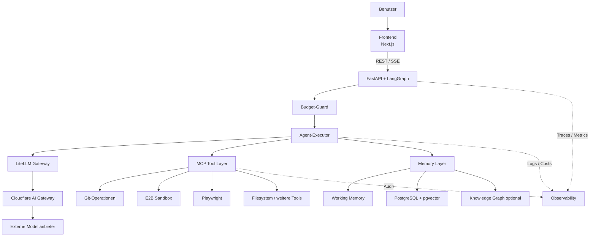
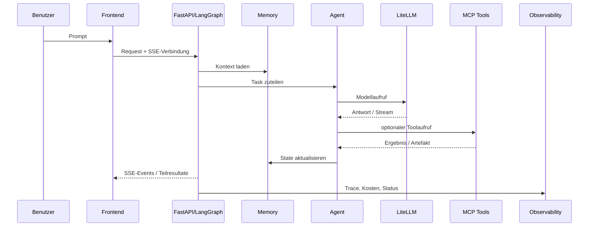
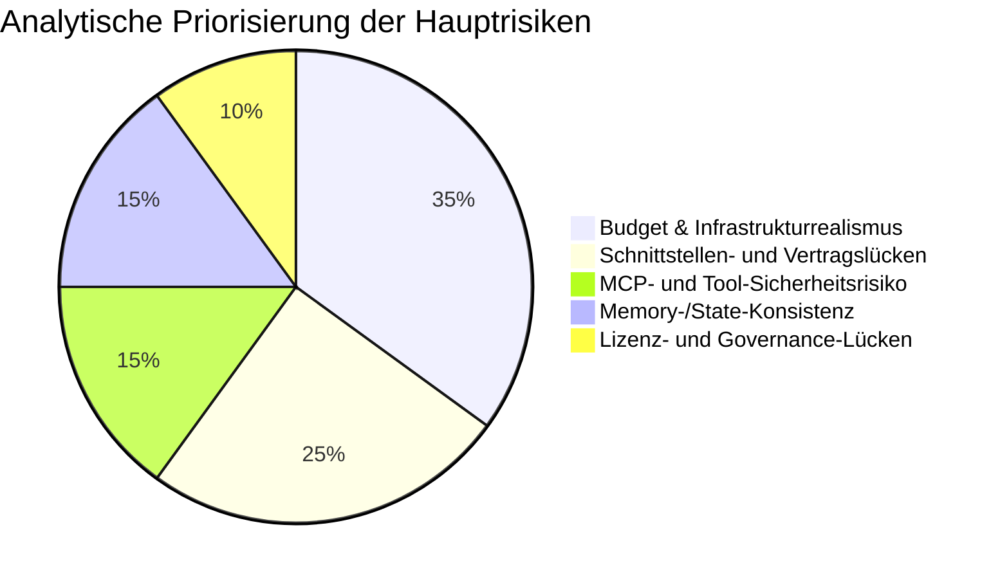

# Superbrain

Die angeforderte HTML-Datei steht hier zum Download bereit: [superbrain_report_2026-04-28.html](sandbox:/mnt/data/superbrain_report_2026-04-28.html)

## Executive Summary

Das Projekt **Superbrain** erscheint nach Auswertung der bereitgestellten Unterlagen nicht als bereits veröffentlichte, öffentlich verifizierbare Produktplattform, sondern als sehr ambitionierter, teilweise ungewöhnlich detaillierter Architektur-, Governance- und Delivery-Masterplan für eine cloud-native, prompt-gesteuerte Multi-Agent-Entwicklerplattform. Die Unterlagen definieren klar den North Star, harte Betriebs- und Governance-Regeln, ein Phasenmodell, Agentenrollen, ein Memory-Konzept und eine Zielarchitektur. Gleichzeitig zeigen die Dokumente selbst, dass noch wesentliche Interface-, Sicherheits- und Betriebsdetails offen sind; die forensische Ergänzung bewertet die Vollständigkeit mit 87/100, die Operationalisierbarkeit aber nur mit 72/100 und die Verifikationstiefe mit 68/100. fileciteturn0file0L95-L133 fileciteturn0file1L41-L52

Der stärkste Teil des Projekts ist die **Architekturdisziplin**: Keine Localhost-Abhängigkeit, explizite Schichten, Human-in-the-loop für kritische Aktionen, Retry-Limits, Memory-Konsolidierung, Observability-Pflicht und ein klarer Anti-Drift-Mechanismus durch ADRs. Der schwächste Teil ist die **betriebsnahe Spezifikation**: API-Contracts, SSE-Reconnect, Task-Queue-Semantik, MCP-Versionspinning, GitHub-Branch-Protection als Konfigurationsartefakt, Rollback-Runbooks, LangGraph-Checkpoint-Migration, Token-Rotation und mehrere UI-/Exportdetails sind noch nicht verbindlich beschrieben. fileciteturn0file0L171-L223 fileciteturn0file0L331-L348 fileciteturn0file1L149-L176 fileciteturn0file1L259-L280 fileciteturn0file1L337-L377

Die wichtigste analytische Feststellung aus dem Abgleich mit aktuellen Primärquellen zu den geplanten Technologien ist: **Die Planunterlagen unterschätzen 2026 den realen Betriebsaufwand einzelner Abhängigkeiten**. Besonders deutlich ist das bei Langfuse: Die aktuelle offizielle Self-Hosting-Dokumentation für v3 beschreibt eine Architektur mit Web-, Worker-, Postgres-, ClickHouse-, Redis/Valkey- und S3/Blob-Komponenten; für VM/Docker-Compose wird sogar eine Empfehlung von mindestens 4 Cores und 16 GiB RAM genannt. Das kollidiert direkt mit dem projektdokumentierten 20-€-Infrastrukturziel und mit der älteren Annahme, Langfuse ließe sich leichtgewichtig auf einem kleinen Hetzner-Setup mitführen. fileciteturn0file0L548-L550 fileciteturn0file1L529-L606 citeturn21view0turn21view1turn22search11turn3search10

Die nachhaltigste Lesart lautet deshalb: **Superbrain ist als Architektur- und Governance-Blueprint überzeugend, aber als unmittelbar produktionsreife Implementierungsplanung noch nicht ausreichend geschlossen**. Das Projekt hat reale Chancen, wenn es in den nächsten Schritten radikal auf interface-first Spezifikation, FinOps, Lizenzklarheit und eine vereinfachte Betriebsbasis fokussiert wird. fileciteturn0file1L615-L620 fileciteturn0file2L8-L37

## Quellenlage und Projektcharakter

Die primären Projektquellen sind die drei bereitgestellten Dateien: ein umfassender Masterplan, eine forensische Ergänzung mit Lücken-, Widerspruchs- und Residualanalyse sowie ein Patch-Dokument, das Budget, Datenbanktopologie, Qdrant-Ausschluss, CrewAI-Einordnung, 5-Minuten-Konsolidierung, Budget-Guard und SSE-Verträge nachschärft. Das Patch-Dokument beansprucht ausdrücklich, die verbindliche Fassung zu sein; gleichzeitig bleiben Teil 1 und Teil 2 als historische und analytische Kontexte relevant, weil sie die offenen Risiken und die ungelösten Vertragslücken sichtbar machen. fileciteturn0file2L6-L37 fileciteturn0file0L903-L920

Im Web ließ sich für den exakten Projektnamen keine belastbare offizielle Projektseite, kein eindeutiges öffentliches Repository und kein projektspezifisches Whitepaper nachweisen. Die Treffer auf den Suchbegriff „Superbrain“ waren thematisch heterogen und bezogen sich auf andere Produkte, Forschungsarbeiten oder Firmen. Deshalb ist die belastbarste Methodik hier: **projektspezifische Aussagen nur aus den gelieferten Unterlagen**, technologische und regulatorische Aussagen aus offiziellen Herstellerdokumentationen, Standards, Behördenquellen und einschlägiger Fachliteratur. citeturn0search0turn0search1turn0search2turn1search2

Die derzeitige Evidenzlage spricht deshalb dafür, Superbrain als **internes oder voröffentliches Architekturprogramm** zu behandeln. Aussagen zu Community, öffentlicher Governance, realen Maintainer-Strukturen, Roadmap-Umsetzung und verfügbarer Codebasis sind – sofern sie in den Dokumenten nicht explizit stehen – als **unspezifiziert** zu markieren. fileciteturn0file1L45-L52

## Projektziele, Nutzerrollen und Anwendungsfälle

Der dokumentierte North Star ist klar: eine cloud-native, prompt-gesteuerte Multi-Agent-Plattform, mit der ein einzelner Entwickler Software inklusive 3D-Webanwendungen über natürliche Sprache erstellen, testen und deployen kann, ohne lokale Modelle, ohne Localhost und mit einem mehrschichtigen Gedächtnis. Das MVP wird eng gefasst: 4-Agenten-Squad, Prompt-Interface, Streaming, Vector-Memory, Git-Integration und produktiver Deploy-Pfad. Dieser Zuschnitt ist architektonisch sinnvoll, weil er die Funktionsbreite begrenzt, ohne die Kernhypothese des Produkts aufzugeben. fileciteturn0file0L95-L133

Die forensische Ergänzung extrahiert zusätzlich eine implizite **Single-Tenant-Annahme für Phase 1 bis 5**. Das ist analytisch wichtig, weil es Authentisierung, Cost Tracking, Partitionierung des Memory-Systems, Berechtigungskonzepte und spätere Multi-Tenancy beeinflusst. Diese Annahme ist plausibel, aber im Masterplan nicht sauber als ADR ausformuliert. Das sollte nachgezogen werden, denn ohne explizite Tenant-Entscheidung bleiben zentrale Sicherheits- und Datenmodelle semantisch unterbestimmt. fileciteturn0file1L89-L100

Die Nutzer- und Agentenrollen sind für ein Projekt in diesem Stadium ungewöhnlich klar beschrieben. Die vier Kernrollen Planner, Coder, Tester und DevOps haben eigene Aufgaben, Tool-Grenzen, Verbote, Eskalationsbedingungen, Laufzeitgrenzen und Speicherschemata. Das ist stark, weil es nicht nur Funktion, sondern auch **operative Disziplin** modelliert. Gleichzeitig ist es noch kein vollständiges Betriebsmodell, weil wichtige Kontrollfragen offen bleiben: Wer validiert „done“, wann ist etwas architekturrelevant genug für einen ADR, wie werden Branch-Policies technisch erzwungen und wie sehen die Memory-Read- und Deployment-Verträge konkret aus. fileciteturn0file0L349-L398 fileciteturn0file1L259-L280

Für die UX ist das Projekt ebenfalls bemerkenswert konkret. Die vier Hauptscreens Workspace, Memory-Viewer, Agent-Activity und Cost-Monitor ergeben ein schlüssiges Bedienmodell für einen technischen Power-User. Die konsequente Forderung nach Zustandsmodellen – Loading, Empty, Success, Warning, Error, Degraded, Disabled, Fallback-Active – ist produktreif gedacht. Dennoch fehlen auch hier entscheidende Details: Wie genau gelangt ein Nutzer aus der Hauptoberfläche in eine nicht-öffentliche Langfuse-Detailansicht, wie funktioniert der Export des Cost-Monitors, welche Recovery-UI greift bei Totalausfall des Orchestrators, und wie wird ein 3D-Screenshot transportiert. fileciteturn0file0L408-L437 fileciteturn0file1L285-L303

Die folgende Tabelle verdichtet die Rollenlage und den dokumentierten Spezifikationsstand. fileciteturn0file0L349-L398 fileciteturn0file1L281-L283

| Rolle | Primäre Aufgabe | Erlaubte Mittel | Kritische Begrenzung | Spezifikationsstand |
|---|---|---|---|---|
| Planner-Agent | Intent parsen, Plan erstellen, Routing vorbereiten | Memory-Read, Task-Router | kein Code, kein Git-Zugriff | klar |
| Coder-Agent | Code erzeugen und in Feature-Branches liefern | GitHub-MCP, Filesystem-MCP, Memory | kein Main-Push, kein Prod-Deploy | klar |
| Tester-Agent | Tests und Browser-Automation | E2B, Playwright, Memory | keine Codeänderung, Session-Schließpflicht | klar |
| DevOps-Agent | Deployment-Konfiguration und Health-Prüfung | Read-only GitHub, Config-Reads, Health API | keine direkte Prod-SSH, keine Secret-Rotation ohne Approval | klar |
| Research/Security/Docs/DB | Erweiterung ab Phase 6 | noch grob | Laufzeit-, Retry- und Eskalationslogik offen | unspezifiziert/teilweise |

## Architektur, Datenflüsse und ML-Bausteine

Die dokumentierte Zielarchitektur folgt einem klassischen, aber für Agentensysteme sinnvollen Muster: Frontend auf entity["company","Vercel","cloud platform"], Backend/Orchestrierung auf entity["company","Hetzner","cloud hosting provider"], Edge- und Gateway-Funktionen über entity["company","Cloudflare","edge platform"], Repository- und CI/CD-Integration über entity["company","GitHub","developer platform"], ein mehrstufiges Memory-System, eine MCP-Toolschicht sowie getrennte Observability. Der Masterplan definiert sieben technische Schichten mit expliziten Besitzern, Inputs, Outputs und Verboten; der Patch verschärft das später durch „eine PostgreSQL-Instanz als primäre Single Source of Truth“, pgvector als einzige Vector-Lösung in Phase 1-5, einen Budget-Guard-Node und vertragsbasierte SSE-Kommunikation. fileciteturn0file0L171-L223 fileciteturn0file2L13-L29

Die Diagrammlogik oben entspricht der dokumentierten Zielarchitektur, ergänzt aber zwei analytisch notwendige Präzisierungen aus dem Patch und der forensischen Ergänzung: den **Budget-Guard als eigene Kontrollinstanz vor der Ausführung** und pgvector als **einzige** Vektoroption in Phase 1-5. Das ist konsistenter als die frühere Parallelität mit Qdrant und verhindert eine unnötige Verzweigung der Datenpfade. fileciteturn0file0L605-L613 fileciteturn0file1L351-L354 fileciteturn0file2L13-L18

Die größte technische Stärke dieser Architektur ist die Wahl von LangGraph als stateful Orchestrierungsgrundlage. Die offizielle Dokumentation beschreibt LangGraph ausdrücklich als Low-Level-Infrastruktur für langlebige, zustandsbehaftete Workflows mit Persistenz, Fehlertoleranz, Human-in-the-loop und dauerhafter Ausführung. Das passt sehr gut zum Superbrain-Zielbild. Ebenso passt LiteLLM als OpenAI-kompatibles Gateway zu einer providerübergreifenden Modellstrategie, und MCP ist prinzipiell der richtige Standard für einen modularen Toolzugriff. citeturn13search11turn13search0turn13search3turn3search14turn3search18turn8search0turn8search3

Die größte Schwäche liegt in den **Schnittstellen zwischen diesen guten Bausteinen**. Die forensische Analyse benennt explizit fehlende HTTP-Methoden, Endpoint-Pfade, Request-/Response-Schemata, SSE-Eventtypen, Reconnect-Strategien, Task-Assignment-Datenstrukturen, Queue-Mechanismen, LiteLLM-Streaming-Verträge und MCP-Versionspinning. Das ist nicht kosmetisch, sondern blockiert reale Implementierbarkeit. Ein System dieser Art scheitert nicht an den Schichten, sondern an unklaren Verträgen zwischen den Schichten. fileciteturn0file1L157-L198

### Komponenten, Module und Schnittstellen

Die folgende Tabelle fasst den dokumentierten Zielstack und den jeweiligen Reifegrad zusammen. Sie ist eine analytische Verdichtung aus Masterplan, Forensik und Patch. fileciteturn0file0L171-L223 fileciteturn0file1L149-L214 fileciteturn0file2L13-L29

| Bereich | Geplanter Baustein | Aufgabe | Technische Bewertung |
|---|---|---|---|
| Frontend | Next.js, shadcn/ui, Tailwind | Workspace, Memory-Viewer, Agent-Activity, Cost-Monitor | passend, aber SSE-Verträge und Fehler-/Reconnect-UX fehlen |
| API-/Orchestrierung | FastAPI + LangGraph | State Machine, Task Routing, Recovery | sehr passend für langlebige Agentenabläufe |
| Agentenebene | Planner, Coder, Tester, DevOps | spezialisierte Ausführung | Rollen stark definiert, Inter-Agent-Verträge offen |
| LLM-Gateway | LiteLLM + AI Gateway | Routing, Cost Tracking, Fallbacks | architektonisch sinnvoll |
| Toolschicht | MCP | standardisierte Toolaufrufe | richtig gewählt, aber sicherheitssensitiv und versionsabhängig |
| Working Memory | Redis/Valkey | kurzer Sitzungszustand | sinnvoll, TTL-/Konsolidierungslogik muss robuster werden |
| Long-Term Memory | PostgreSQL + pgvector | semantische Suche | konsistent und kosteneffizient |
| Knowledge Graph | Neo4j optional | strukturierte Abhängigkeiten | nur grob beschrieben |
| Observability | Langfuse + Prometheus + Grafana | Traces, Kosten, Alerts, Dashboards | fachlich stark, operativ schwer |

### Persistenz, Datenflüsse, APIs und Inferenzpfade

Das persistente Kernmodell besteht laut Plan aus `projects`, `agent_sessions`, `agent_messages`, `memory_entries` und `cost_tracking`. Dazu kommen Redis für flüchtigen Kontext und LangGraph-Checkpoints in PostgreSQL. Das ist eine solide Grundlage, weil State, Kosten und Aktivitäten von Anfang an in das Domänenmodell gezogen werden. Die forensische Ergänzung weist aber korrekt darauf hin, dass das konkrete LangGraph-Checkpoint-Schema und dessen Migrationsmechanik offen sind; ohne das bleibt die Forderung „PostgreSQL-only, niemals in-memory“ auf halbem Weg stehen. fileciteturn0file0L546-L549 fileciteturn0file0L607-L613 fileciteturn0file1L347-L354 citeturn13search0turn13search4turn13search22

Das Memory-System ist konzeptionell gut: Redis als Working Memory, Long-Term Memory über pgvector, optionaler Knowledge Graph ab späteren Phasen, verpflichtende Purge-API für DSGVO-Zwecke. Die forensische Analyse identifiziert jedoch zu Recht eine Race-Condition in der älteren 30-Minuten-Konsolidierungslogik; der Patch korrigiert das auf eine 5-Minuten-Konsolidierung. Diese Korrektur ist schlüssig, auch weil Redis-Ablaufverhalten nicht deterministisch auf einzelne Keys beschränkt ist, sondern aktiv und passiv verarbeitet wird. Technisch ist der Patch damit klar robuster als die ältere Planung. fileciteturn0file0L311-L324 fileciteturn0file1L201-L214 fileciteturn0file2L23-L29 citeturn4search3turn4search7turn4search0

Dieser Datenfluss ist als Grundmuster plausibel, aber die Unterlagen spezifizieren weder die genauen SSE-Eventtypen noch die Wiederaufnahme bei abgebrochenen Verbindungen. Technisch ist das umso relevanter, weil sowohl Next.js als auch FastAPI Streaming/SSE gut unterstützen, die reale Produktrobustheit aber an Eventschema, Idempotenz, Client-Reconnect und Fortschrittspersistenz hängt. Gerade für lange Agentenläufe sollte der Stream deshalb als **View auf persistenten State** modelliert werden und nicht als alleiniger Transport des Wahrheitszustands. fileciteturn0file1L161-L166 citeturn5search0turn5search2turn5search9turn13search3

### ML-Modelle, Trainingsdaten und RAG

Das Projekt trainiert nach den vorliegenden Unterlagen **keine eigenen Modelle**. Stattdessen sind verschiedene externe LLMs je nach Rolle vorgesehen, dazu ein Embedding-Modell für Long-Term Memory. Projektspezifische Trainingsdaten, Fine-Tuning-Pipelines oder eigene Modell-Lifecycle-Prozesse sind nirgends beschrieben; diese Punkte sind daher als **unspezifiziert** zu markieren. Was konkret spezifiziert ist, ist lediglich der Inferenzpfad: Agent → LiteLLM → ggf. AI Gateway/Fallback → externer Provider, plus Embeddings für Memory-Konsolidierung. fileciteturn0file0L313-L319 fileciteturn0file0L605-L610

Das Embedding-Konzept mit semantischer Suche, Chunking und Vektorindex entspricht dem etablierten Muster von Retrieval-Augmented Generation. Inhaltlich ist diese Architektur plausibel; die Originalarbeit zu RAG beschreibt genau die Kopplung von parametischem Sprachmodell und nicht-parametrischem Speicher. Für Superbrain ist die Schwachstelle weniger das Grundprinzip als die fehlende Re-Embedding-Strategie bei Modellwechseln sowie die Gefahr, dass die naive „Top-5 à 512 Token“-Injektion kleine Kontextfenster zu schnell füllt. fileciteturn0file1L233-L239 citeturn4search1turn4search5turn12search0turn12search4

Die folgende Tabelle fasst den ML-bezogenen Architekturstand zusammen. fileciteturn0file0L313-L319 fileciteturn0file1L233-L239

| ML-/Datenaspekt | Dokumentierter Stand |
|---|---|
| Eigene Basismodelle | unspezifiziert / nicht vorgesehen |
| Eigenes Fine-Tuning | unspezifiziert |
| Trainingsdatenkorpus | unspezifiziert |
| Embedding-Modell | spezifiziert als `text-embedding-3-small` oder OSS-Alternative |
| Retrievalspeicher | pgvector in PostgreSQL |
| Inferenzpfad | Agent → Gateway → Provider |
| Re-Embedding-Strategie | unspezifiziert |
| Kontextfenster-Management | teilweise spezifiziert, aber riskant dimensioniert |

## Implementierung, Infrastruktur, Sicherheit und Compliance

Die gewählte Programmiersprachen- und Framework-Kombination ist stimmig: Next.js im Frontend, FastAPI im API-/Orchestrierungslayer, LangGraph für langlebige State Machines, Docker Compose für frühe Phasen, GitHub Actions für CI/CD und ein Self-Hosting-Ansatz, der langsame Agentenläufe nicht auf serverless-only Plattformen zwingt. Auch die Auswahl von Playwright für Browser-Tests, pgvector für semantische Suche und Prometheus/Grafana für Monitoring passt fachlich gut. fileciteturn0file0L472-L480 fileciteturn0file0L540-L550 citeturn9search1turn9search2turn9search17turn18search4turn18search1turn19search2

Der dokumentierte CI/CD-Plan ist sinnvoll, aber technisch noch nicht geschlossen. Pull-Request-Checks, Staging-first, manuell genehmigte Production-Deployments und Hotfix-Pfade sind sinnvolle Grundmuster. Die Lücken liegen beim tatsächlichen Transport von Artefakten und Deploy-Triggern auf die Zielumgebung. Dazu kommt ein weiterer realer Constraint: GitHub-Umgebungen, Secrets und Deployment-Protection-Regeln hängen je nach Repository-Typ und Plan an Verfügbarkeitsgrenzen; außerdem sind Minuten- und Storage-Limits für private Repositories relevant. Solange das Projekt nicht entscheidet, ob das Repository privat oder öffentlich ist und welchen GitHub-Plan es tatsächlich nutzt, bleibt das CI/CD-Design finanziell und organisatorisch unvollständig. fileciteturn0file0L544-L545 fileciteturn0file1L339-L342 citeturn5search3turn5search11turn7search0turn7search8

Die Infrastrukturannahmen sind inzwischen der kritischste Realitätsbruch. Die Projektdokumente setzen ein hartes Infrastrukturziel von 20 € pro Monat, sprechen aber gleichzeitig von Staging, Langfuse, Redis, PostgreSQL, Reverse Proxy, MCP-Gateway und weiteren Diensten. Die forensische Ergänzung identifiziert zu Recht mehrere residuale Widersprüche um Servergröße, Langfuse-DB-Topologie und Staging-Kosten. Hinzu kommt, dass Hetzner im April 2026 Preise angepasst hat und die offiziellen Preis- und Tarifseiten zeigen, dass die Spielräume kleiner geworden sind. Unter diesen Bedingungen erscheint ein vollständiger Self-Hosted-Stack mit aktueller Observability höchstens in stark vereinfachter Form budgetkompatibel. fileciteturn0file0L478-L479 fileciteturn0file1L529-L606 fileciteturn0file2L8-L18 citeturn23search4turn23search11turn23search0

### Technologievergleich

Die folgende Tabelle vergleicht die dokumentierten Kerntechnologien mit ihrer konkreten Rolle im Projekt und den wichtigsten analytischen Befunden. fileciteturn0file0L171-L223 fileciteturn0file2L13-L29 citeturn13search11turn13search0turn3search14turn8search1turn21view0

| Technologie | Projektrolle | Pluspunkte | Hauptprobleme |
|---|---|---|---|
| LangGraph | Orchestrierung, Persistenz, Recovery | stateful, fehlertolerant, Human-in-the-loop | Checkpoint-Schema/Migration noch nicht beschrieben |
| LiteLLM | Modellrouting / Gateway | einheitliches API-Format, Multi-Provider | Capability-Matrix und Versions-Pinning fehlen |
| MCP | Tool-Standardisierung | gute Modularität, wiederverwendbar | hoher Hardening-Bedarf, Versions- und Scope-Management offen |
| PostgreSQL + pgvector | Kernpersistenz + semantische Suche | konsistent, kosteneffizient, SQL-nah | Schema-/Migrationsdetails offen |
| Redis/Valkey | Working Memory / Queue-nah | schnell, passend für TTL-State | Lizenz- und Betriebsentscheidung offen |
| Langfuse | LLM-Observability | fachlich sehr stark | v3 operativ deutlich schwerer als im Plan |
| Prometheus / Grafana | Metriken / Dashboards / Alerts | industriebewährt | zusätzlicher Betriebs- und Lizenzaufwand |

### Sicherheits-, Datenschutz- und Compliance-Aspekte

Der Sicherheitsansatz des Projekts ist in der Konzeption erstaunlich reif. Er kombiniert Zero-Trust-Denken, Human-Approval für kritische Aktionen, Secrets außerhalb des Codes, obligatorisches Logging, Branch-Schutz, Budget-Guards, Rate Limiting, Audit Logs und isolierte Sandbox-Ausführung. Das passt gut zu offiziellen deutschen und internationalen Leitlinien: Das BSI beschreibt Zero Trust als präventives Sicherheitsparadigma, und deutsche Datenschutzbehörden betonen für Art. 25 DSGVO ausdrücklich Datenschutz durch Technikgestaltung und Datenminimierung ab dem frühesten Entwurfszeitpunkt. fileciteturn0file0L127-L131 fileciteturn0file0L331-L348 citeturn10search0turn10search4turn11search1turn11search5

Die DSGVO-seitige Idee einer einheitlichen Memory-Purge-API ist fachlich richtig positioniert. Die Unterlagen verlangen, dass Redis-Entries, Embeddings, Datenbankeinträge, Langfuse-Traces und Projektartefakte einer Person mit einer Operation löschbar sind. Das passt grundsätzlich zu den behördlichen Erläuterungen zum Recht auf Löschung aus Art. 17 DSGVO und zu Privacy-by-Design-Anforderungen. Die Lücke liegt nicht im Ziel, sondern in der Nachweisbarkeit: Löschkonzept, Datenklassifikation, Aufbewahrungsfristen, technische Maskierung, Restore-Verhalten und Löschbeweise sind noch keine spezifizierten Betriebsartefakte. fileciteturn0file0L321-L324 citeturn11search0turn11search4turn11search10

Aus Anwendungssicherheitssicht ist die Projektrichtung ebenfalls richtig, aber noch zu abstrakt. OWASP ASVS und das junge OWASP LLMSVS liefern gute Rahmen für Web- und LLM-nahe Sicherheitsverifikation; im Projekt taucht Security-Scanning bereits als Gedanke auf, aber nicht als vollständige Kontrollmatrix. Besonders kritisch ist die MCP-Schicht: Die offizielle Spezifikation warnt selbst, dass MCP mächtige Daten- und Codezugriffspfade eröffnet und deshalb sorgfältig abgesichert werden muss. Für Superbrain heißt das praktisch: Tool-Scopes, erlaubte Server, Review-Pflichten, Transportwahl, Allowlisting und Host-Isolation dürfen nicht implizit bleiben. fileciteturn0file0L392-L398 fileciteturn0file1L395-L405 citeturn10search3turn10search15turn16search2turn8search1turn8search11

Die Entscheidung für GitHub OAuth im Frontend ist für einfache Benutzeranmeldung nachvollziehbar, aber für **Repository-Operationen** ist ein GitHub App-Modell wahrscheinlich sauberer. Die offiziellen GitHub-Dokumente betonen, dass GitHub Apps fein granularere Berechtigungen und kurzlebige Tokens bieten. Für ein Agentensystem, das Code lesen, schreiben und Deployments anstoßen kann, wäre das aus Least-Privilege-Sicht die robustere Richtung. Als Empfehlung gilt deshalb: GitHub OAuth für Login ist vertretbar; für agentische Repo-Operationen sollte zusätzlich oder primär ein GitHub App-Modell definiert werden. fileciteturn0file0L660-L677 citeturn20search3turn20search11turn7search1turn7search5

## Entwicklungsstand, Governance, Lizenzierung, Risiken und Empfehlungen

Das Projekt besitzt eine stringente Roadmap von Goal Lock über Foundation, Core Runtime, Product Surface, Hardening und Release Readiness bis hin zu Scale Expansion. Diese Roadmap ist nicht vage, sondern enthält pro Phase Ziel, Abhängigkeiten, Verifikation und teils sogar konkrete Agent-Prompts. Das ist methodisch stark und dürfte den Übergang von Architektur zu Delivery erleichtern. Gleichzeitig zeigt der Patch, dass fundamentale Entscheidungen – Datenbanktopologie, Budgetstart, Vector-Store-Wahl, CrewAI-Begrenzung – erst nachträglich bereinigt wurden. Das spricht weniger gegen die Architektur als gegen die Reife des Standes: Sie ist noch in Konsolidierung, nicht in stabiler Ausführung. fileciteturn0file0L466-L527 fileciteturn0file0L534-L757 fileciteturn0file2L8-L37

Die Governance des Projekts ist hingegen eine echte Stärke. Risk Register, Verification Register, Release Checklist, Assumption Log, Open Questions Log, Technical Debt Log, Ownership-Map und Runbooks sind als Pflichtartefakte benannt. Das ist weit mehr als viele frühe KI-Projekte mitbringen. Wenn diese Artefakte tatsächlich gepflegt werden, ist die Chance gut, dass Superbrain nicht an fehlender Disziplin scheitert. Die entscheidende Bedingung ist aber, dass Governance nicht nur dokumentiert, sondern in CI/CD, Repository-Regeln, Konfigurationsdateien und Betriebsrunbooks materialisiert wird. fileciteturn0file0L860-L870

Die Projektlizenz selbst ist in den gelieferten Unterlagen **nicht spezifiziert**. Für ein „Open-Source-first“-Projekt ist das zu wenig, weil die tatsächliche Rechtslage nicht nur vom eigenen Code, sondern von der Lizenzmischung der Abhängigkeiten geprägt wird. Mehrere Kernbestandteile sind permissiv oder weitgehend permissiv dokumentiert – LangGraph, Next.js, FastAPI, PostgreSQL, große Teile von LiteLLM und Langfuse –, aber es gibt relevante Ausnahmen: Grafana OSS ist AGPL-orientiert, Redis hat 2026 eine deutlich komplexere Lizenzlage, während Valkey unter BSD-3-Clause positioniert ist. Für die Projektstrategie heißt das: **eigene Projektlizenz festlegen, Drittkomponenten inventarisieren, SBOM pflegen und Redis/Valkey bewusst entscheiden**. citeturn17search2turn18search4turn18search1turn19search2turn17search0turn17search9turn19search0turn19search7turn18search6turn22search17turn22search20

Projektspezifische Maintainer, Contribution-Richtlinien, Code-of-Conduct-Regeln, Community-Prozesse oder öffentliche Governance-Strukturen sind in den vorliegenden Unterlagen nicht beschrieben und im Web nicht belastbar nachweisbar. Das ist im frühen Stadium nicht ungewöhnlich, sollte aber bewusst als Lücke betrachtet werden. Spätestens ab öffentlicher Zusammenarbeit braucht das Projekt ein minimales Governance-Paket aus LICENSE, CONTRIBUTING, SECURITY, CODEOWNERS, RELEASE und ADR-Policy. **Aktueller Status: unspezifiziert.** fileciteturn0file1L515-L620

### Risiko- und Chancenbild

Die folgende Grafik verdichtet die wesentlichen Risikocluster. Sie ist keine projektoffizielle Prozentverteilung, sondern eine analytische Priorisierung auf Basis der dokumentierten Risiken und der extern verifizierten Technologiebedingungen. fileciteturn0file0L766-L805 fileciteturn0file1L383-L405

Die Chance des Projekts liegt klar in der Kombination aus guter Architekturdisziplin, realistischer Agenten-Governance und einem produktnahen Bedienmodell für einen technischen Solouser. Die Risiken liegen ebenso klar in Betriebsrealismus, Budgets, konkreter Schnittstellenspezifikation und Sicherheitsverhärtung. Dieses Risiko-/Chancenprofil ist günstig genug für Weiterentwicklung – aber nur, wenn Superbrain nicht zu früh versucht, alle geplanten Komponenten gleichzeitig produktiv zu fahren. fileciteturn0file0L123-L131 fileciteturn0file1L421-L427

### Empfehlungen für die Weiterentwicklung

Die wichtigste Empfehlung ist eine **harte Vereinfachung der frühen Betriebsbasis**. Phase 1 bis 3 sollte auf einem PostgreSQL-first-Ansatz mit pgvector, LangGraph, FastAPI, Next.js, Cost Tracking und minimal notwendiger Toolschicht stabilisiert werden. Qdrant ist laut Patch ohnehin ausgeschlossen, und auch Langfuse sollte nur dann voll self-hosted eingeführt werden, wenn der reale Ressourcenbedarf explizit gegen Budget und Infrastrukturprofil gerechnet wurde. Andernfalls ist eine abgespeckte Observability-Phase oder eine spätere Einführung sinnvoller. fileciteturn0file2L13-L18 citeturn21view0turn21view1

Die zweite Empfehlung ist **interface-first Engineering**. Vor weiterer Funktionsausweitung sollten mindestens folgende Artefakte fertig werden: API-Register, SSE-Eventtypen und Reconnect-Strategie, Task-Assignment-Schema, Memory-Read-/Write-Verträge, Git-Branch-Protection-Regeln, Deployment-Mechanik zu Hetzner, Budget-Guard-Semantik, Rollback-Runbooks und Security-Policies für MCP-Server. Solange diese Verträge fehlen, skaliert die Komplexität schneller als die Verlässlichkeit. fileciteturn0file1L157-L198 fileciteturn0file1L337-L377

Die dritte Empfehlung betrifft **Security by Default**. Branch Protection muss technisch hinterlegt werden, Gitleaks sollte verpflichtend in CI laufen, Rate Limiting sollte zweistufig bleiben, Refresh-Token-Rotation muss spezifiziert werden, und MCP-Server sollten grundsätzlich allowlist-basiert, versioniert und isoliert betrieben werden. Für Sandbox- und Toolsysteme ist das keine optionale Verbesserung, sondern der Unterschied zwischen kontrollierbarer und unkontrollierbarer Ausführungsfläche. fileciteturn0file2L23-L29 citeturn14search2turn14search7turn20search1turn20search6turn16search2

Die vierte Empfehlung ist **Lizenz- und Produktgovernance**. Das Projekt braucht eine eigene Lizenzentscheidung, eine SBOM, eine Third-Party-Policy und klare Auswahlregeln für nicht-permissive Komponenten. Wenn Open-Source-first wirklich hart gemeint ist, spricht viel dafür, Redis durch Valkey zu ersetzen oder diese Option zumindest als ADR zu prüfen. Ebenso sollte zwischen GitHub OAuth für Login und GitHub App für Repository-Rechte sauber getrennt werden. citeturn18search6turn22search17turn22search20turn20search3

### Offene Fragen und Limitierungen

Mehrere Punkte bleiben trotz der vorliegenden Unterlagen offen und sollten bewusst als **unspezifiziert** geführt werden: die öffentliche Codebasis, die konkrete Projektlizenz, Maintainer- und Community-Strukturen, die genaue Tenant-Architektur, das finale Auth-Modell für produktive Repo-Operationen, die Rollback- und Disaster-Recovery-Prozeduren, die Re-Embedding-Strategie, die Capability-Matrix der Modellanbieter und die tatsächliche FinOps-Tauglichkeit des Zielstacks unter aktuellen Markt- und Lizenzbedingungen. Diese offenen Fragen mindern nicht den Wert des Architekturentwurfs, aber sie begrenzen den Reifegrad der Projektbewertung. fileciteturn0file1L103-L112 fileciteturn0file1L493-L516 fileciteturn0file1L617-L620